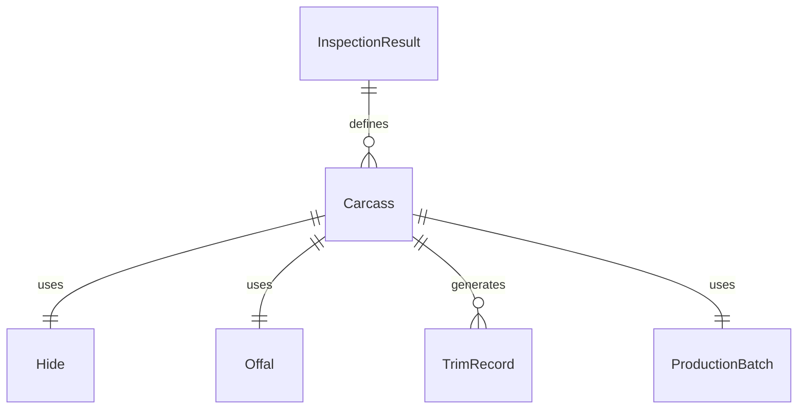
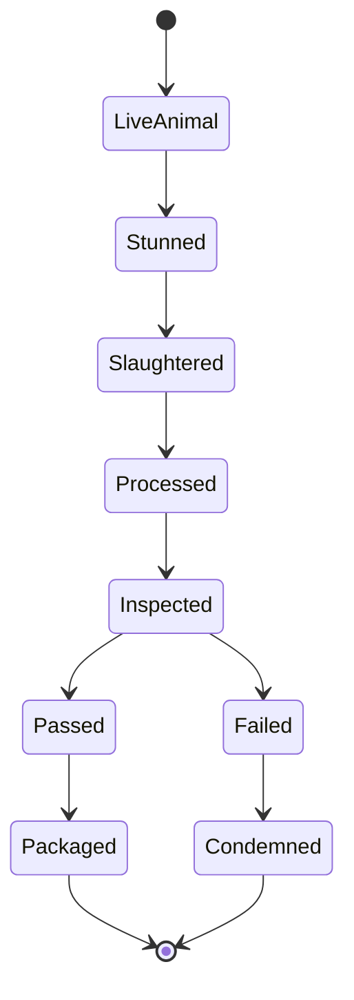
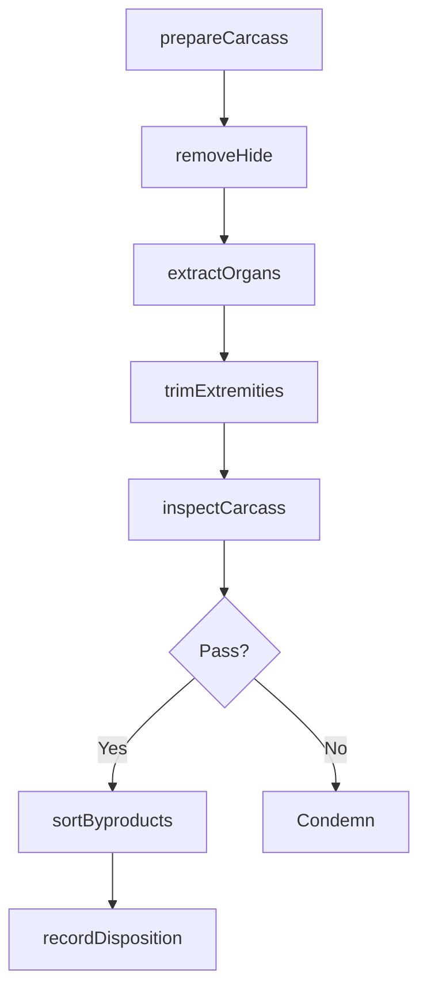
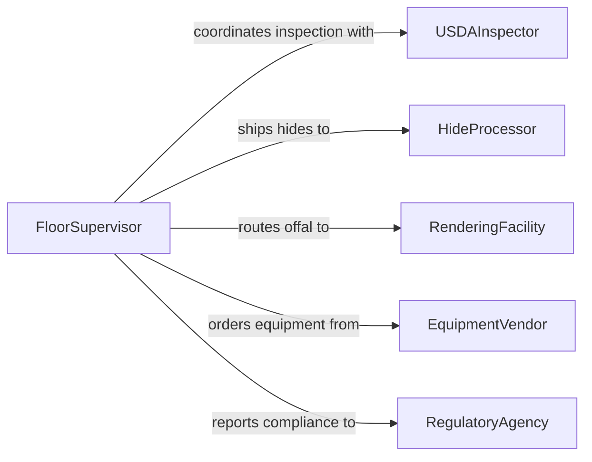

# Remove Skin Body Parts Animals

> Business-as-Code definition for removing skin and body parts from animals. Models the workflow for hide removal, organ extraction, and carcass trimming in meat processing and rendering operations.

## Overview

Removing skin and body parts from animals involves skinning hides, extracting organs, separating heads, hooves, and other non-meat components during carcass processing. This activity is performed in slaughterhouses, meat packing plants, and rendering facilities following USDA and food safety regulations. The definition provides actions for each stage of the removal process, events for quality tracking, and searches for production and compliance data.

## Actors

| Actor | Description |
|-------|-------------|
| USDAInspector | Inspects carcasses and verifies compliance with federal regulations |
| HideProcessor | Purchases and processes removed hides for leather production |
| RenderingFacility | Receives offal and byproducts for rendering into usable materials |
| EquipmentVendor | Supplies skinning tools, mechanized hide pullers, and cutting equipment |
| RegulatoryAgency | Sets and enforces food safety and animal processing standards |

## Roles

| Role | Description |
|------|-------------|
| FloorSupervisor | Oversees skinning and trimming operations on the processing line |
| Skinner | Performs hide removal using hand tools or mechanized equipment |
| Trimmer | Removes heads, hooves, and non-edible parts from the carcass |
| QualityControlTechnician | Inspects removed parts and carcass surfaces for contamination |

## Entities

| Entity | Description |
|--------|-------------|
| Carcass | The animal body undergoing skin and part removal |
| Hide | The removed skin destined for tanning or rendering |
| Offal | Internal organs and viscera separated from the carcass |
| TrimRecord | Documentation of parts removed and their disposition |
| InspectionResult | USDA or quality control findings for a processed carcass |
| ProductionBatch | A group of carcasses processed together during a shift |

## Actions

| Action | Description |
|--------|-------------|
| prepareCarcass | Position the carcass on the processing line for skinning |
| removeHide | Separate the hide from the carcass using knives or mechanical pullers |
| extractOrgans | Remove internal organs and viscera for inspection and sorting |
| trimExtremities | Detach heads, hooves, tails, and other non-meat parts |
| inspectCarcass | Examine exposed surfaces for defects, contamination, or disease |
| sortByproducts | Classify removed parts for rendering, sale, or disposal |
| recordDisposition | Document the destination and weight of all removed components |

## Events

| Event | Description |
|-------|-------------|
| carcassPrepared | Carcass positioned and ready for skinning operations |
| hideRemoved | Hide successfully separated from the carcass |
| organsExtracted | Internal organs removed and available for inspection |
| extremitiesTrimmed | Non-meat parts detached from the carcass |
| carcassInspected | Quality control or USDA inspection completed |
| byproductsSorted | Removed parts classified and routed to their destinations |
| dispositionRecorded | Weight and routing of all byproducts documented |

## Searches

| Search | Description |
|--------|-------------|
| findProductionBatches | List processing batches by date, shift, or species |
| getInspectionResults | Retrieve inspection outcomes by carcass or batch |
| getByproductYields | Look up byproduct weights and disposition by batch |
| findHideInventory | Search available hides by grade, species, and weight |


## Entity Relationships



## State Diagram



## Workflow



## Actor Relationships



## Usage

### Calling Actions

```typescript
import { removeSkinBodyPartsAnimals } from '@headlessly/remove-skin-body-parts-animals'

const processing = removeSkinBodyPartsAnimals()

// Prepare a carcass for skinning
const carcass = await processing.prepareCarcass({
  batchId: 'batch-2026-0315',
  species: 'cattle',
  tagNumber: 'USDA-44821',
  linePosition: 12
})

// Remove hide using mechanical puller
await processing.removeHide({
  carcassId: carcass.id,
  method: 'mechanical-puller',
  gradeTarget: 'A'
})

// Sort byproducts for disposition
await processing.sortByproducts({
  carcassId: carcass.id,
  categories: [
    { type: 'hide', destination: 'tannery' },
    { type: 'offal', destination: 'rendering' },
    { type: 'bones', destination: 'gelatin-plant' }
  ]
})
```

### Event-Driven Automation

```typescript
// Trigger USDA hold when inspection fails
processing.carcassInspected(async ({ carcassId, passed, findings }) => {
  if (!passed) {
    await holdCarcass({
      carcassId,
      reason: findings.join('; '),
      requiredAction: 'usda-review'
    })
  }
})

// Update inventory when hides are removed
processing.hideRemoved(async ({ carcassId, hideWeight, grade }) => {
  await updateInventory({
    type: 'hide',
    weight: hideWeight,
    grade,
    sourceCarcass: carcassId
  })
})
```
