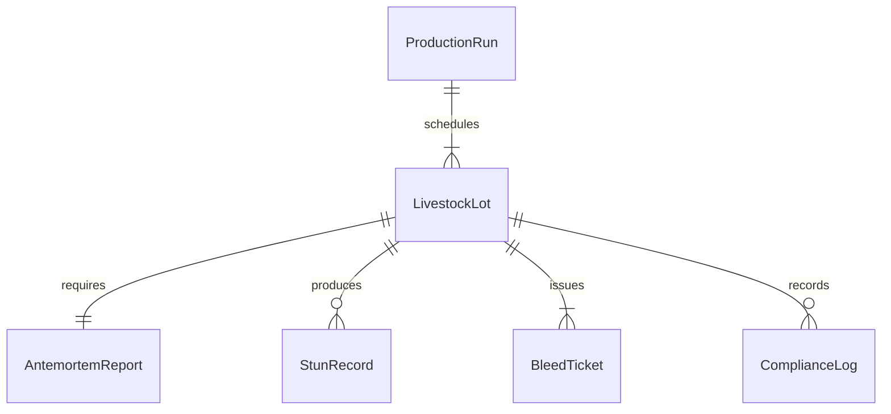
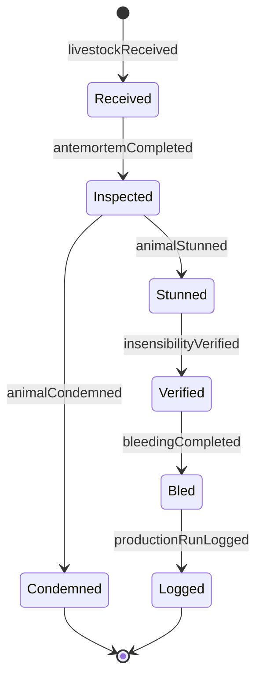
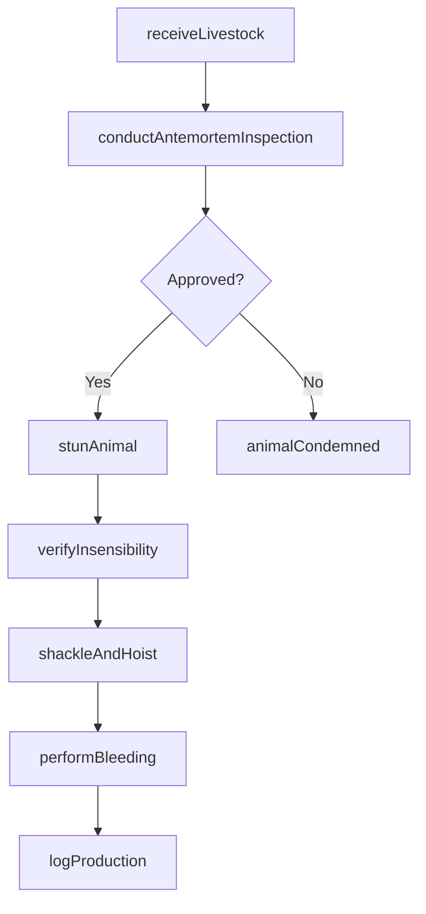
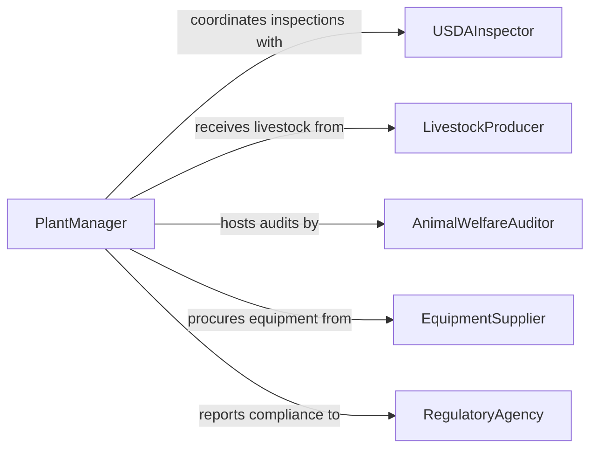

# Slaughter Animals

> Business-as-Code definition for animal slaughter operations. Models the workflow from livestock receiving through humane stunning, bleeding, and initial carcass preparation in regulated processing facilities.

## Overview

Animal slaughter involves the humane killing and initial processing of livestock in accordance with the Humane Methods of Slaughter Act and USDA regulations. This activity covers livestock receiving, ante-mortem inspection, stunning, shackling, bleeding, and scalding or initial carcass preparation. The definition exposes actions for each stage of the slaughter process, events for regulatory compliance tracking, and searches for production and inspection data.

## Actors

| Actor | Description |
|-------|-------------|
| USDAInspector | Conducts ante-mortem and post-mortem inspections |
| LivestockProducer | Delivers animals to the processing facility |
| AnimalWelfareAuditor | Evaluates humane handling and stunning practices |
| EquipmentSupplier | Provides stunning devices, shackles, and processing equipment |
| RegulatoryAgency | Establishes and enforces slaughter regulations and standards |

## Roles

| Role | Description |
|------|-------------|
| PlantManager | Oversees all slaughter operations and regulatory compliance |
| StunningOperator | Administers humane stunning to render animals insensible |
| KillFloorWorker | Performs shackling, sticking, and bleeding operations |
| AntemortemInspector | Examines live animals for signs of disease before processing |

## Entities

| Entity | Description |
|--------|-------------|
| LivestockLot | A group of animals received from a producer for processing |
| AntemortemReport | Inspection findings on live animals prior to slaughter |
| StunRecord | Documentation of stunning method, device, and effectiveness |
| BleedTicket | A record of bleed time, completeness, and carcass routing |
| ProductionRun | A scheduled slaughter session with target throughput |
| ComplianceLog | Cumulative regulatory compliance records for the facility |

## Actions

| Action | Description |
|--------|-------------|
| receiveLivestock | Accept and pen incoming animals with identification verification |
| conductAntemortemInspection | Examine live animals for disease, injury, or distress |
| stunAnimal | Apply approved stunning method to render the animal insensible |
| shackleAndHoist | Secure the stunned animal on the processing line |
| performBleeding | Execute the sticking cut and monitor complete blood drainage |
| verifyInsensibility | Confirm the animal shows no signs of consciousness post-stun |
| logProduction | Record throughput, timing, and compliance data for the run |

## Events

| Event | Description |
|-------|-------------|
| livestockReceived | Animals accepted at the facility and penned for inspection |
| antemortemCompleted | Pre-slaughter inspection finished with disposition assigned |
| animalStunned | Stunning administered and effectiveness confirmed |
| bleedingCompleted | Blood drainage finished and carcass advanced on the line |
| insensibilityVerified | Post-stun check confirmed the animal is fully insensible |
| animalCondemned | Animal rejected during ante-mortem inspection |
| productionRunLogged | Shift production data recorded and submitted |

## Searches

| Search | Description |
|--------|-------------|
| findLivestockLots | List received livestock lots by producer, species, or date |
| getStunRecords | Retrieve stunning effectiveness data by operator or shift |
| getAntemortemFindings | Look up inspection results by lot or individual animal |
| findProductionRuns | Search production runs by date, shift, or throughput |


## Entity Relationships



## State Diagram



## Workflow



## Actor Relationships



## Usage

### Calling Actions

```typescript
import { slaughterAnimals } from '@headlessly/slaughter-animals'

const slaughter = slaughterAnimals()

// Receive a livestock lot
const lot = await slaughter.receiveLivestock({
  producerId: 'ranch-highland-44',
  species: 'cattle',
  headCount: 120,
  arrivalTime: '2026-03-15T05:30:00Z'
})

// Conduct ante-mortem inspection
const inspection = await slaughter.conductAntemortemInspection({
  lotId: lot.id,
  inspectorId: 'usda-vet-301',
  findings: []
})

// Stun and verify insensibility
const stun = await slaughter.stunAnimal({
  animalTag: 'USDA-00482',
  method: 'captive-bolt',
  deviceId: 'CB-unit-3'
})

await slaughter.verifyInsensibility({
  stunRecordId: stun.id,
  cornealReflex: false,
  rhythmicBreathing: false
})
```

### Event-Driven Automation

```typescript
// Alert welfare officer on condemned animals
slaughter.animalCondemned(async ({ animalTag, lotId, reason }) => {
  await notify({
    to: 'animal-welfare-officer',
    message: `Animal ${animalTag} from lot ${lotId} condemned: ${reason}`
  })
})

// Track stunning effectiveness metrics
slaughter.animalStunned(async ({ operatorId, method, firstAttemptSuccess }) => {
  await recordMetric({
    metric: 'stunning-effectiveness',
    operator: operatorId,
    method,
    firstAttempt: firstAttemptSuccess
  })
})
```
