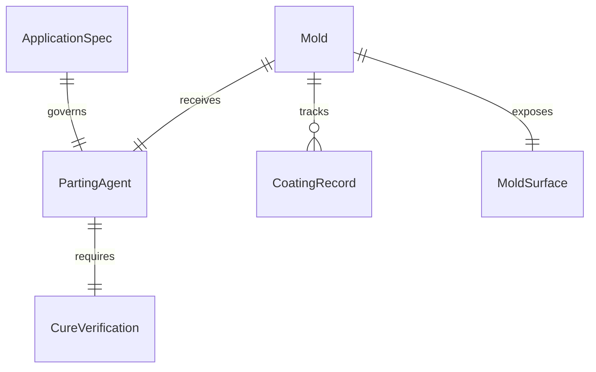
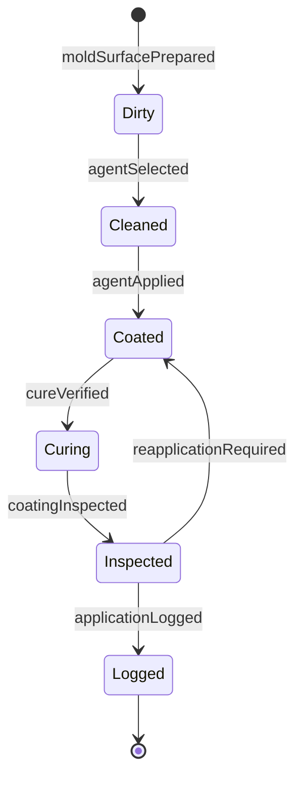
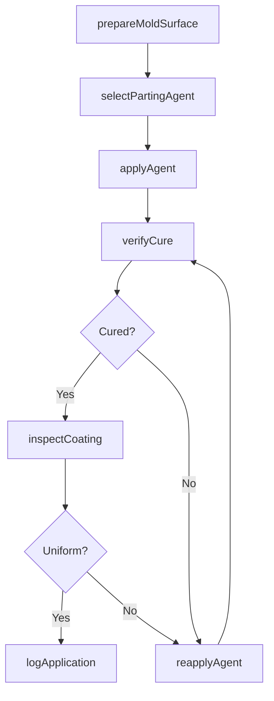
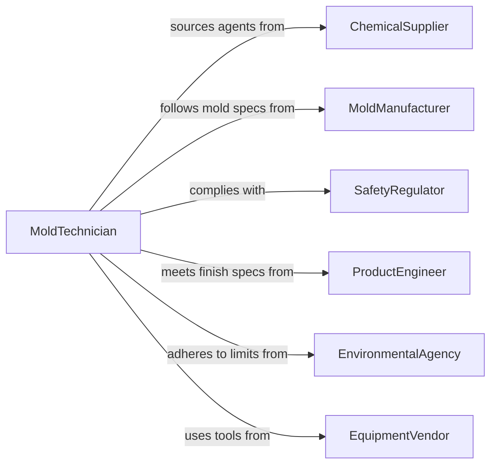

# Apply Parting Agents Solutions Molds

> Business-as-Code definition for applying parting agents or release solutions to molds. Models the preparation of mold surfaces with release compounds to ensure clean workpiece separation in casting, molding, and composite fabrication processes.

## Overview

Applying parting agents to molds is an essential preparatory step in manufacturing processes such as injection molding, casting, composite layup, and concrete forming. This definition covers mold surface preparation, release agent selection based on mold material and product type, application methods, curing verification, and documentation for process traceability. Proper application prevents workpiece adhesion, reduces mold damage, and ensures consistent surface finish quality.

## Actors

| Actor | Description |
|-------|-------------|
| ChemicalSupplier | Provides release agents, mold coatings, and surface treatments |
| MoldManufacturer | Supplies molds and specifies compatible release agents |
| SafetyRegulator | Enforces chemical handling and ventilation requirements |
| ProductEngineer | Specifies surface finish requirements that influence agent selection |
| EnvironmentalAgency | Regulates VOC emissions and chemical waste disposal |
| EquipmentVendor | Supplies spray systems, brushes, and application tools |

## Roles

| Role | Description |
|------|-------------|
| MoldTechnician | Prepares mold surfaces and applies parting agents |
| ProcessEngineer | Selects release agents and defines application parameters |
| QualityInspector | Verifies coating uniformity and curing before production |
| SafetyCoordinator | Ensures proper PPE usage and ventilation during application |

## Entities

| Entity | Description |
|--------|-------------|
| Mold | The forming tool that receives the parting agent coating |
| PartingAgent | The release compound applied to prevent workpiece adhesion |
| ApplicationSpec | Documented parameters for coating method, thickness, and cure time |
| CoatingRecord | Log of agent type, application time, and operator details |
| MoldSurface | The specific surface condition of the mold before and after treatment |
| CureVerification | Confirmation that the release agent has properly set or dried |

## Actions

| Action | Description |
|--------|-------------|
| prepareMoldSurface | Clean and condition the mold surface before agent application |
| selectPartingAgent | Choose the appropriate release agent for the mold and product combination |
| applyAgent | Coat the mold surface with the selected parting agent |
| verifyCure | Confirm the release agent has properly cured or dried |
| inspectCoating | Check coating uniformity, thickness, and coverage |
| logApplication | Record application details for traceability and process control |
| reapplyAgent | Apply additional coats when coverage or cure is insufficient |

## Events

| Event | Description |
|-------|-------------|
| moldSurfacePrepared | Mold surface has been cleaned and conditioned for coating |
| agentSelected | Parting agent has been chosen for the production run |
| agentApplied | Release agent has been applied to the mold surface |
| cureVerified | Agent cure or drying has been confirmed |
| coatingInspected | Coating quality check has been completed |
| applicationLogged | Application details have been recorded |
| reapplicationRequired | Coating was found insufficient and needs additional application |

## Searches

| Search | Description |
|--------|-------------|
| findCoatingRecords | List application records by mold, agent type, or date |
| getPartingAgents | Retrieve compatible agents for a given mold material |
| getMoldHistory | View treatment history for a specific mold |
| getCureFailures | Find instances where cure verification failed |


## Entity Relationships



## State Diagram



## Workflow



## Actor Relationships



## Usage

### Calling Actions

```typescript
import { applyPartingAgentsSolutionsMolds } from '@headlessly/apply-parting-agents-solutions-molds'

const molding = applyPartingAgentsSolutionsMolds()

// Prepare the mold surface
await molding.prepareMoldSurface({
  moldId: 'MLD-INJ-4420',
  cleaningMethod: 'solvent-wipe',
  solvent: 'isopropyl-alcohol',
  surfaceCondition: 'previous-residue-removed'
})

// Select and apply parting agent
const agent = await molding.selectPartingAgent({
  moldMaterial: 'tool-steel',
  productMaterial: 'polyurethane',
  surfaceFinish: 'semi-gloss'
})

await molding.applyAgent({
  moldId: 'MLD-INJ-4420',
  agentId: agent.id,
  method: 'spray',
  coats: 2,
  dryTimeBetweenCoats: 120
})
```

### Event-Driven Automation

```typescript
// Auto-schedule reapplication when cure fails
molding.reapplicationRequired(async ({ moldId, agentId, reason }) => {
  await molding.applyAgent({
    moldId,
    agentId,
    method: 'spray',
    coats: 1,
    notes: `Reapplication due to: ${reason}`
  })
})

// Track mold usage for preventive maintenance scheduling
molding.applicationLogged(async ({ moldId, applicationCount }) => {
  if (applicationCount % 50 === 0) {
    await scheduleMoldInspection({
      moldId,
      reason: 'Periodic inspection after 50 application cycles'
    })
  }
})
```
