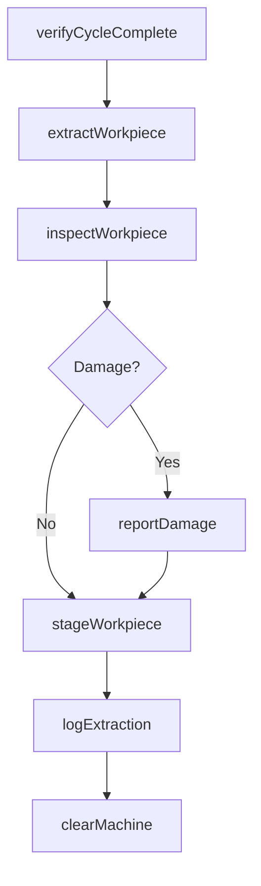
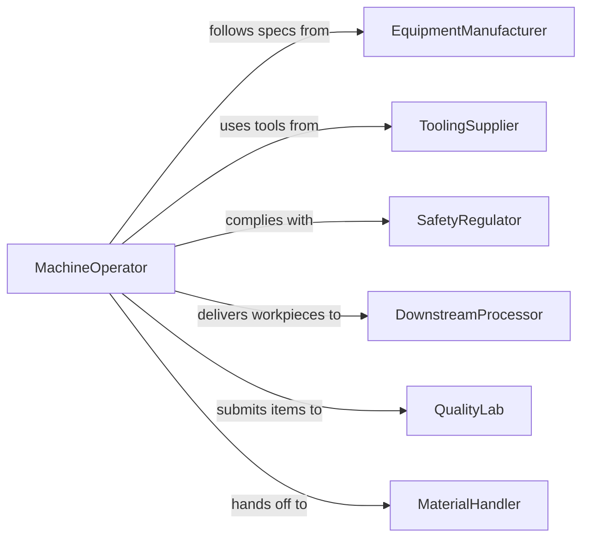

# Remove Products Workpieces Production Equipment

> Business-as-Code definition for removing products or workpieces from production equipment. Models the safe extraction, handling, and staging of finished or in-process items from manufacturing machinery.

## Overview

Removing products and workpieces from production equipment is a critical step in manufacturing workflows where completed or partially completed items must be safely extracted from machines such as CNC mills, lathes, presses, injection molders, and conveyor systems. This definition covers extraction procedures, handling protocols, staging for downstream operations, and tracking of cycle completion across production lines.

## Actors

| Actor | Description |
|-------|-------------|
| EquipmentManufacturer | Provides machine specifications and extraction guidelines |
| ToolingSupplier | Supplies extraction tools, fixtures, and handling aids |
| SafetyRegulator | Enforces workplace safety standards for machine interaction |
| DownstreamProcessor | Receives extracted workpieces for next production stage |
| QualityLab | Performs dimensional and surface quality checks on removed items |
| MaterialHandler | Transports staged workpieces to storage or next operation |

## Roles

| Role | Description |
|------|-------------|
| MachineOperator | Removes workpieces from equipment following standard procedures |
| ProductionSupervisor | Oversees removal operations and ensures cycle time targets |
| QualityInspector | Checks extracted items for damage or dimensional conformance |
| SafetyOfficer | Monitors compliance with lockout-tagout and extraction safety protocols |

## Entities

| Entity | Description |
|--------|-------------|
| Workpiece | The product or part being removed from production equipment |
| ProductionMachine | The equipment from which the workpiece is extracted |
| ExtractionProcedure | Documented steps for safely removing items from a specific machine |
| CycleRecord | Log of production cycle completion and extraction timing |
| StagingArea | Designated location where extracted workpieces are placed |
| HandlingSpec | Requirements for gripping, temperature, and orientation during removal |

## Actions

| Action | Description |
|--------|-------------|
| verifyCycleComplete | Confirm the production cycle has finished before extraction |
| extractWorkpiece | Physically remove the workpiece from the production equipment |
| inspectWorkpiece | Check the extracted item for damage or defects from removal |
| stageWorkpiece | Place the extracted item in the designated staging area |
| logExtraction | Record extraction time, operator, and workpiece details |
| clearMachine | Prepare the equipment for the next production cycle |
| reportDamage | Document any damage to workpiece or equipment during extraction |

## Events

| Event | Description |
|-------|-------------|
| cycleVerified | Production cycle has been confirmed complete |
| workpieceExtracted | Workpiece has been successfully removed from the machine |
| workpieceInspected | Post-extraction inspection has been completed |
| workpieceStaged | Workpiece has been placed in the staging area |
| extractionLogged | Extraction details have been recorded in the production log |
| machineCleared | Equipment has been prepared for the next cycle |
| damageReported | Extraction damage has been documented |

## Searches

| Search | Description |
|--------|-------------|
| findExtractions | List extraction events by machine, operator, or time period |
| getWorkpieces | Retrieve workpieces by status, type, or staging location |
| getCycleTimes | Query extraction cycle times by machine or production run |
| getDamageReports | Find damage incidents by machine, workpiece type, or date |

## Workflow



## Actor Relationships



## Usage

### Calling Actions

```typescript
import { removeProductsWorkpiecesProductionEquipment } from '@headlessly/remove-products-workpieces-production-equipment'

const removal = removeProductsWorkpiecesProductionEquipment()

// Verify cycle is complete before extraction
const cycle = await removal.verifyCycleComplete({
  machineId: 'CNC-HAAS-VF2-007',
  productionRunId: 'PR-2026-0338',
  expectedCycleTime: 240
})

// Extract the workpiece
const extraction = await removal.extractWorkpiece({
  machineId: cycle.machineId,
  workpieceId: 'WP-ALU-BRACKET-1042',
  procedure: 'hydraulic-clamp-release',
  handlingSpec: { gloves: 'heat-resistant', orientation: 'vertical' }
})

// Stage for downstream processing
await removal.stageWorkpiece({
  workpieceId: extraction.workpieceId,
  stagingArea: 'SA-DEBURRING-LINE-3',
  priority: 'standard'
})
```

### Event-Driven Automation

```typescript
// Trigger next production cycle when machine is cleared
removal.machineCleared(async ({ machineId, productionRunId }) => {
  const remainingUnits = await getRemainingUnits(productionRunId)
  if (remainingUnits > 0) {
    await startNextCycle({ machineId, productionRunId })
  }
})

// Alert quality team on extraction damage
removal.damageReported(async ({ workpieceId, machineId, damageType }) => {
  await notify({
    to: 'quality-lab',
    message: `Extraction damage on ${workpieceId} from ${machineId}: ${damageType}`
  })
})
```
