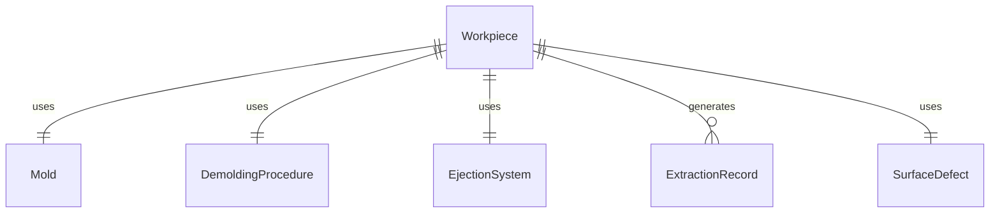
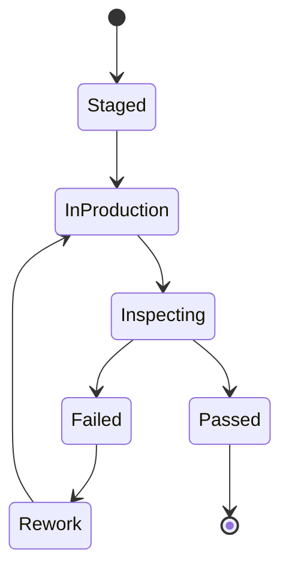
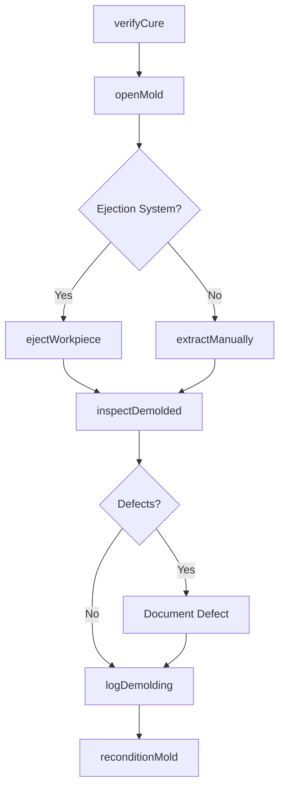
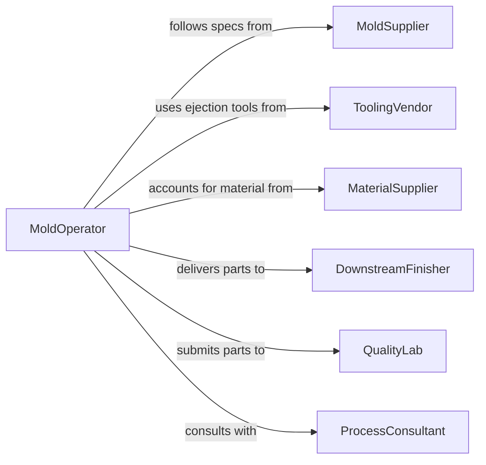

# Remove Workpieces Molds

> Business-as-Code definition for removing workpieces from molds. Models the demolding process including cure verification, extraction technique selection, and post-extraction inspection for cast, molded, and formed products.

## Overview

Removing workpieces from molds is the critical demolding step in casting, injection molding, compression molding, and composite fabrication processes. This definition covers cure or solidification verification, mold opening sequences, workpiece extraction using manual or mechanical methods, post-extraction inspection for surface defects, and mold reconditioning for subsequent cycles. Proper demolding technique prevents part warping, surface marring, and mold damage.

## Actors

| Actor | Description |
|-------|-------------|
| MoldSupplier | Provides molds and demolding specifications |
| ToolingVendor | Supplies ejector pins, air blast systems, and extraction fixtures |
| MaterialSupplier | Provides raw materials whose properties affect demolding behavior |
| DownstreamFinisher | Receives demolded parts for trimming, deburring, or coating |
| QualityLab | Tests demolded parts for dimensional accuracy and surface integrity |
| ProcessConsultant | Advises on demolding techniques to reduce cycle times and defects |

## Roles

| Role | Description |
|------|-------------|
| MoldOperator | Performs the physical demolding and extraction operations |
| ProcessEngineer | Defines demolding parameters and extraction sequences |
| QualityInspector | Examines demolded parts for defects caused during extraction |
| MoldMaintainer | Cleans, inspects, and reconditions molds after each cycle |

## Entities

| Entity | Description |
|--------|-------------|
| Workpiece | The cast, molded, or formed part being extracted from the mold |
| Mold | The forming tool from which the workpiece is removed |
| DemoldingProcedure | Documented sequence for safely extracting workpieces |
| EjectionSystem | Mechanical system (pins, air, hydraulic) used to release the part |
| ExtractionRecord | Log of demolding event including time, method, and outcome |
| SurfaceDefect | Any marring, warping, or damage resulting from the demolding process |

## Actions

| Action | Description |
|--------|-------------|
| verifyCure | Confirm the workpiece has solidified or cured sufficiently for removal |
| openMold | Separate mold halves or remove mold covers to access the workpiece |
| ejectWorkpiece | Activate ejection system to release the workpiece from the mold cavity |
| extractManually | Manually remove the workpiece using hand tools or fixtures |
| inspectDemolded | Check the extracted workpiece for surface defects or dimensional issues |
| reconditionMold | Clean and prepare the mold for the next production cycle |
| logDemolding | Record extraction details for process tracking and quality traceability |

## Events

| Event | Description |
|-------|-------------|
| cureVerified | Workpiece has been confirmed ready for extraction |
| moldOpened | Mold has been separated to allow workpiece access |
| workpieceEjected | Ejection system has released the workpiece from the cavity |
| workpieceExtracted | Workpiece has been fully removed from the mold |
| demoldedInspected | Post-extraction inspection has been completed |
| moldReconditioned | Mold has been cleaned and prepared for next cycle |
| demoldingLogged | Extraction event details have been recorded |

## Searches

| Search | Description |
|--------|-------------|
| findDemoldingRecords | List extraction events by mold, part type, or date range |
| getMoldCycles | Retrieve cycle count and history for a specific mold |
| getSurfaceDefects | Find defect records by part type, mold, or defect category |
| getEjectionParameters | Query ejection settings by mold type or material |


## Entity Relationships



## State Diagram



## Workflow



## Actor Relationships



## Usage

### Calling Actions

```typescript
import { removeWorkpiecesMolds } from '@headlessly/remove-workpieces-molds'

const demolding = removeWorkpiecesMolds()

// Verify cure before extraction
const cureCheck = await demolding.verifyCure({
  moldId: 'MLD-COMP-2200',
  workpieceId: 'WP-EPOXY-PANEL-0087',
  minimumCureTime: 1800,
  temperatureThreshold: 45
})

// Open mold and eject workpiece
await demolding.openMold({
  moldId: 'MLD-COMP-2200',
  separationForce: 'hydraulic',
  openingDistance: 150
})

await demolding.ejectWorkpiece({
  moldId: 'MLD-COMP-2200',
  ejectionMethod: 'air-blast',
  pressure: 4.5,
  duration: 3
})
```

### Event-Driven Automation

```typescript
// Auto-recondition mold after each extraction
demolding.workpieceExtracted(async ({ moldId, cycleNumber }) => {
  await demolding.reconditionMold({
    moldId,
    cleaningMethod: cycleNumber % 10 === 0 ? 'deep-solvent-clean' : 'compressed-air',
    applyRelease: true
  })
})

// Alert engineering on recurring defects
demolding.demoldedInspected(async ({ moldId, workpieceId, defects }) => {
  if (defects.length > 0) {
    const recentDefects = await demolding.getSurfaceDefects({ moldId, lastCycles: 10 })
    if (recentDefects.length > 3) {
      await notify({
        to: 'process-engineering',
        message: `Recurring demolding defects on mold ${moldId} - ${recentDefects.length} in last 10 cycles`
      })
    }
  }
})
```
