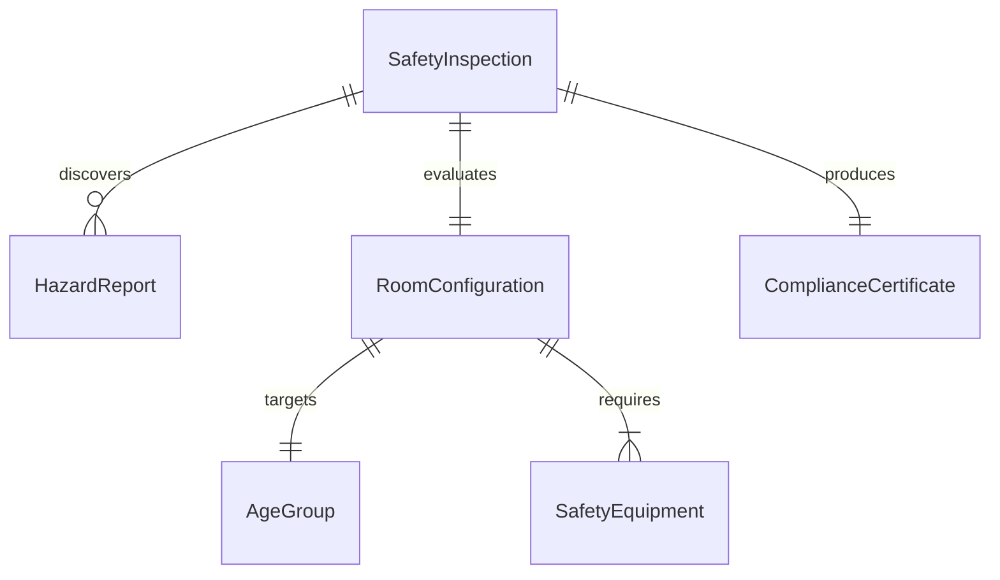
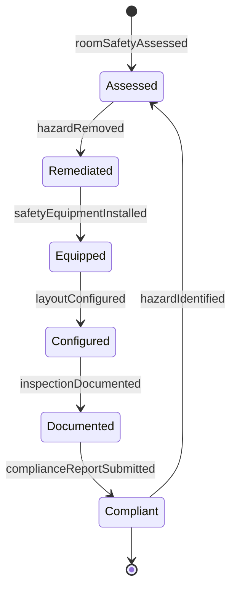
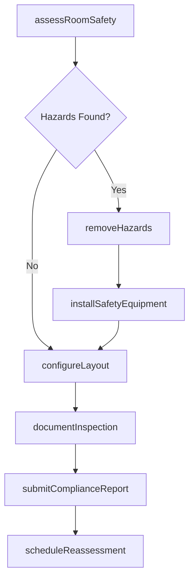
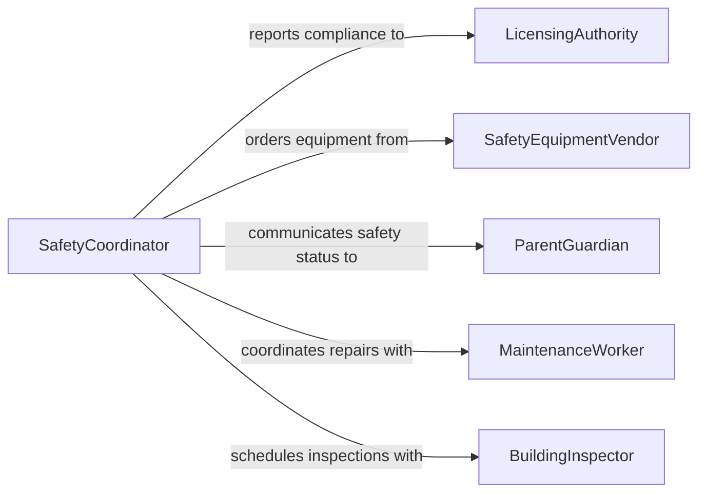

# Arrange Childcare Educational Settings Ensure

> Business-as-Code definition for arranging childcare or educational settings to ensure the physical safety of children. Models the complete process of evaluating, configuring, and maintaining safe environments for young learners.

## Overview

Arranging childcare and educational settings for physical safety involves inspecting facilities, removing hazards, securing furniture and equipment, and configuring spaces so that children can move, play, and learn without risk of injury. This activity covers age-appropriate room layouts, safety gate placement, outlet covers, secure storage of chemicals or sharp objects, and compliance with licensing regulations. It is a continuous process requiring regular reassessment as children grow and room usage changes.

## Actors

| Actor | Description |
|-------|-------------|
| LicensingAuthority | Inspects facilities and enforces childcare safety regulations |
| SafetyEquipmentVendor | Supplies child-proofing products, safety gates, and protective covers |
| ParentGuardian | Provides information about children's specific safety needs or concerns |
| BuildingInspector | Evaluates structural safety and fire code compliance |
| InsuranceProvider | Assesses facility risk and sets coverage requirements |

## Roles

| Role | Description |
|------|-------------|
| ChildcareDirector | Oversees facility safety standards and compliance across all rooms |
| LeadTeacher | Arranges individual classroom environments to meet safety protocols |
| SafetyCoordinator | Conducts routine safety audits and manages hazard remediation |
| MaintenanceWorker | Installs safety hardware, repairs fixtures, and addresses physical hazards |

## Entities

| Entity | Description |
|--------|-------------|
| SafetyInspection | A formal evaluation of a room or facility against safety standards |
| HazardReport | A documented safety concern requiring remediation |
| RoomConfiguration | The layout and arrangement of a specific childcare or classroom space |
| SafetyEquipment | Devices such as safety gates, outlet covers, corner guards, and cabinet locks |
| ComplianceCertificate | Documentation confirming a facility meets regulatory safety requirements |
| AgeGroup | A classification of children by developmental stage affecting room setup requirements |

## Actions

| Action | Description |
|--------|-------------|
| assessRoomSafety | Evaluate a room for potential hazards based on the age group using it |
| installSafetyEquipment | Add or replace child-proofing devices such as gates, locks, and covers |
| removeHazards | Identify and eliminate or secure dangerous items in the environment |
| configureLayout | Arrange furniture and play areas to prevent injuries and allow supervision |
| documentInspection | Record findings from a safety assessment with photos and notes |
| scheduleReassessment | Set a future date for re-evaluating the safety of a configured space |
| submitComplianceReport | File safety documentation with the licensing authority |

## Events

| Event | Description |
|-------|-------------|
| roomSafetyAssessed | A safety evaluation of a room has been completed |
| safetyEquipmentInstalled | Child-proofing devices have been added to the environment |
| hazardRemoved | A documented safety hazard has been eliminated or secured |
| layoutConfigured | Room furniture and equipment have been arranged for safe use |
| inspectionDocumented | Safety assessment findings have been formally recorded |
| complianceReportSubmitted | Required safety documentation has been filed with regulators |
| hazardIdentified | A new safety concern has been discovered during inspection |

## Searches

| Search | Description |
|--------|-------------|
| findOpenHazards | List unresolved hazard reports by room, severity, or date |
| getInspectionHistory | Retrieve past safety inspections for a specific room or facility |
| getComplianceStatus | Check current licensing compliance status for each room |
| findEquipmentByRoom | List installed safety equipment and its condition by location |


## Entity Relationships



## State Diagram



## Workflow



## Actor Relationships



## Usage

### Calling Actions

```typescript
import { arrangeChildcareEducationalSettingsEnsure } from '@headlessly/arrange-childcare-educational-settings-ensure'

const settings = arrangeChildcareEducationalSettingsEnsure()

// Assess room safety for toddlers
const assessment = await settings.assessRoomSafety({
  roomId: 'TODDLER-A',
  ageGroup: '18-36-months',
  inspector: 'safety-coordinator-01'
})

// Install required safety equipment
await settings.installSafetyEquipment({
  roomId: 'TODDLER-A',
  equipment: [
    { type: 'safety-gate', location: 'kitchen-entrance' },
    { type: 'outlet-cover', quantity: 12 },
    { type: 'corner-guard', location: 'activity-tables', quantity: 8 }
  ]
})

// Submit compliance report to licensing authority
await settings.submitComplianceReport({
  facilityId: 'sunshine-learning-center',
  inspectionId: assessment.id,
  regulatoryBody: 'state-childcare-licensing'
})
```

### Event-Driven Automation

```typescript
// Escalate high-severity hazards immediately
settings.hazardIdentified(async ({ roomId, hazardType, severity }) => {
  if (severity === 'critical') {
    await notify({
      to: 'childcare-director',
      message: `Critical hazard in ${roomId}: ${hazardType} - room closed pending remediation`
    })
    await settings.configureLayout({ roomId, status: 'closed' })
  }
})

// Auto-schedule reassessment after equipment installation
settings.safetyEquipmentInstalled(async ({ roomId, installedAt }) => {
  await settings.scheduleReassessment({
    roomId,
    reassessDate: addDays(installedAt, 30)
  })
})
```
