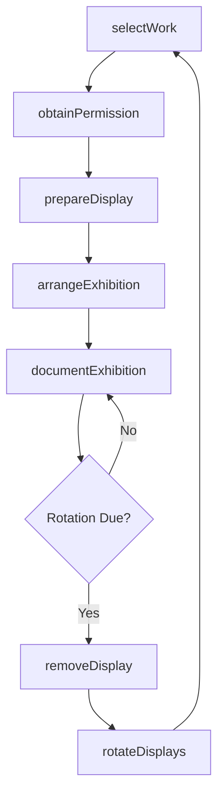
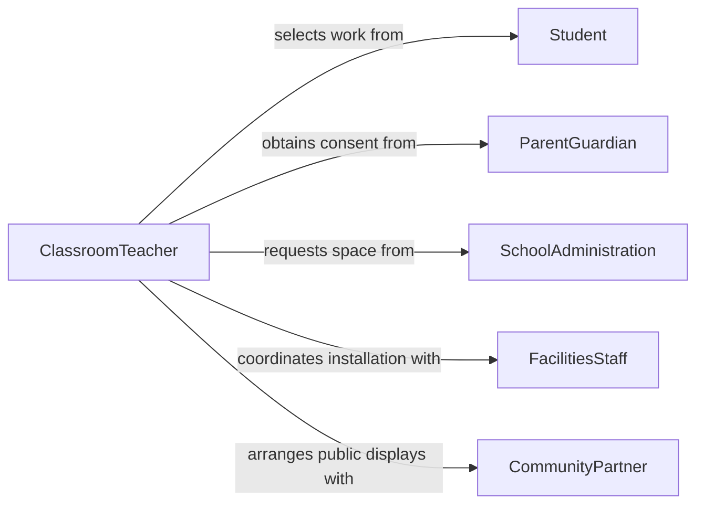

# Display Student Work

> Business-as-Code definition for displaying student work. Models the workflow for selecting, curating, mounting, and showcasing student projects, artwork, and academic achievements in educational settings.

## Overview

Displaying student work involves selecting exemplary student projects, artwork, writing samples, and academic achievements for presentation in classrooms, hallways, school lobbies, and digital portfolios. This activity supports student motivation, celebrates accomplishment, and communicates learning outcomes to parents and the school community. The definition provides actions for work selection, display preparation, and exhibition management, along with events for tracking display rotations and student recognition.

## Actors

| Actor | Description |
|-------|-------------|
| Student | Creates the work to be displayed and grants permission for exhibition |
| ParentGuardian | Views displayed work and attends exhibition events |
| SchoolAdministration | Establishes display policies and allocates exhibition spaces |
| FacilitiesStaff | Installs bulletin boards, display cases, and mounting hardware |
| CommunityPartner | Sponsors exhibitions or provides public display venues |

## Roles

| Role | Description |
|------|-------------|
| ClassroomTeacher | Selects student work and arranges classroom displays |
| ArtInstructor | Curates student artwork for hallway and gallery exhibitions |
| MediaSpecialist | Manages digital portfolio platforms and online display galleries |
| DisplayCoordinator | Plans school-wide display rotations and exhibition schedules |

## Entities

| Entity | Description |
|--------|-------------|
| StudentWork | A piece of student-created content such as an essay, project, or artwork |
| DisplaySpace | A physical or digital location designated for exhibiting work |
| Exhibition | A curated collection of student work organized around a theme or event |
| MountingMaterial | Backing boards, frames, labels, and hanging supplies |
| DisplaySchedule | A rotation plan specifying which work appears in which space and when |
| RecognitionRecord | Documentation of displayed work linked to student achievement records |

## Actions

| Action | Description |
|--------|-------------|
| selectWork | Choose exemplary student work for display based on quality and criteria |
| obtainPermission | Secure student and parent consent for public exhibition |
| prepareDisplay | Mount, frame, or format selected work with labels and descriptions |
| arrangeExhibition | Install prepared work in designated display spaces |
| rotateDisplays | Replace current displays with new selections on a scheduled basis |
| documentExhibition | Photograph and catalog displayed work for digital archives |
| removeDisplay | Take down expired displays and return work to students |

## Events

| Event | Description |
|-------|-------------|
| workSelected | Student work chosen for display |
| permissionObtained | Consent received from student and parent for exhibition |
| displayPrepared | Work mounted, labeled, and ready for installation |
| exhibitionArranged | Display installed and visible to the school community |
| displayRotated | Previous work replaced with new selections |
| exhibitionDocumented | Photographs and records of the display archived |
| displayRemoved | Work taken down and returned to students |

## Searches

| Search | Description |
|--------|-------------|
| findStudentWork | List available student work by subject, grade level, or quality rating |
| getDisplaySchedule | Retrieve the current and upcoming display rotation calendar |
| getExhibitionHistory | Look up past exhibitions by theme, date, or display space |
| findDisplaySpaces | Search available physical and digital display locations |

## Workflow



## Actor Relationships



## Usage

### Calling Actions

```typescript
import { displayStudentWork } from '@headlessly/display-student-work'

const displays = displayStudentWork()

// Select student work for a science fair display
const selected = await displays.selectWork({
  classId: 'bio-101-period-3',
  criteria: 'science-fair-winners',
  gradeLevel: 10,
  maxItems: 12
})

// Prepare the display with mounting and labels
await displays.prepareDisplay({
  workIds: selected.map(w => w.id),
  mountingType: 'foam-board',
  includeLabels: true,
  labelFields: ['studentName', 'projectTitle', 'award']
})

// Arrange in the main hallway exhibition space
await displays.arrangeExhibition({
  displaySpaceId: 'main-hallway-north',
  theme: 'Spring Science Fair 2026',
  startDate: '2026-04-01',
  endDate: '2026-04-30'
})
```

### Event-Driven Automation

```typescript
// Notify parents when their child's work is displayed
displays.exhibitionArranged(async ({ workIds, displaySpace, theme }) => {
  for (const workId of workIds) {
    const work = await getWorkDetails(workId)
    await notify({
      to: work.parentEmail,
      message: `${work.studentName}'s work is now on display: "${theme}" in ${displaySpace}`
    })
  }
})

// Archive display when rotation is due
displays.displayRemoved(async ({ exhibitionId, workIds }) => {
  await displays.documentExhibition({
    exhibitionId,
    workIds,
    archivePhotos: true
  })
})
```
