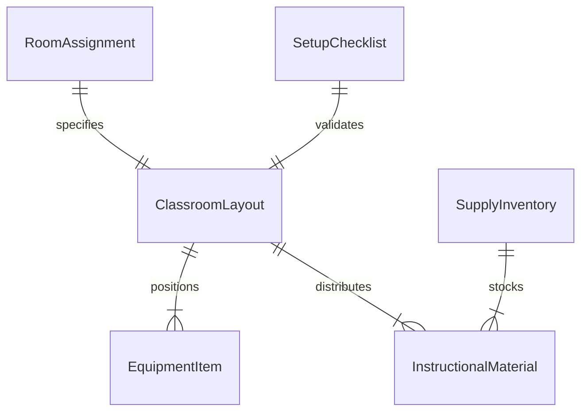
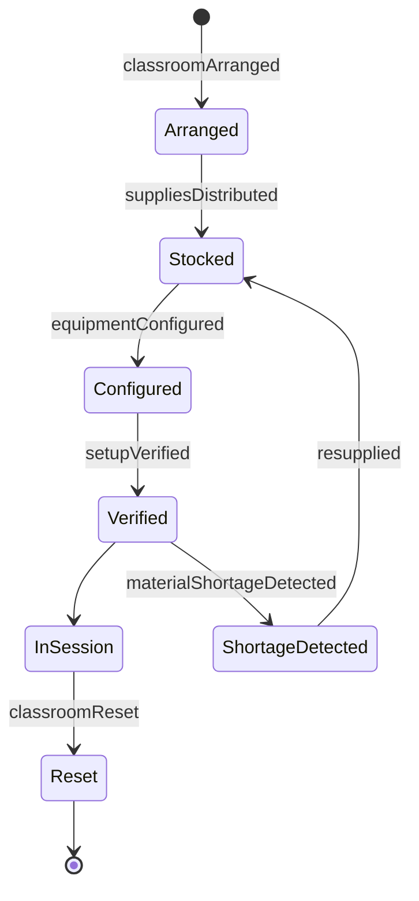
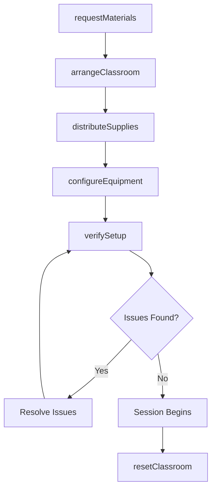
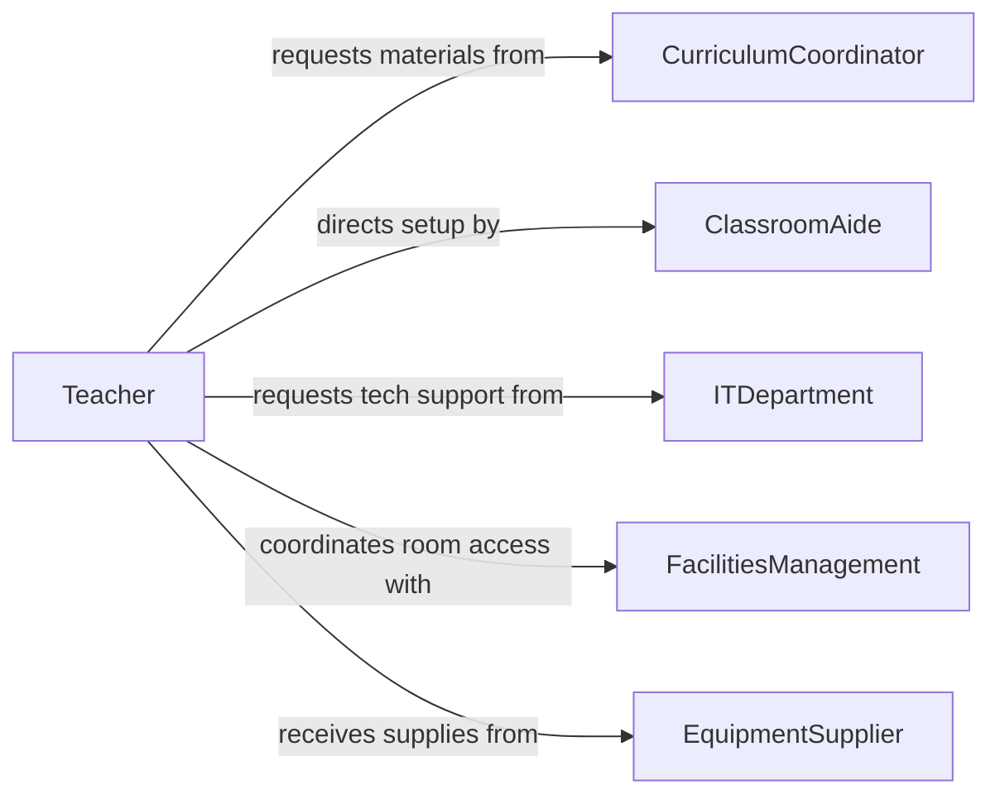

# Set Up Classroom Materials Equipment

> Business-as-Code definition for setting up classroom materials or equipment. Models the process of preparing instructional spaces with the appropriate tools, supplies, and technology for effective learning.

## Overview

Setting up classroom materials or equipment involves preparing learning environments by arranging desks, distributing supplies, configuring audiovisual technology, and organizing instructional aids before classes or training sessions begin. This activity ensures that educators and students have the physical resources needed for planned lessons and activities. It spans everything from laying out lab equipment for science courses to configuring projectors and interactive whiteboards for presentations.

## Actors

| Actor | Description |
|-------|-------------|
| EquipmentSupplier | Provides classroom technology, furniture, and instructional tools |
| FacilitiesManagement | Maintains building infrastructure and room assignments |
| ITDepartment | Supports technology setup including projectors, computers, and networks |
| ParentVolunteer | Assists with classroom preparation for special events or activities |
| CurriculumCoordinator | Specifies required materials based on lesson plans and standards |

## Roles

| Role | Description |
|------|-------------|
| Teacher | Plans lessons and directs how materials and equipment should be arranged |
| ClassroomAide | Physically sets up and organizes materials under teacher guidance |
| LabTechnician | Prepares specialized equipment for science, computer, or vocational labs |
| MediaSpecialist | Configures audiovisual and digital learning equipment |

## Entities

| Entity | Description |
|--------|-------------|
| ClassroomLayout | The spatial arrangement of furniture, stations, and equipment in a room |
| InstructionalMaterial | Physical or digital resources used during instruction |
| EquipmentItem | A specific device or tool such as a projector, microscope, or whiteboard |
| SetupChecklist | A task list ensuring all required materials are prepared and functional |
| RoomAssignment | The scheduled allocation of a specific space for a class or activity |
| SupplyInventory | Tracked stock of consumable classroom supplies |

## Actions

| Action | Description |
|--------|-------------|
| arrangeClassroom | Configure desks, chairs, and stations according to the lesson layout |
| distributeSupplies | Hand out materials such as textbooks, worksheets, or lab kits to stations |
| configureEquipment | Set up and test projectors, computers, or lab instruments |
| verifySetup | Confirm all items on the setup checklist are in place and operational |
| resetClassroom | Return the room to its default configuration after a session |
| requestMaterials | Submit a request for additional supplies or replacement equipment |
| lockdownEquipment | Secure expensive or sensitive equipment after use |

## Events

| Event | Description |
|-------|-------------|
| classroomArranged | The room layout has been configured for the upcoming session |
| suppliesDistributed | All instructional materials have been placed at student stations |
| equipmentConfigured | Technology and lab equipment have been set up and tested |
| setupVerified | The setup checklist has been completed and confirmed |
| classroomReset | The room has been returned to its default layout |
| materialShortageDetected | Required supplies are missing or insufficient for the session |
| equipmentMalfunctionReported | A piece of equipment has been found non-functional during setup |

## Searches

| Search | Description |
|--------|-------------|
| findRoomAssignments | List classroom assignments by date, instructor, or course |
| getEquipmentStatus | Retrieve operational status and location of specific equipment items |
| getSupplyLevels | Check current inventory of consumable classroom supplies |
| findSetupChecklists | Locate setup checklists by course type or room |


## Entity Relationships



## State Diagram



## Workflow



## Actor Relationships



## Usage

### Calling Actions

```typescript
import { setUpClassroomMaterialsEquipment } from '@headlessly/set-up-classroom-materials-equipment'

const classroom = setUpClassroomMaterialsEquipment()

// Arrange a classroom for a science lab
const layout = await classroom.arrangeClassroom({
  roomId: 'SCI-204',
  layoutType: 'lab-stations',
  stations: 8,
  date: '2026-03-15'
})

// Configure equipment at each station
await classroom.configureEquipment({
  roomId: 'SCI-204',
  equipment: [
    { type: 'microscope', quantity: 8, calibrated: true },
    { type: 'projector', source: 'laptop-hdmi' }
  ]
})

// Verify the complete setup
const verification = await classroom.verifySetup({
  roomId: 'SCI-204',
  checklistId: 'biology-101-lab'
})
```

### Event-Driven Automation

```typescript
// Alert when supplies are running low
classroom.materialShortageDetected(async ({ roomId, material, currentStock }) => {
  await notify({
    to: 'supply-coordinator',
    message: `Low stock of ${material} in room ${roomId}: ${currentStock} remaining`
  })
})

// Auto-generate reset task after session ends
classroom.setupVerified(async ({ roomId, sessionEndTime }) => {
  await scheduleTask({
    action: 'resetClassroom',
    roomId,
    scheduledAt: sessionEndTime
  })
})
```
