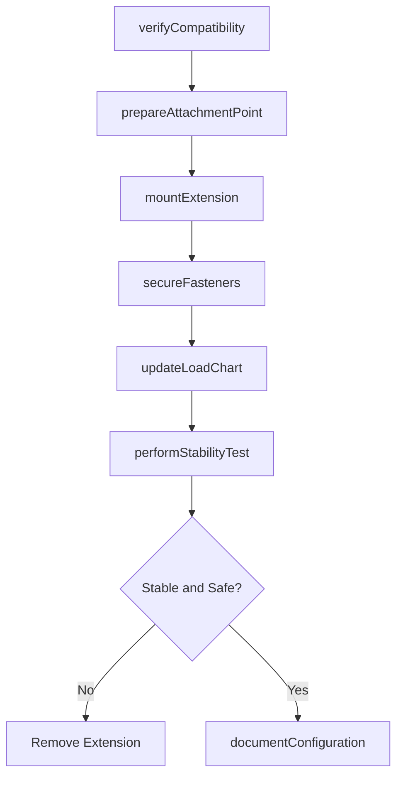
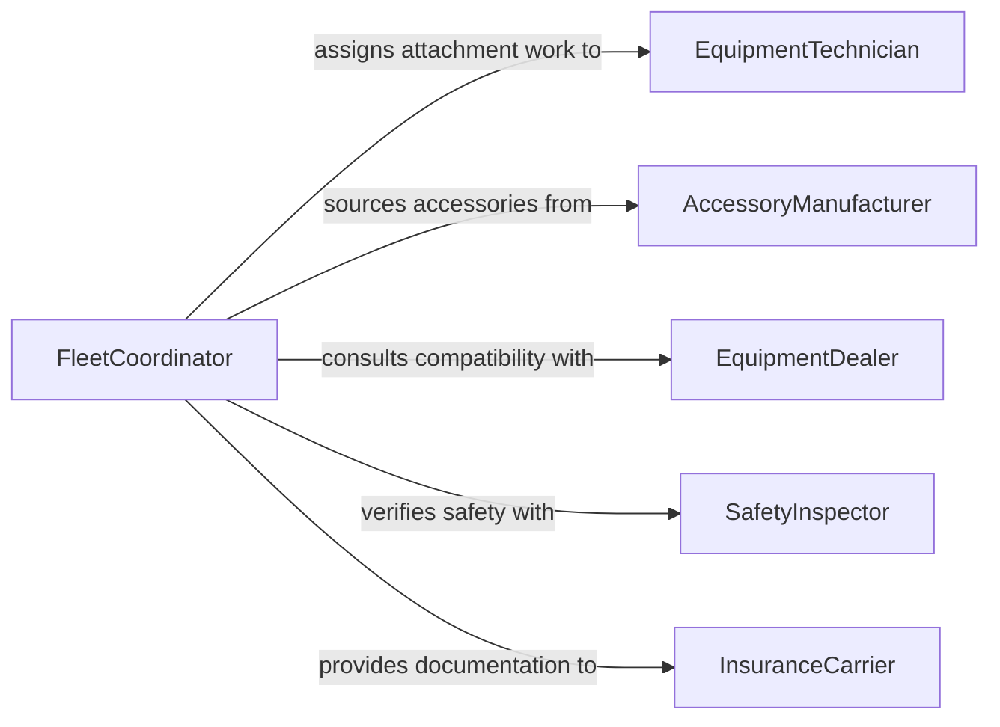

# Attach Equipment Extensions Accessories

> Business-as-Code definition for attaching equipment extensions or accessories. Models the process of mounting auxiliary devices, reach extensions, and supplementary accessories onto equipment to enhance capability or adapt it for specific tasks.

## Overview

Attaching equipment extensions or accessories involves connecting add-on devices such as boom extensions, tool adapters, material handling arms, lighting rigs, dust collection attachments, and other supplementary components to base equipment. This activity expands the operational reach, precision, or versatility of machinery across construction, manufacturing, agriculture, and utility maintenance contexts. Workers verify compatibility, secure mechanical connections, and test the extended configuration to ensure safe operation within rated load limits.

## Actors

| Actor | Description |
|-------|-------------|
| AccessoryManufacturer | Produces extensions, adapters, and supplementary devices |
| EquipmentDealer | Advises on compatible accessories and provides installation support |
| ProjectManager | Determines which accessories are needed for specific job requirements |
| SafetyEngineer | Reviews load ratings and stability analysis for extended configurations |
| InsuranceCarrier | Requires documentation of approved accessory installations |

## Roles

| Role | Description |
|------|-------------|
| EquipmentTechnician | Mounts and secures extensions and accessories on equipment |
| Operator | Uses the equipment in its extended configuration during operations |
| FleetCoordinator | Manages accessory inventory and tracks equipment configurations |
| SafetyInspector | Verifies that extended configurations meet load and stability ratings |

## Entities

| Entity | Description |
|--------|-------------|
| Extension | A device that increases the reach or range of the base equipment |
| Accessory | A supplementary device that adds capability to the equipment |
| BaseEquipment | The primary machine receiving the extension or accessory |
| CompatibilityRecord | Documentation confirming the accessory is approved for the equipment |
| LoadChart | The rated capacity table adjusted for the extended configuration |
| AttachmentPoint | The mechanical interface where the extension connects to the equipment |

## Actions

| Action | Description |
|--------|-------------|
| verifyCompatibility | Confirm the extension or accessory is approved for the base equipment |
| prepareAttachmentPoint | Inspect and clean the connection interface on the equipment |
| mountExtension | Physically attach the extension or accessory to the equipment |
| secureFasteners | Tighten bolts, pins, and locking mechanisms to specification |
| updateLoadChart | Adjust the rated capacity based on the extended configuration |
| performStabilityTest | Verify that the equipment remains stable with the accessory attached |
| documentConfiguration | Record the installed accessories and updated operating parameters |

## Events

| Event | Description |
|-------|-------------|
| compatibilityVerified | The extension has been confirmed as approved for the equipment |
| attachmentPointPrepared | The connection interface has been inspected and readied |
| extensionMounted | The extension or accessory has been physically attached |
| fastenersSecured | All bolts and locking mechanisms have been tightened to specification |
| loadChartUpdated | The rated capacity has been adjusted for the extended configuration |
| stabilityTestPassed | The equipment has been verified stable in the extended configuration |
| configurationRejected | The extension fails compatibility, load, or stability requirements |

## Searches

| Search | Description |
|--------|-------------|
| findCompatibleAccessories | Retrieve extensions and accessories approved for a specific equipment model |
| getConfigurationHistory | List past accessory installations by equipment or date |
| getLoadCharts | Retrieve adjusted capacity tables by equipment and extension combination |

## Workflow



## Actor Relationships



## Usage

### Calling Actions

```typescript
import { attachEquipmentExtensionsAccessories } from '@headlessly/attach-equipment-extensions-accessories'

const extensions = attachEquipmentExtensionsAccessories()

// Verify compatibility of a boom extension
const compatibility = await extensions.verifyCompatibility({
  baseEquipmentId: 'telehandler-JLG-1055',
  extensionId: 'boom-ext-15ft-rated',
  manufacturer: 'JLG',
  modelYear: 2024
})

// Mount the extension
await extensions.mountExtension({
  baseEquipmentId: 'telehandler-JLG-1055',
  extensionId: 'boom-ext-15ft-rated',
  attachmentPoint: 'boom-tip-flange',
  pins: ['lock-pin-A', 'lock-pin-B']
})

// Secure and update capacity
await extensions.secureFasteners({
  baseEquipmentId: 'telehandler-JLG-1055',
  fasteners: [
    { location: 'flange-bolt-1', torque: 180, unit: 'ft-lb' },
    { location: 'flange-bolt-2', torque: 180, unit: 'ft-lb' },
    { location: 'safety-pin', type: 'cotter', verified: true }
  ]
})

await extensions.updateLoadChart({
  baseEquipmentId: 'telehandler-JLG-1055',
  extensionId: 'boom-ext-15ft-rated',
  reducedCapacity: { maxLoad: 4000, unit: 'lbs', atRadius: 45 }
})

// Perform stability test
await extensions.performStabilityTest({
  baseEquipmentId: 'telehandler-JLG-1055',
  testLoad: 3200,
  testRadius: 40,
  result: 'pass'
})
```

### Event-Driven Automation

```typescript
// Block operation when configuration is rejected
extensions.configurationRejected(async ({ baseEquipmentId, extensionId, reason }) => {
  await lockoutEquipment({
    equipmentId: baseEquipmentId,
    reason: `Extension ${extensionId} rejected: ${reason}`,
    lockType: 'administrative'
  })
  await notify({
    to: 'fleet-coordinator',
    message: `Extension rejected on ${baseEquipmentId}: ${reason}`
  })
})

// Update fleet records when configuration is documented
extensions.stabilityTestPassed(async ({ baseEquipmentId, extensionId }) => {
  await updateFleetConfiguration({
    equipmentId: baseEquipmentId,
    activeExtension: extensionId,
    status: 'approved-for-operation',
    verifiedAt: new Date().toISOString()
  })
})
```
