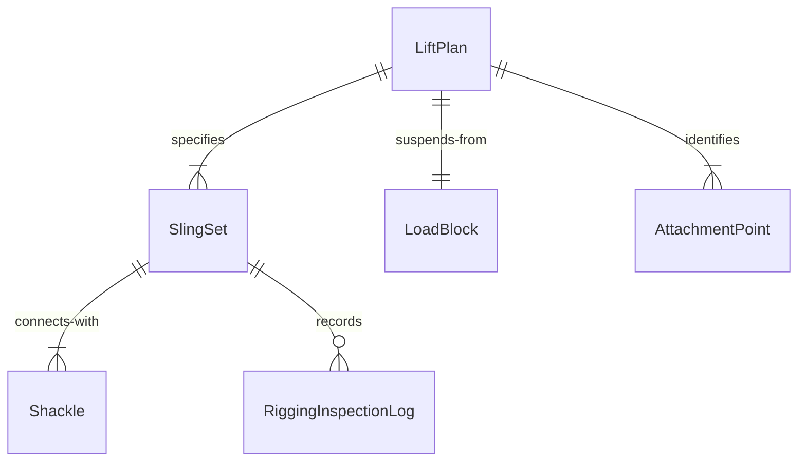
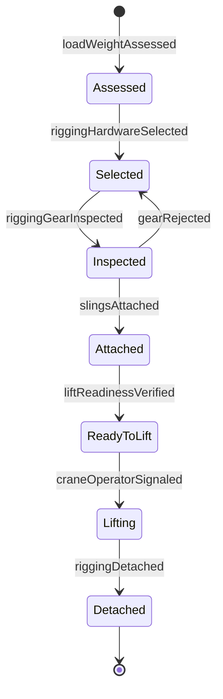
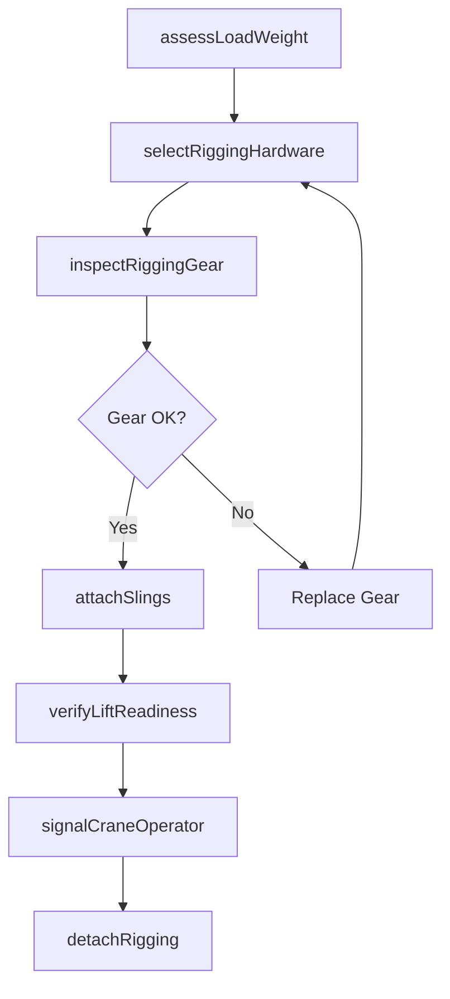
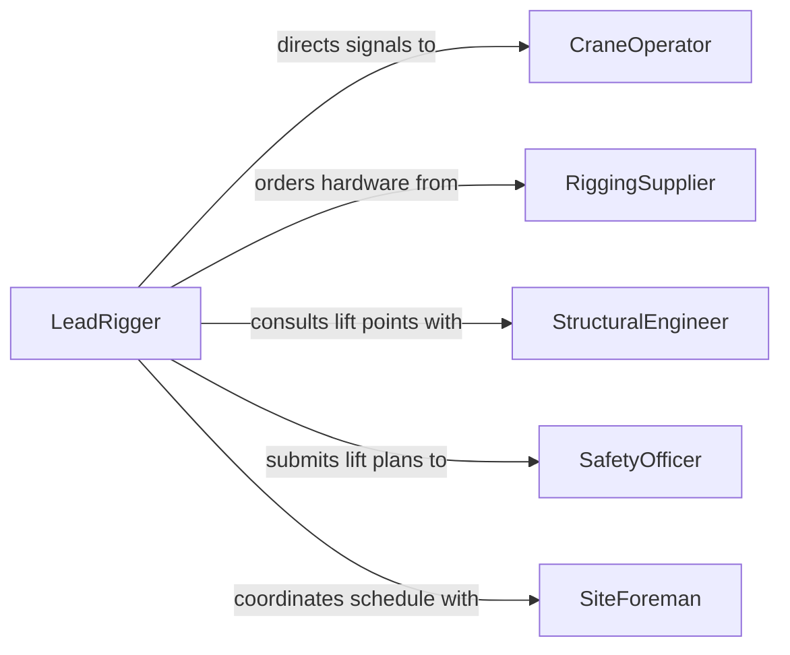

# Attach Rigging Objects So They

> Business-as-Code definition for attaching rigging to objects so they can be moved. Models the process of selecting, inspecting, and securing slings, chains, and lifting hardware to loads for safe crane and hoist operations.

## Overview

Attaching rigging to objects for movement involves assessing load weight and center of gravity, selecting appropriate slings and hardware, and securing attachment points to ensure the load can be lifted and transported without shifting or falling. Riggers must calculate sling angles, verify rated capacities, and communicate with crane operators using standardized hand signals or radio protocols. This activity is essential in construction, manufacturing, and logistics wherever heavy or awkward loads must be relocated by mechanical lifting.

## Actors

| Actor | Description |
|-------|-------------|
| CraneOperator | Operates the crane or hoist that lifts and moves the rigged load |
| RiggingSupplier | Provides slings, shackles, chains, and specialized lifting devices |
| StructuralEngineer | Certifies lift points on building components and structural steel |
| SafetyOfficer | Enforces site rigging safety regulations and reviews lift plans |
| SiteForeman | Coordinates rigging activities within the broader construction schedule |

## Roles

| Role | Description |
|------|-------------|
| LeadRigger | Plans the rigging configuration and directs the attachment of hardware to the load |
| SignalPerson | Communicates between the rigging crew and crane operator during lifts |
| RiggingInspector | Examines slings, shackles, and hardware for wear, damage, and certification |
| LiftPlanner | Develops detailed lift plans including load calculations and rigging diagrams |

## Entities

| Entity | Description |
|--------|-------------|
| LiftPlan | A documented plan specifying load weight, rigging configuration, and crane capacity |
| SlingSet | A matched group of slings rated for a specific load capacity and angle |
| Shackle | A U-shaped metal connector used to join slings to lift points |
| LoadBlock | The component on the crane from which slings are suspended |
| AttachmentPoint | A certified location on the load where rigging hardware is secured |
| RiggingInspectionLog | A record of hardware inspections, defect findings, and certifications |

## Actions

| Action | Description |
|--------|-------------|
| assessLoadWeight | Determine the total weight and center of gravity of the object to be moved |
| selectRiggingHardware | Choose slings, shackles, and connectors based on load requirements and sling angles |
| inspectRiggingGear | Examine all hardware for wear, corrosion, and valid inspection tags |
| attachSlings | Secure slings to the load's certified attachment points |
| verifyLiftReadiness | Confirm that rigging is correctly attached and all personnel are clear |
| signalCraneOperator | Communicate lift, swing, and set commands using standard hand signals or radio |
| detachRigging | Remove slings and hardware from the load after it has been safely placed |

## Events

| Event | Description |
|-------|-------------|
| loadWeightAssessed | Load weight and center of gravity have been determined |
| riggingHardwareSelected | Appropriate slings and connectors have been chosen for the lift |
| riggingGearInspected | All hardware has been examined and cleared for use |
| slingsAttached | Slings have been secured to the load's attachment points |
| liftReadinessVerified | Pre-lift checks are complete and the load is cleared for hoisting |
| craneOperatorSignaled | Lift commands have been communicated to the crane operator |
| riggingDetached | All hardware has been removed from the load after placement |

## Searches

| Search | Description |
|--------|-------------|
| findLiftPlans | List lift plans by date, crane, or load type |
| getSlingInventory | Retrieve available sling sets by capacity, length, and inspection status |
| getInspectionLogs | Look up rigging inspection records by hardware serial number or date |


## Entity Relationships



## State Diagram



## Workflow



## Actor Relationships



## Usage

### Calling Actions

```typescript
import { attachRiggingObjectsSoThey } from '@headlessly/attach-rigging-objects-so-they'

const rigging = attachRiggingObjectsSoThey()

// Assess the load before rigging
const load = await rigging.assessLoadWeight({
  objectDescription: 'Steel I-beam, 40ft',
  estimatedWeightLbs: 12000,
  centerOfGravity: { offsetFromCenter: '2ft-left' }
})

// Select appropriate rigging hardware
const hardware = await rigging.selectRiggingHardware({
  loadId: load.id,
  slingAngle: 60,
  requiredCapacity: 14000,
  slingType: 'wire-rope'
})

// Attach slings and verify lift readiness
await rigging.attachSlings({
  loadId: load.id,
  slingSetId: hardware.slingSetId,
  attachmentPoints: ['north-lug', 'south-lug']
})

await rigging.verifyLiftReadiness({
  loadId: load.id,
  craneId: 'CRANE-200T-01'
})
```

### Event-Driven Automation

```typescript
// Notify crane operator when rigging is verified
rigging.liftReadinessVerified(async ({ loadId, craneId }) => {
  await notify({
    to: `crane-operator-${craneId}`,
    message: `Load ${loadId} rigging verified -- ready to hoist`
  })
})

// Log detachment and update sling usage records
rigging.riggingDetached(async ({ slingSetId, loadWeightLbs, liftDuration }) => {
  await updateSlingUsageLog({
    slingSetId,
    loadWeightLbs,
    liftDuration,
    completedAt: new Date()
  })
})
```
