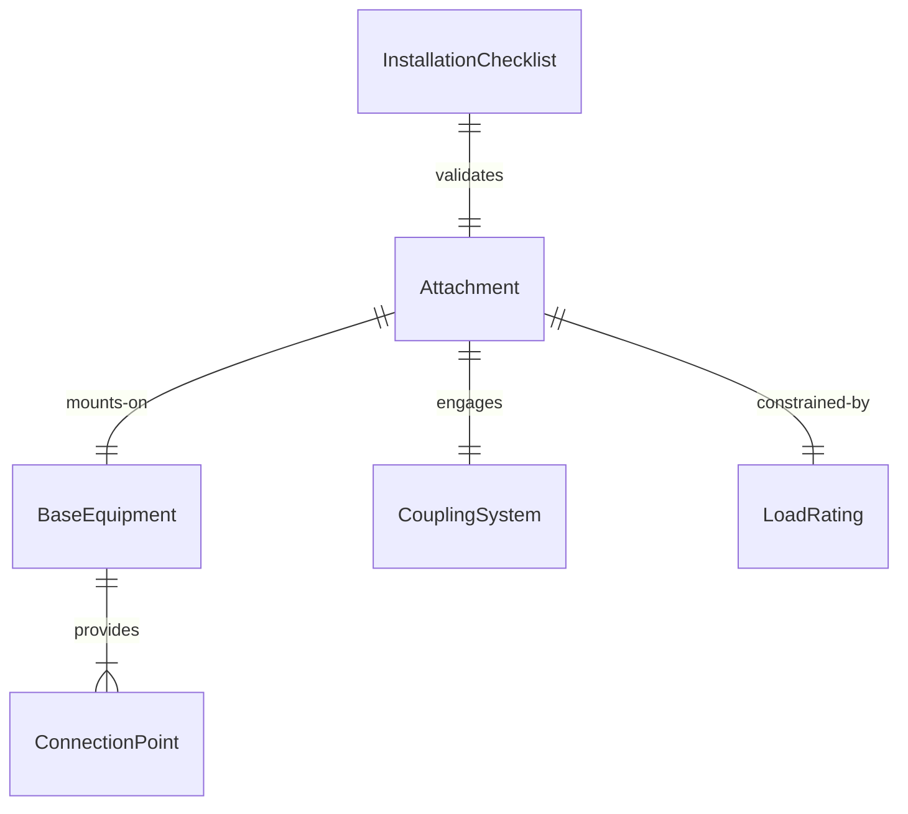
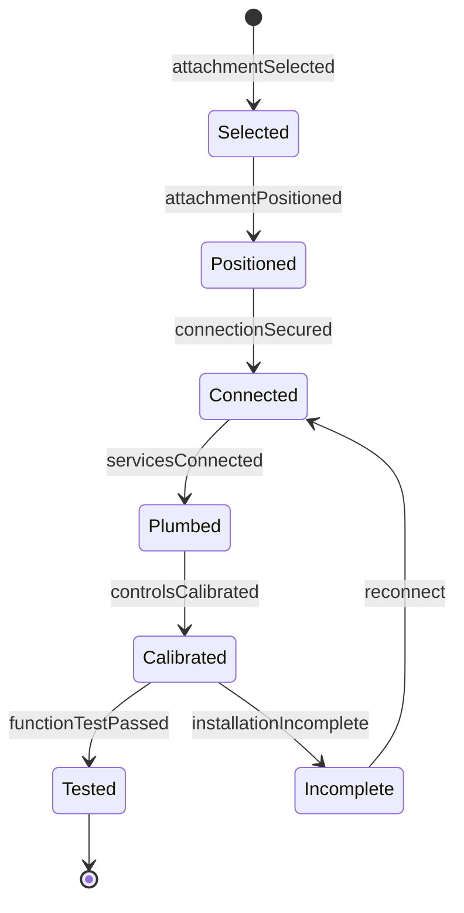
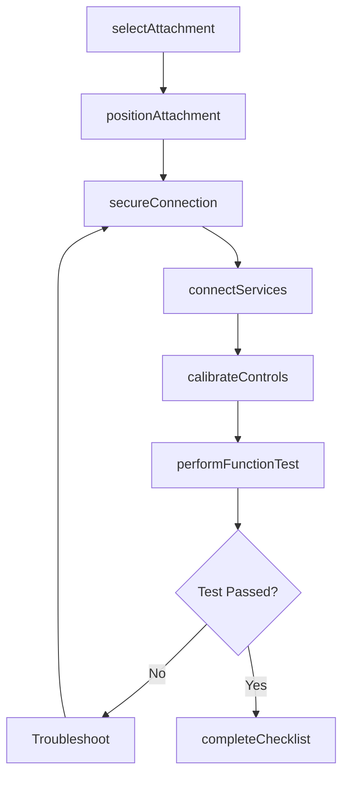
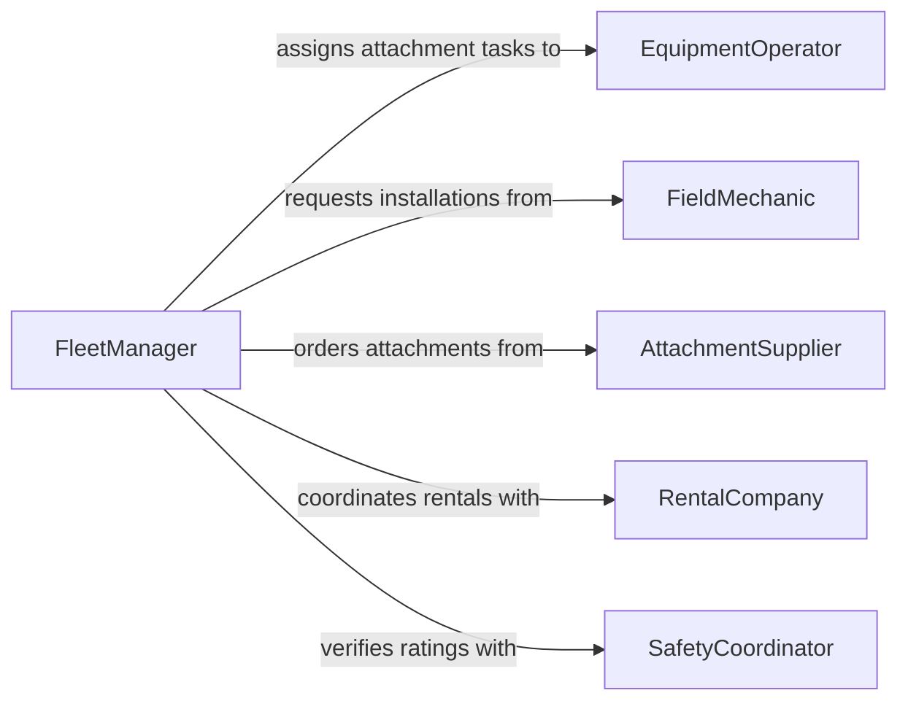

# Install Equipment Attachments Components

> Business-as-Code definition for installing equipment attachments or components. Models the process of mounting, connecting, and configuring attachments and peripheral components on machinery and equipment to expand or modify operational capability.

## Overview

Installing equipment attachments or components involves mounting accessories, tooling, and peripheral devices onto machinery to prepare it for specific tasks. This activity spans construction equipment (buckets, blades, augers), agricultural machinery (planters, headers, sprayers), manufacturing equipment (tool holders, chucks, dies), and general industrial applications. Operators and technicians follow equipment manuals and safety protocols to connect hydraulic lines, electrical harnesses, and mechanical fasteners, then verify that attachments function correctly before use.

## Actors

| Actor | Description |
|-------|-------------|
| AttachmentSupplier | Manufactures and distributes equipment attachments and accessories |
| EquipmentDealer | Provides equipment, attachments, and installation support |
| RentalCompany | Rents specialized attachments for short-term project needs |
| EquipmentOwner | Specifies which attachments are needed for upcoming work |
| SafetyRegulator | Sets standards for attachment installation and load ratings |

## Roles

| Role | Description |
|------|-------------|
| EquipmentOperator | Mounts attachments and operates equipment in the field |
| FieldMechanic | Performs complex attachment installations requiring technical skill |
| FleetManager | Tracks attachment inventory and assigns equipment configurations |
| SafetyCoordinator | Verifies that attachment installations meet load and safety ratings |

## Entities

| Entity | Description |
|--------|-------------|
| Attachment | A device mounted on equipment to perform a specific function |
| BaseEquipment | The primary machine receiving the attachment installation |
| CouplingSystem | The mechanical or hydraulic interface connecting attachment to equipment |
| InstallationChecklist | A step-by-step verification form for the attachment installation |
| LoadRating | The maximum safe operating capacity for the attached configuration |
| ConnectionPoint | A hydraulic, electrical, or mechanical interface on the equipment |

## Actions

| Action | Description |
|--------|-------------|
| selectAttachment | Choose the correct attachment for the equipment and task |
| positionAttachment | Align the attachment with the equipment coupling system |
| secureConnection | Fasten mechanical pins, bolts, or quick-couplers to lock the attachment |
| connectServices | Attach hydraulic hoses, electrical connectors, or pneumatic lines |
| calibrateControls | Adjust operator controls to match the installed attachment |
| performFunctionTest | Operate the attachment through its full range to verify performance |
| completeChecklist | Sign off the installation checklist confirming all steps are complete |

## Events

| Event | Description |
|-------|-------------|
| attachmentSelected | The correct attachment has been identified for the task |
| attachmentPositioned | The attachment has been aligned with the equipment coupler |
| connectionSecured | Mechanical fasteners have been engaged and locked |
| servicesConnected | Hydraulic, electrical, or pneumatic lines have been attached |
| controlsCalibrated | Operator controls have been adjusted for the new attachment |
| functionTestPassed | The attachment has operated correctly through its full range |
| installationIncomplete | A required step in the installation checklist has not been satisfied |

## Searches

| Search | Description |
|--------|-------------|
| findAttachments | Retrieve available attachments by type, compatibility, or location |
| getInstallationHistory | List past attachment installations by equipment or date |
| getEquipmentConfigurations | View current attachment setups across the equipment fleet |


## Entity Relationships



## State Diagram



## Workflow



## Actor Relationships



## Usage

### Calling Actions

```typescript
import { installEquipmentAttachmentsComponents } from '@headlessly/install-equipment-attachments-components'

const install = installEquipmentAttachmentsComponents()

// Select and position an attachment
const attachment = await install.selectAttachment({
  baseEquipmentId: 'excavator-CAT-320-07',
  taskType: 'trenching',
  attachmentType: 'bucket',
  width: 24
})

await install.positionAttachment({
  baseEquipmentId: 'excavator-CAT-320-07',
  attachmentId: attachment.id,
  couplingType: 'quick-coupler-S70'
})

// Secure and connect
await install.secureConnection({
  baseEquipmentId: 'excavator-CAT-320-07',
  attachmentId: attachment.id,
  pins: ['retain-pin-left', 'retain-pin-right'],
  lockVerified: true
})

await install.connectServices({
  baseEquipmentId: 'excavator-CAT-320-07',
  attachmentId: attachment.id,
  connections: [
    { type: 'hydraulic', port: 'aux-1', pressure: 3500 },
    { type: 'hydraulic', port: 'aux-2', pressure: 3500 }
  ]
})

// Test and complete
await install.performFunctionTest({
  baseEquipmentId: 'excavator-CAT-320-07',
  attachmentId: attachment.id,
  testSequence: ['curl-in', 'curl-out', 'float', 'full-cycle']
})
```

### Event-Driven Automation

```typescript
// Alert when installation is incomplete
install.installationIncomplete(async ({ baseEquipmentId, attachmentId, missingStep }) => {
  await notify({
    to: 'field-mechanic',
    message: `Installation incomplete on ${baseEquipmentId}: ${missingStep} not verified`
  })
})

// Update fleet records when function test passes
install.functionTestPassed(async ({ baseEquipmentId, attachmentId }) => {
  await updateFleetConfiguration({
    equipmentId: baseEquipmentId,
    currentAttachment: attachmentId,
    status: 'ready-for-operation',
    installedAt: new Date().toISOString()
  })
})
```
