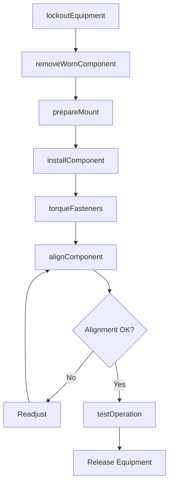
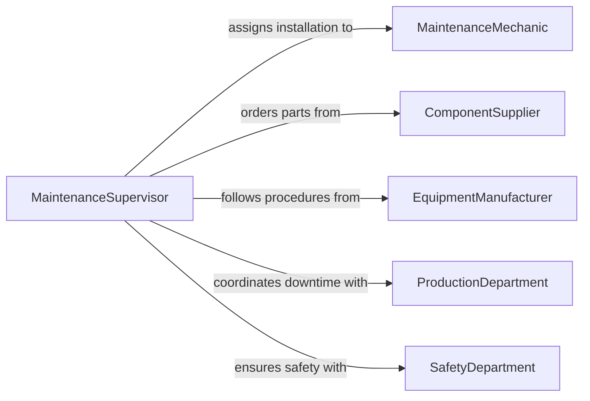

# Install Mechanical Components Production Equipment

> Business-as-Code definition for installing mechanical components in production equipment. Models the process of fitting gears, bearings, shafts, belts, rollers, and other mechanical parts into manufacturing machinery during setup, changeover, or maintenance.

## Overview

Installing mechanical components in production equipment involves fitting gears, bearings, shafts, belts, pulleys, rollers, and other mechanical parts into manufacturing machinery to prepare it for operation. This activity occurs during initial equipment setup, production changeovers, and preventive maintenance cycles. Technicians follow manufacturer specifications and engineering drawings to ensure components are correctly oriented, torqued, lubricated, and aligned for reliable performance and product quality.

## Actors

| Actor | Description |
|-------|-------------|
| ComponentSupplier | Provides bearings, gears, belts, and other mechanical parts |
| EquipmentManufacturer | Specifies component types, tolerances, and installation procedures |
| ProductionDepartment | Schedules equipment availability windows for component installation |
| SafetyDepartment | Enforces lockout/tagout procedures during mechanical work |
| WarehouseTeam | Stores and issues replacement components from parts inventory |

## Roles

| Role | Description |
|------|-------------|
| MaintenanceMechanic | Installs and adjusts mechanical components in equipment |
| MaintenanceSupervisor | Oversees installation quality and schedules mechanical work |
| ReliabilityEngineer | Specifies component selection and replacement intervals |
| MachineOperator | Assists with post-installation operational verification |

## Entities

| Entity | Description |
|--------|-------------|
| MechanicalComponent | A gear, bearing, shaft, belt, or other part being installed |
| Equipment | The production machine receiving the component installation |
| InstallationProcedure | Step-by-step instructions for fitting a specific component |
| TorqueSpecification | The required fastener tightness values for the installation |
| AlignmentRecord | Documented measurements of component alignment after installation |
| WorkOrder | A maintenance or setup task authorizing the installation |

## Actions

| Action | Description |
|--------|-------------|
| lockoutEquipment | Apply lockout/tagout to isolate the machine from energy sources |
| removeWornComponent | Disassemble and extract the component being replaced |
| prepareMount | Clean mounting surfaces and inspect for wear or damage |
| installComponent | Fit the new mechanical component into its housing or mounting |
| torqueFasteners | Tighten bolts and fasteners to the specified torque values |
| alignComponent | Verify and adjust alignment of shafts, pulleys, or gears |
| testOperation | Run the machine under controlled conditions to verify installation |

## Events

| Event | Description |
|-------|-------------|
| equipmentLockedOut | The machine has been isolated from energy sources |
| wornComponentRemoved | The old component has been disassembled and extracted |
| mountPrepared | Mounting surfaces have been cleaned and inspected |
| componentInstalled | The new mechanical component has been fitted into position |
| fastenersTorqued | All fasteners have been tightened to specification |
| componentAligned | Alignment has been verified within tolerance |
| operationTested | The machine has been run and confirmed operational |

## Searches

| Search | Description |
|--------|-------------|
| findWorkOrders | Retrieve installation work orders by equipment, status, or priority |
| getComponentInventory | Check available replacement parts by type, specification, or location |
| getAlignmentRecords | List alignment measurements by equipment and installation date |
| getMaintenanceHistory | Review past component installations for a specific machine |

## Workflow



## Actor Relationships



## Usage

### Calling Actions

```typescript
import { installMechanicalComponentsProductionEquipment } from '@headlessly/install-mechanical-components-production-equipment'

const installation = installMechanicalComponentsProductionEquipment()

// Lock out the equipment for maintenance
await installation.lockoutEquipment({
  equipmentId: 'conveyor-line-04',
  workOrderId: 'WO-MNT-2026-0892',
  energySources: ['electrical', 'pneumatic'],
  technician: 'mechanic-johnson'
})

// Install a new drive bearing
await installation.installComponent({
  equipmentId: 'conveyor-line-04',
  component: {
    type: 'bearing',
    partNumber: '6208-2RS',
    location: 'drive-shaft-outboard'
  },
  lubricant: 'NLGI-2-lithium',
  method: 'press-fit'
})

// Torque and align
await installation.torqueFasteners({
  equipmentId: 'conveyor-line-04',
  fasteners: [
    { location: 'bearing-housing-cap', torque: 45, unit: 'ft-lb' },
    { location: 'pillow-block-bolts', torque: 65, unit: 'ft-lb' }
  ]
})

await installation.alignComponent({
  equipmentId: 'conveyor-line-04',
  method: 'dial-indicator',
  tolerance: { radial: 0.002, axial: 0.003 }
})
```

### Event-Driven Automation

```typescript
// Notify production when installation is complete
installation.operationTested(async ({ equipmentId, workOrderId }) => {
  await notify({
    to: 'production-supervisor',
    message: `Equipment ${equipmentId} ready for production after component installation (${workOrderId})`
  })
})

// Track component lifecycle
installation.componentInstalled(async ({ equipmentId, component }) => {
  await updateAssetRegistry({
    equipmentId,
    componentPartNumber: component.partNumber,
    installedDate: new Date().toISOString(),
    nextReplacementDate: addMonths(new Date(), component.serviceInterval)
  })
})
```
