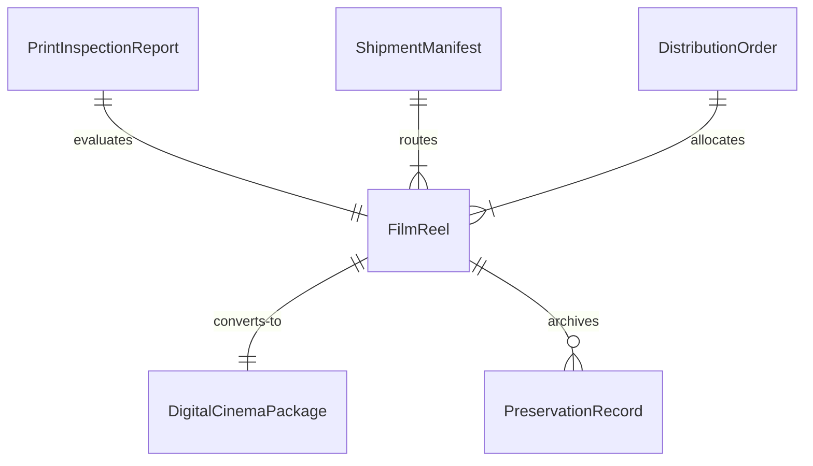
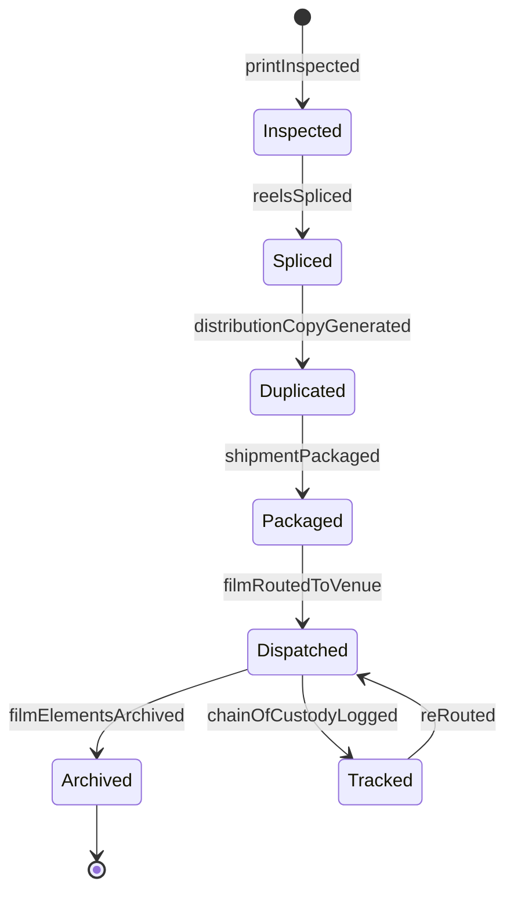
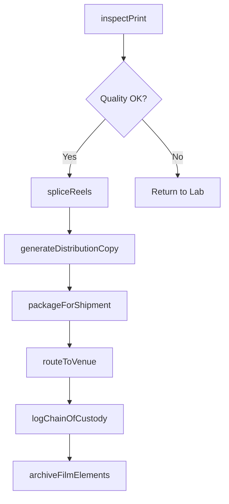
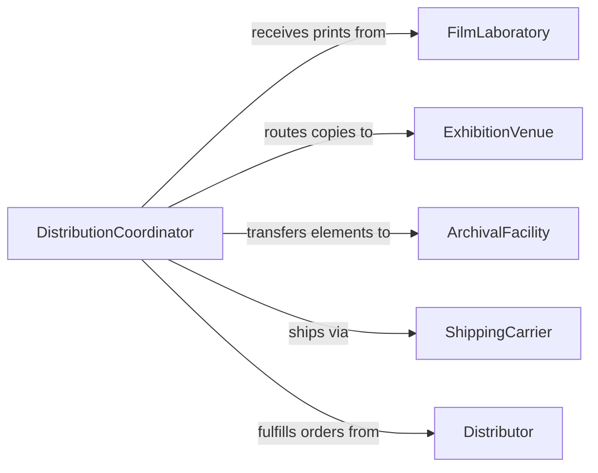

# Prepare Film Distribution Use

> Business-as-Code definition for preparing film for distribution or use. Models the workflow of processing, inspecting, packaging, and routing film reels and digital media assets for exhibition, archival, or commercial distribution.

## Overview

Preparing film for distribution or use involves processing exposed film stock, performing quality control inspections on prints or digital intermediates, and packaging materials for shipment to theaters, broadcasters, or archival facilities. This includes splicing reels, verifying color timing and sound synchronization, generating distribution copies in required formats, and labeling shipments with proper handling instructions. The process ensures that film content reaches its destination in exhibition-ready condition.

## Actors

| Actor | Description |
|-------|-------------|
| FilmLaboratory | Processes and develops exposed film stock into viewable prints |
| Distributor | Coordinates the routing of film copies to theaters and broadcast outlets |
| ExhibitionVenue | Receives and projects film prints or ingests digital cinema packages |
| ArchivalFacility | Stores film elements under climate-controlled preservation conditions |
| ShippingCarrier | Transports physical film reels between facilities with chain-of-custody tracking |

## Roles

| Role | Description |
|------|-------------|
| FilmPrepTechnician | Inspects, splices, and packages film reels for distribution |
| QualityControlReviewer | Screens prints to verify color, sound sync, and physical integrity |
| DistributionCoordinator | Schedules shipments and tracks film copies across exhibition circuits |
| ArchivalSpecialist | Prepares film elements for long-term preservation and storage |

## Entities

| Entity | Description |
|--------|-------------|
| FilmReel | A physical spool of processed motion picture film |
| DigitalCinemaPackage | An encrypted digital file set formatted for theatrical projection |
| PrintInspectionReport | Documentation of a film print's visual and audio quality |
| ShipmentManifest | A list of film elements and their routing destinations |
| DistributionOrder | A directive specifying which titles go to which venues and when |
| PreservationRecord | Metadata about storage conditions, format, and conservation treatments |

## Actions

| Action | Description |
|--------|-------------|
| inspectPrint | Examine film print for scratches, splices, color fading, and sound quality |
| spliceReels | Join individual film reels into a continuous projection reel |
| generateDistributionCopy | Create exhibition copies from the master negative or digital intermediate |
| packageForShipment | Place film reels in protective cases with handling instructions |
| routeToVenue | Assign distribution copies to specific theaters or broadcast outlets |
| archiveFilmElements | Transfer film masters and prints to climate-controlled storage |
| logChainOfCustody | Record each handoff of film materials between parties |

## Events

| Event | Description |
|-------|-------------|
| printInspected | Film print has been examined and its condition documented |
| reelsSpliced | Individual reels have been joined into a projection-ready assembly |
| distributionCopyGenerated | A new exhibition copy has been produced from the master |
| shipmentPackaged | Film materials have been cased and labeled for transport |
| filmRoutedToVenue | Distribution copy has been assigned and dispatched to a venue |
| filmElementsArchived | Masters and prints have been placed in archival storage |
| chainOfCustodyLogged | A custody transfer has been recorded in the tracking system |

## Searches

| Search | Description |
|--------|-------------|
| findDistributionOrders | List orders by title, venue, or shipment date |
| getFilmReelStatus | Retrieve the current location and condition of a specific reel |
| getInspectionReports | Look up quality control reports by title or inspection date |


## Entity Relationships



## State Diagram



## Workflow



## Actor Relationships



## Usage

### Calling Actions

```typescript
import { prepareFilmDistributionUse } from '@headlessly/prepare-film-distribution-use'

const film = prepareFilmDistributionUse()

// Inspect a film print before distribution
const inspection = await film.inspectPrint({
  reelId: 'REEL-2026-0412',
  title: 'Midnight Crossing',
  checkpoints: ['color-timing', 'sound-sync', 'physical-condition']
})

// Splice reels for theatrical projection
await film.spliceReels({
  reelIds: ['REEL-2026-0412-A', 'REEL-2026-0412-B', 'REEL-2026-0412-C'],
  projectionFormat: '35mm-scope'
})

// Route copies to exhibition venues
await film.routeToVenue({
  distributionOrderId: 'DO-2026-1187',
  venues: [
    { venueId: 'AMC-NYC-34', deliveryDate: '2026-03-15' },
    { venueId: 'REGAL-LA-07', deliveryDate: '2026-03-17' }
  ]
})
```

### Event-Driven Automation

```typescript
// Alert distribution coordinator when a print fails inspection
film.printInspected(async ({ reelId, passed, defects }) => {
  if (!passed) {
    await notify({
      to: 'distribution-coordinator',
      message: `Print ${reelId} failed inspection: ${defects.join(', ')}`
    })
  }
})

// Auto-archive film elements after distribution window closes
film.filmRoutedToVenue(async ({ distributionOrderId, returnDate }) => {
  await scheduleTask({
    action: 'archiveFilmElements',
    distributionOrderId,
    scheduledAt: returnDate
  })
})
```
