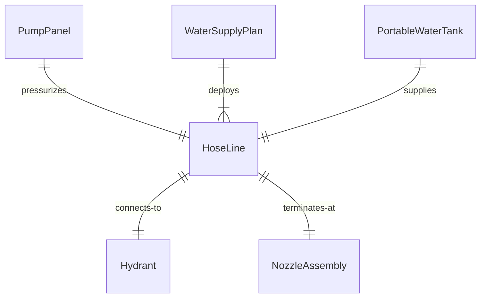
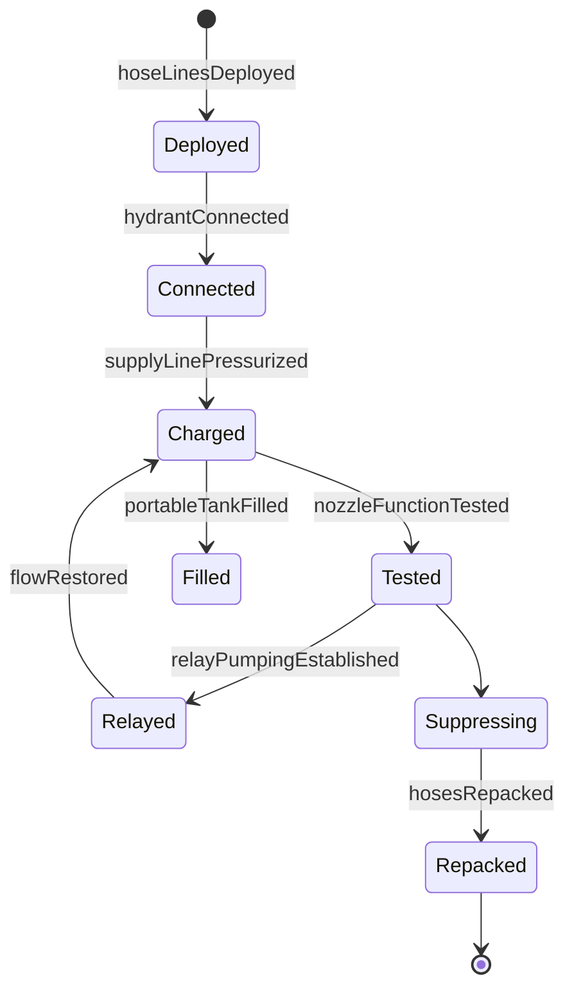
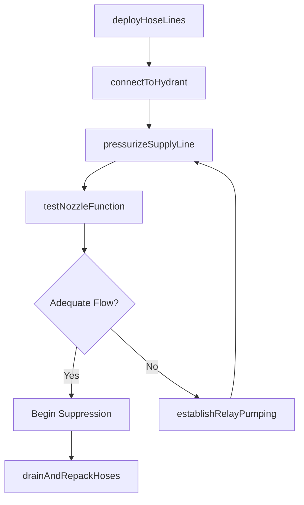
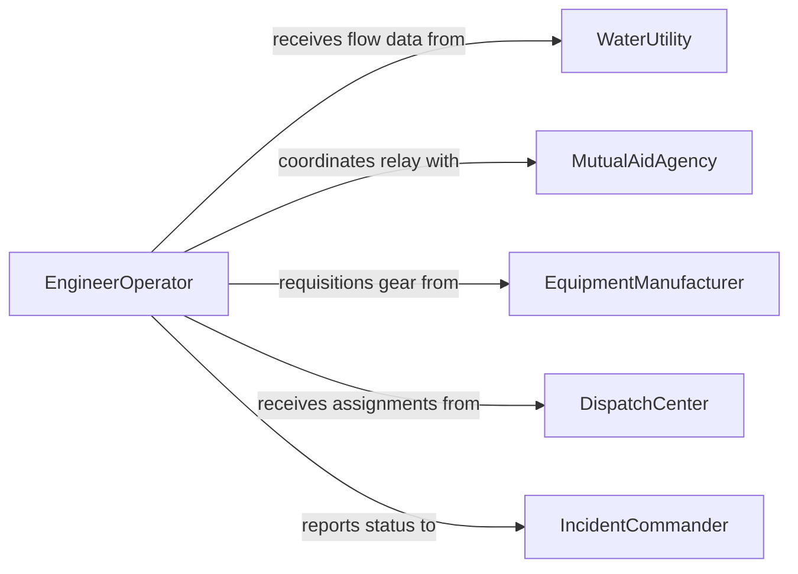

# Prepare Hoses Water Supplies Fight

> Business-as-Code definition for preparing hoses and water supplies to fight fires. Models the complete process of deploying, connecting, pressurizing, and maintaining fire suppression water delivery systems in emergency and standby operations.

## Overview

Preparing hoses and water supplies for firefighting involves selecting the correct hose diameter and length, connecting to hydrants or portable water tanks, pressurizing supply lines, and establishing relay pumping operations when water sources are remote. Crews must verify coupling integrity, test nozzle function, and confirm adequate flow rates before engaging fire suppression. This process is critical in both structural and wildland firefighting, where delays in water delivery directly impact life safety and property loss outcomes.

## Actors

| Actor | Description |
|-------|-------------|
| WaterUtility | Maintains municipal hydrant systems and provides flow rate data |
| MutualAidAgency | Neighboring fire departments that provide additional apparatus and personnel |
| EquipmentManufacturer | Supplies hoses, nozzles, fittings, and portable pumps |
| DispatchCenter | Coordinates incident assignments and resource allocation |
| IncidentCommander | Directs overall fireground operations and water supply strategy |

## Roles

| Role | Description |
|------|-------------|
| EngineerOperator | Operates the fire apparatus pump and manages water pressure |
| HoseTeamLeader | Directs the layout and connection of hose lines on the fireground |
| Firefighter | Physically deploys hoses, makes hydrant connections, and operates nozzles |
| WaterSupplyOfficer | Plans and coordinates relay pumping and tanker shuttle operations |

## Entities

| Entity | Description |
|--------|-------------|
| HoseLine | A connected length of fire hose from water source to nozzle |
| Hydrant | A fixed water supply point connected to the municipal water main |
| PortableWaterTank | A collapsible reservoir used for water storage at rural fire scenes |
| PumpPanel | The control interface on a fire apparatus for regulating water flow and pressure |
| NozzleAssembly | The discharge device at the end of a hose line controlling spray pattern and flow |
| WaterSupplyPlan | A tactical plan specifying water sources, relay points, and flow requirements |

## Actions

| Action | Description |
|--------|-------------|
| deployHoseLines | Lay out hose from the apparatus to the fire location in the required configuration |
| connectToHydrant | Attach supply hose to a fire hydrant and open the valve |
| pressurizeSupplyLine | Engage the apparatus pump and bring hose lines to operating pressure |
| establishRelayPumping | Set up engine-to-engine relay when the water source is distant |
| testNozzleFunction | Verify spray pattern, flow rate, and shutoff operation on each nozzle |
| fillPortableTank | Transfer water from tankers into collapsible reservoirs at the scene |
| drainAndRepackHoses | Drain water from hose lines and repack them on the apparatus after the incident |

## Events

| Event | Description |
|-------|-------------|
| hoseLinesDeployed | Hose lines have been laid out and are ready for connection |
| hydrantConnected | Supply hose has been attached to the hydrant and water is flowing |
| supplyLinePressurized | Hose lines are charged and at operating pressure |
| relayPumpingEstablished | Engine relay is operational and sustaining required flow rates |
| nozzleFunctionTested | Nozzle assemblies have been verified for proper operation |
| portableTankFilled | Collapsible water reservoir is full and available for drafting |
| hosesRepacked | Hose lines have been drained, dried, and stowed on the apparatus |

## Searches

| Search | Description |
|--------|-------------|
| findNearbyHydrants | Locate hydrants by GPS coordinates, flow capacity, or status |
| getWaterSupplyPlans | Retrieve tactical water supply plans by incident or district |
| getHoseInventory | List available hose by diameter, length, and apparatus assignment |


## Entity Relationships



## State Diagram



## Workflow



## Actor Relationships



## Usage

### Calling Actions

```typescript
import { prepareHosesWaterSuppliesFight } from '@headlessly/prepare-hoses-water-supplies-fight'

const fireWater = prepareHosesWaterSuppliesFight()

// Deploy hose lines at a structure fire
const hoseLayout = await fireWater.deployHoseLines({
  incidentId: 'INC-2026-0847',
  configuration: '2.5-inch-supply-to-1.75-inch-attack',
  lengthFeet: 400,
  apparatusId: 'ENGINE-12'
})

// Connect to the nearest hydrant
await fireWater.connectToHydrant({
  hydrantId: 'HYD-NE-4412',
  hoseLineId: hoseLayout.id,
  supplyDiameter: '4-inch-LDH'
})

// Pressurize and test before engaging
await fireWater.pressurizeSupplyLine({
  hoseLineId: hoseLayout.id,
  targetPressurePSI: 150
})
```

### Event-Driven Automation

```typescript
// Alert water supply officer when flow is inadequate
fireWater.supplyLinePressurized(async ({ hoseLineId, actualFlowGPM, requiredFlowGPM }) => {
  if (actualFlowGPM < requiredFlowGPM) {
    await notify({
      to: 'water-supply-officer',
      message: `Hose line ${hoseLineId} flow ${actualFlowGPM} GPM below required ${requiredFlowGPM} GPM`
    })
  }
})

// Auto-schedule hose maintenance after incident
fireWater.hosesRepacked(async ({ apparatusId, hoseLineIds }) => {
  await scheduleMaintenanceCheck({
    apparatusId,
    hoseLineIds,
    type: 'post-incident-inspection',
    dueDate: addDays(new Date(), 1)
  })
})
```
