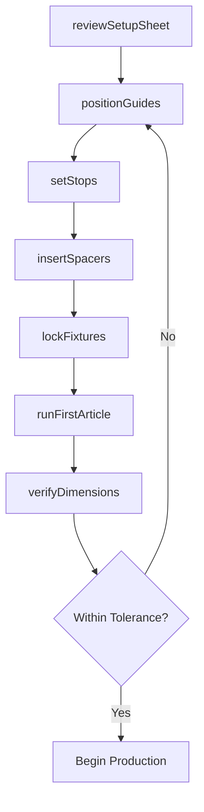
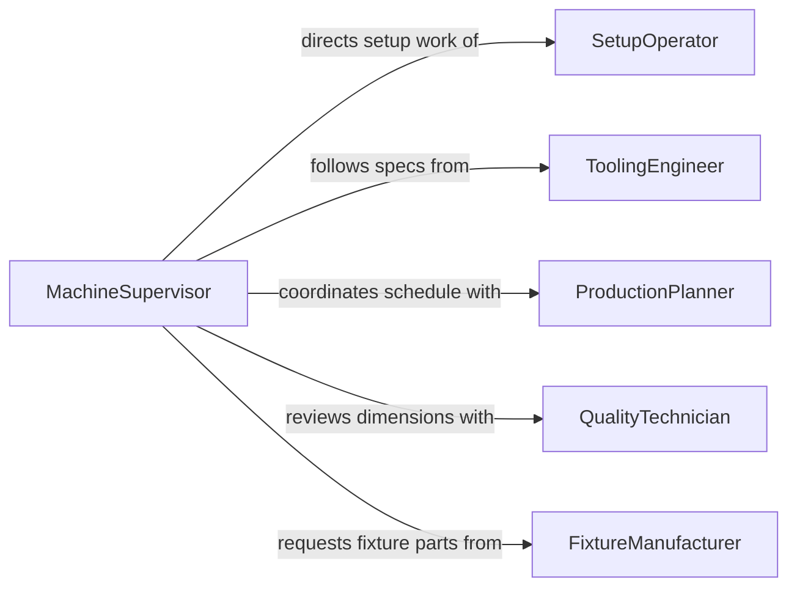

# Set Equipment Guides Stops Spacers

> Business-as-Code definition for setting equipment guides, stops, spacers, or other fixtures. Models the precision adjustment of machine fixtures that control material positioning, travel limits, and dimensional consistency during production operations.

## Overview

Setting equipment guides, stops, spacers, and other fixtures involves adjusting mechanical devices on production machinery to control the position, travel distance, and spacing of workpieces during manufacturing operations. These fixtures ensure that each part is processed consistently to the specified dimensions, whether on saws, presses, drill presses, CNC machines, or packaging lines. Proper fixture setup directly determines part accuracy, reduces scrap, and enables repeatable production runs.

## Actors

| Actor | Description |
|-------|-------------|
| FixtureManufacturer | Supplies guides, stops, spacers, and custom fixture components |
| ProductionPlanner | Issues work orders specifying part dimensions and run quantities |
| ToolingEngineer | Designs fixture configurations for specific production operations |
| MachineryVendor | Provides machine specifications and adjustment procedures |
| CustomerQuality | Audits part dimensions and fixture calibration records |

## Roles

| Role | Description |
|------|-------------|
| SetupOperator | Adjusts guides, stops, and spacers on production equipment |
| MachineSupervisor | Verifies setup accuracy and authorizes production runs |
| QualityTechnician | Measures first-article parts to confirm fixture settings |
| MaintenanceTechnician | Repairs and replaces worn fixture components |

## Entities

| Entity | Description |
|--------|-------------|
| Guide | A fixture component that directs material along a path |
| Stop | A mechanical limit that positions material at a fixed point |
| Spacer | A precision insert that sets a specific gap or offset distance |
| SetupSheet | A document specifying all fixture positions for a production run |
| FirstArticle | The initial part produced after setup to verify dimensional accuracy |
| FixtureSetting | A recorded position or adjustment value for a fixture component |

## Actions

| Action | Description |
|--------|-------------|
| reviewSetupSheet | Read the setup specifications for the upcoming production run |
| positionGuides | Adjust material guides to direct workpieces along the correct path |
| setStops | Position mechanical stops to define travel limits and cut lengths |
| insertSpacers | Install spacers to achieve required gaps or offsets |
| lockFixtures | Tighten and secure all adjusted fixture components |
| runFirstArticle | Produce an initial part to validate the fixture settings |
| verifyDimensions | Measure the first article against specified tolerances |

## Events

| Event | Description |
|-------|-------------|
| setupSheetReviewed | The setup specifications have been read and understood |
| guidesPositioned | Material guides have been adjusted to the specified positions |
| stopsSet | Mechanical stops have been positioned at the required limits |
| spacersInserted | Spacers have been installed to achieve the target offsets |
| fixturesLocked | All fixture components have been tightened and secured |
| firstArticleProduced | The initial validation part has been manufactured |
| dimensionsVerified | First article measurements confirm fixture accuracy |

## Searches

| Search | Description |
|--------|-------------|
| findSetupSheets | Retrieve setup documents by machine, product, or work order |
| getFixtureSettings | List recorded fixture positions by machine and production run |
| getFirstArticleResults | Get dimensional inspection results for setup validation parts |

## Workflow



## Actor Relationships



## Usage

### Calling Actions

```typescript
import { setEquipmentGuidesStopsSpacers } from '@headlessly/set-equipment-guides-stops-spacers'

const fixtures = setEquipmentGuidesStopsSpacers()

// Review the setup sheet for the production run
const setup = await fixtures.reviewSetupSheet({
  workOrderId: 'WO-2026-1842',
  machineId: 'saw-station-03',
  productId: 'bracket-AL6061-T6'
})

// Position guides and stops per specification
await fixtures.positionGuides({
  machineId: 'saw-station-03',
  guidePositions: [
    { guide: 'fence', offset: 4.750 },
    { guide: 'infeed-roller', height: 0.375 }
  ]
})

await fixtures.setStops({
  machineId: 'saw-station-03',
  stops: [
    { stop: 'length-stop', position: 12.000 },
    { stop: 'depth-stop', position: 0.250 }
  ]
})

// Run and verify first article
const part = await fixtures.runFirstArticle({ machineId: 'saw-station-03' })
await fixtures.verifyDimensions({
  firstArticleId: part.id,
  tolerances: { length: 0.005, width: 0.005, depth: 0.003 }
})
```

### Event-Driven Automation

```typescript
// Alert quality when first article is produced
fixtures.firstArticleProduced(async ({ machineId, firstArticleId }) => {
  await notify({
    to: 'quality-technician',
    message: `First article ${firstArticleId} ready for inspection on ${machineId}`
  })
})

// Release production when dimensions are verified
fixtures.dimensionsVerified(async ({ machineId, workOrderId }) => {
  await releaseProductionRun({
    machineId,
    workOrderId,
    status: 'approved-to-run'
  })
})
```
