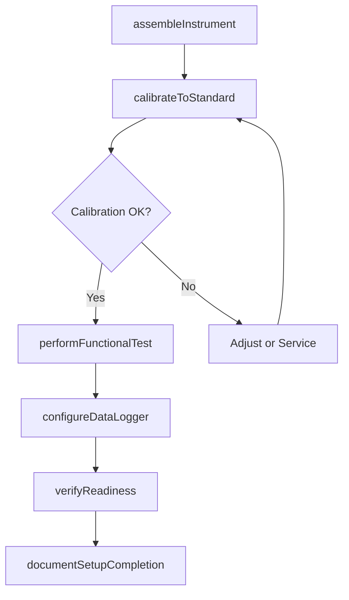
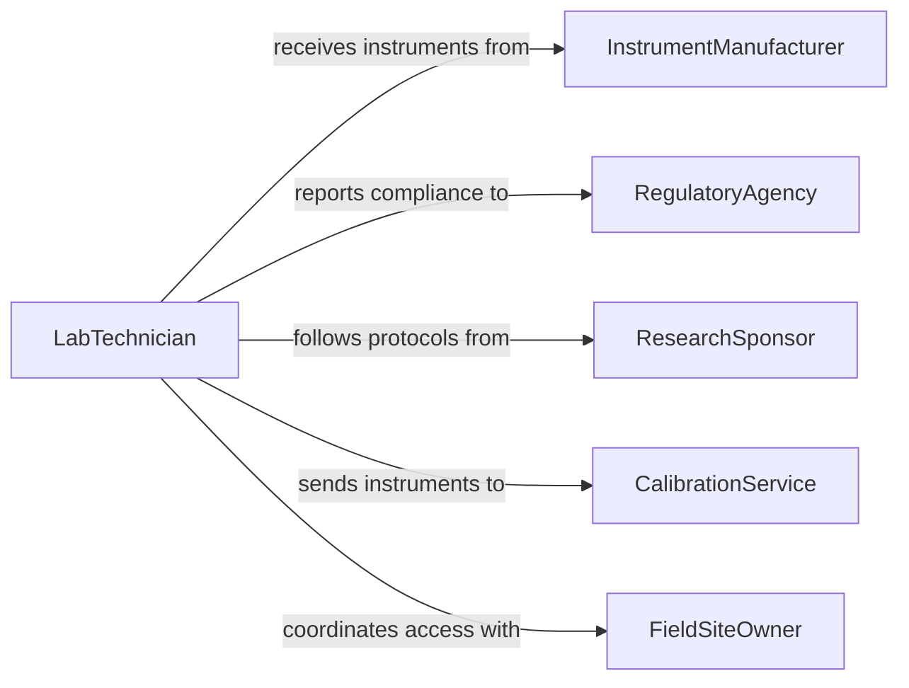

# Set Up Laboratory Field Equipment

> Business-as-Code definition for setting up laboratory or field equipment. Models the process of assembling, calibrating, and verifying scientific instruments and sampling apparatus for research, testing, and environmental monitoring.

## Overview

Setting up laboratory and field equipment involves unpacking, assembling, and calibrating instruments such as spectrometers, chromatographs, microscopes, weather stations, and water quality sensors for their intended analytical or monitoring purpose. Technicians must follow manufacturer protocols, perform calibration checks against known standards, and document equipment readiness before sample analysis or data collection begins. Proper setup ensures measurement accuracy, regulatory compliance, and reproducibility of scientific results across both controlled laboratory and variable field environments.

## Actors

| Actor | Description |
|-------|-------------|
| InstrumentManufacturer | Supplies scientific instruments and provides calibration standards |
| RegulatoryAgency | Sets measurement accuracy requirements and audits laboratory compliance |
| ResearchSponsor | Funds the study and defines the data quality objectives for the project |
| CalibrationService | Performs third-party instrument calibration and issues certification records |
| FieldSiteOwner | Grants access to monitoring locations and coordinates site logistics |

## Roles

| Role | Description |
|------|-------------|
| LabTechnician | Assembles, calibrates, and operates laboratory instruments |
| FieldScientist | Deploys and configures monitoring equipment at outdoor collection sites |
| QualityAssuranceOfficer | Verifies calibration records and ensures equipment meets method requirements |
| PrincipalInvestigator | Directs the research protocol and approves equipment configurations |

## Entities

| Entity | Description |
|--------|-------------|
| Instrument | A scientific device used for measurement, analysis, or observation |
| CalibrationRecord | Documentation of calibration date, standards used, and acceptance criteria |
| SamplingKit | A portable collection of tools and containers for gathering field samples |
| MethodProtocol | A standard operating procedure specifying equipment setup and analysis steps |
| FieldStation | A temporary or permanent monitoring location with deployed instruments |
| MaintenanceLog | A history of repairs, part replacements, and service events for an instrument |

## Actions

| Action | Description |
|--------|-------------|
| assembleInstrument | Unpack and connect components of a laboratory or field instrument |
| calibrateToStandard | Run calibration checks using certified reference materials |
| deployFieldStation | Transport and install monitoring equipment at a collection site |
| verifyReadiness | Confirm that the instrument produces acceptable results on quality control samples |
| configureDataLogger | Set sampling intervals, data formats, and communication parameters |
| performFunctionalTest | Run a diagnostic sequence to verify all instrument subsystems operate correctly |
| documentSetupCompletion | Record equipment serial numbers, calibration dates, and configuration details |

## Events

| Event | Description |
|-------|-------------|
| instrumentAssembled | All instrument components have been connected and powered on |
| calibrationCompleted | Calibration checks have passed within acceptable tolerances |
| fieldStationDeployed | Monitoring equipment has been installed at the field site |
| readinessVerified | Quality control samples confirm the instrument is producing accurate results |
| dataLoggerConfigured | Sampling parameters and communication settings have been programmed |
| functionalTestPassed | Diagnostic sequence confirms all subsystems are operational |
| setupDocumented | Equipment configuration and calibration records have been filed |

## Searches

| Search | Description |
|--------|-------------|
| findInstruments | List instruments by type, location, or calibration status |
| getCalibrationRecords | Retrieve calibration history for a specific instrument or date range |
| getFieldStations | Look up deployed field stations by project, region, or monitoring parameter |
| findExpiredCalibrations | Identify instruments with calibrations past their due date |

## Workflow



## Actor Relationships



## Usage

### Calling Actions

```typescript
import { setUpLaboratoryFieldEquipment } from '@headlessly/set-up-laboratory-field-equipment'

const labEquip = setUpLaboratoryFieldEquipment()

// Assemble a gas chromatograph in the analytical lab
const instrument = await labEquip.assembleInstrument({
  type: 'Gas Chromatograph',
  model: 'Agilent 8890',
  serialNumber: 'GC-2026-0041',
  location: 'Lab 204, Bench 3'
})

// Calibrate against certified reference standards
const calibration = await labEquip.calibrateToStandard({
  instrumentId: instrument.id,
  standards: ['EPA-524.2-STD-A', 'EPA-524.2-STD-B'],
  acceptanceCriteria: { rSquared: 0.995, rpdLimit: 20 }
})

// Verify readiness with a quality control sample
await labEquip.verifyReadiness({
  instrumentId: instrument.id,
  qcSample: 'LCS-VOC-2026-Q1',
  expectedRecovery: { min: 80, max: 120, unit: 'percent' }
})
```

### Event-Driven Automation

```typescript
// Notify QA officer when calibration fails
labEquip.calibrationCompleted(async ({ instrumentId, passed, deviations }) => {
  if (!passed) {
    await notify({
      to: 'qa-officer',
      message: `Instrument ${instrumentId} calibration failed: ${deviations.join(', ')}`
    })
  }
})

// Auto-schedule recalibration when certification approaches expiry
labEquip.setupDocumented(async ({ instrumentId, calibrationExpiry }) => {
  const reminderDate = subtractDays(new Date(calibrationExpiry), 14)
  await scheduleTask({
    action: 'calibrateToStandard',
    instrumentId,
    scheduledAt: reminderDate
  })
})
```
