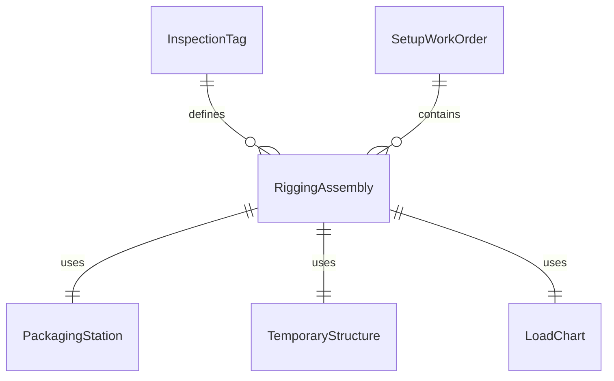
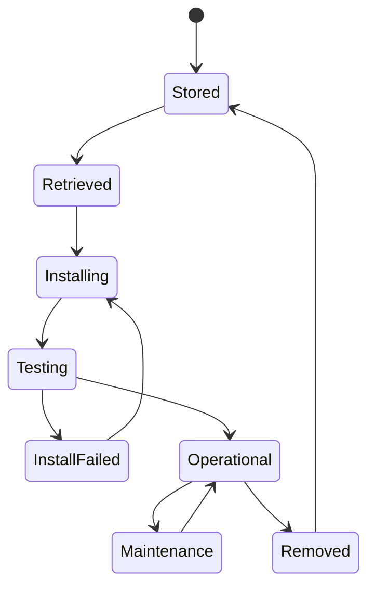
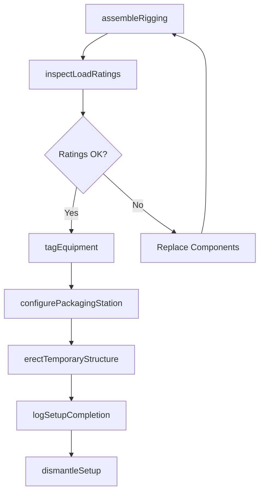
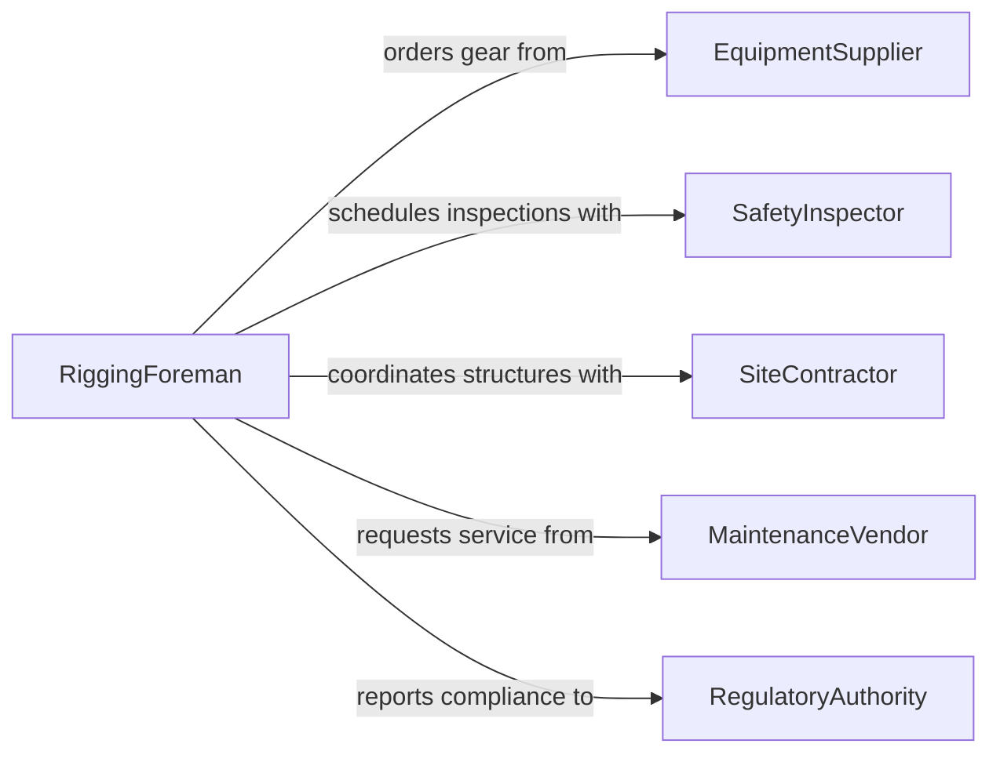

# Set Up Material Handling Gear

> Business-as-Code definition for setting up material handling gear and equipment. Models the end-to-end process of assembling, configuring, and validating rigging, packaging systems, and temporary structures for safe material movement.

## Overview

Setting up material handling gear encompasses the assembly and configuration of rigging hardware, packaging equipment, conveyor systems, and temporary structures used in warehousing, construction, and logistics operations. This process requires careful inspection of load ratings, proper attachment of slings and shackles, and verification that all equipment meets safety standards before use. Effective setup minimizes workplace injuries and ensures efficient material flow across receiving, staging, and shipping areas.

## Actors

| Actor | Description |
|-------|-------------|
| EquipmentSupplier | Provides rigging hardware, slings, hoists, and packaging machinery |
| SafetyInspector | Conducts third-party inspections of rigging and structural integrity |
| SiteContractor | Erects temporary structures such as scaffolding and staging platforms |
| MaintenanceVendor | Services and repairs material handling equipment on scheduled intervals |
| RegulatoryAuthority | Enforces OSHA and ANSI standards for rigging and material handling |

## Roles

| Role | Description |
|------|-------------|
| RiggingForeman | Plans and supervises the assembly of rigging and lifting equipment |
| MaterialHandler | Operates and configures packaging and conveyor equipment on the floor |
| SafetyCoordinator | Verifies compliance with load ratings, fall protection, and tagging standards |
| WarehouseSupervisor | Oversees daily setup and teardown of material handling stations |

## Entities

| Entity | Description |
|--------|-------------|
| RiggingAssembly | A configured set of slings, shackles, and spreader bars for a specific lift |
| PackagingStation | A workstation equipped with sealing, wrapping, or palletizing machinery |
| TemporaryStructure | Scaffolding, ramps, or staging platforms erected for material movement |
| LoadChart | Reference document specifying weight limits and rigging configurations |
| InspectionTag | Certification tag indicating equipment has passed safety inspection |
| SetupWorkOrder | A directive specifying what equipment to assemble, where, and by when |

## Actions

| Action | Description |
|--------|-------------|
| assembleRigging | Connect slings, shackles, and spreader bars according to the load chart |
| configurePackagingStation | Position and calibrate packaging machinery for the current product run |
| erectTemporaryStructure | Build scaffolding, ramps, or platforms at the designated work area |
| inspectLoadRatings | Verify that all rigging components meet or exceed the planned load weight |
| tagEquipment | Attach inspection tags and color-coded status indicators to gear |
| dismantleSetup | Break down rigging and temporary structures after the operation completes |
| logSetupCompletion | Record setup details, inspection results, and equipment serial numbers |

## Events

| Event | Description |
|-------|-------------|
| riggingAssembled | All rigging components have been connected and are ready for use |
| packagingStationConfigured | Packaging equipment has been positioned and calibrated |
| temporaryStructureErected | Scaffolding or staging platform has been built and stabilized |
| loadRatingsVerified | Inspection confirms all components meet required weight limits |
| equipmentTagged | Inspection tags have been applied to certified gear |
| setupDismantled | Rigging and temporary structures have been safely broken down |
| setupCompletionLogged | Setup records have been filed in the equipment management system |

## Searches

| Search | Description |
|--------|-------------|
| findSetupWorkOrders | List setup work orders by date, location, or equipment type |
| getEquipmentByTag | Retrieve equipment records by inspection tag or serial number |
| getLoadCharts | Look up load charts for specific rigging configurations and capacities |
| findOverdueInspections | Identify rigging and gear with expired inspection certifications |


## Entity Relationships



## State Diagram



## Workflow



## Actor Relationships



## Usage

### Calling Actions

```typescript
import { setUpMaterialHandlingGear } from '@headlessly/set-up-material-handling-gear'

const gear = setUpMaterialHandlingGear()

// Assemble rigging for a heavy equipment lift
const rigging = await gear.assembleRigging({
  loadChart: 'LC-2024-HEAVY',
  components: ['4-leg-sling', 'shackle-35T', 'spreader-bar-20ft'],
  location: 'Bay 12, Warehouse A'
})

// Inspect load ratings before operation
const inspection = await gear.inspectLoadRatings({
  riggingAssemblyId: rigging.id,
  plannedLoad: { weight: 28000, unit: 'lbs' }
})

// Tag equipment after passing inspection
await gear.tagEquipment({
  riggingAssemblyId: rigging.id,
  inspectionId: inspection.id,
  tagColor: 'green',
  expiresAt: '2026-06-30'
})
```

### Event-Driven Automation

```typescript
// Notify safety coordinator when rigging is assembled
gear.riggingAssembled(async ({ riggingAssemblyId, location }) => {
  await notify({
    to: 'safety-coordinator',
    message: `Rigging assembly ${riggingAssemblyId} ready for inspection at ${location}`
  })
})

// Auto-generate teardown work order when setup is logged
gear.setupCompletionLogged(async ({ setupWorkOrderId, estimatedDuration }) => {
  await gear.dismantleSetup({
    workOrderId: setupWorkOrderId,
    scheduledAt: addHours(new Date(), estimatedDuration)
  })
})
```
