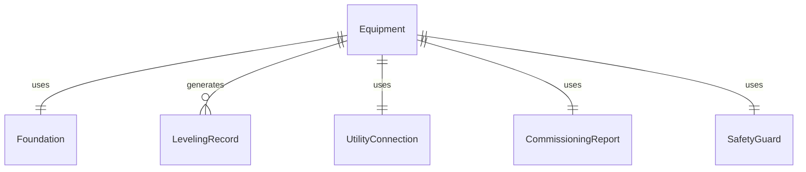
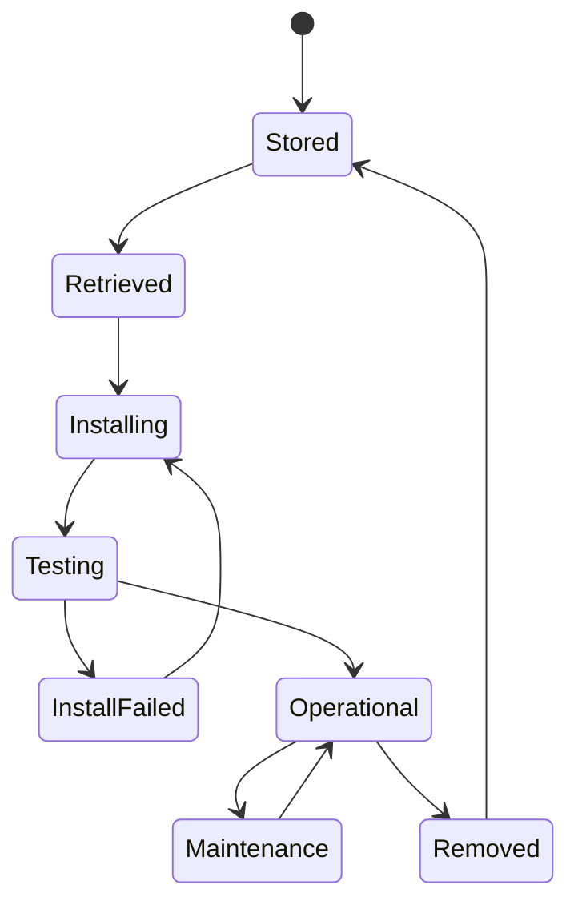
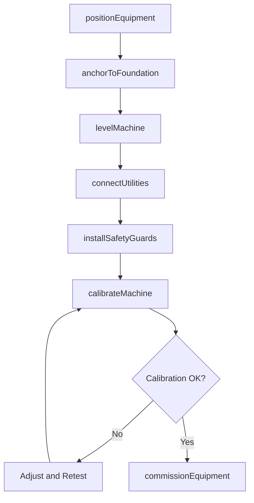
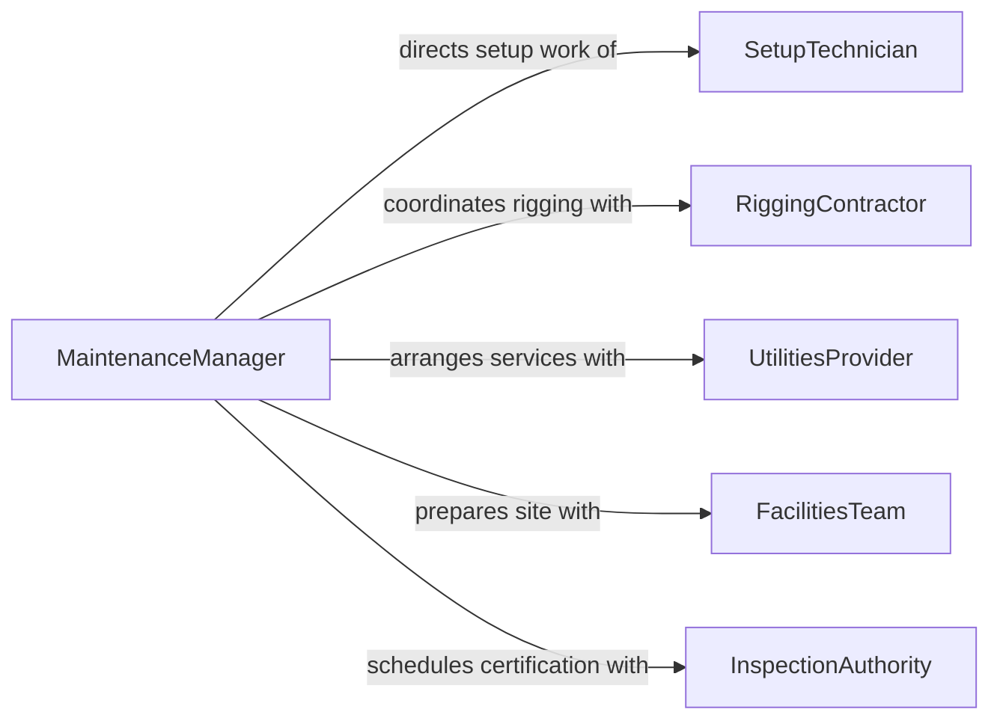

# Set Up Mechanical Equipment

> Business-as-Code definition for setting up mechanical equipment. Models the complete process of assembling, positioning, leveling, connecting, and commissioning mechanical machinery for production or operational use.

## Overview

Setting up mechanical equipment involves receiving, positioning, leveling, assembling, and commissioning machinery such as lathes, milling machines, presses, conveyors, pumps, and compressors. Technicians anchor equipment to foundations, connect power and utility services, install guards and safety devices, and perform initial calibration runs. A thorough setup ensures that equipment operates within manufacturer specifications, meets safety requirements, and produces quality output from the first production run.

## Actors

| Actor | Description |
|-------|-------------|
| EquipmentManufacturer | Supplies machinery and provides setup documentation |
| RiggingContractor | Transports and positions heavy equipment using cranes and forklifts |
| UtilitiesProvider | Connects electrical, compressed air, water, and drainage services |
| FacilitiesTeam | Prepares foundations, anchors, and floor space for equipment placement |
| InspectionAuthority | Certifies that installed equipment meets regulatory and safety standards |

## Roles

| Role | Description |
|------|-------------|
| SetupTechnician | Assembles, levels, and calibrates mechanical equipment |
| MaintenanceManager | Plans and oversees equipment installation projects |
| ElectricalTechnician | Wires power connections and verifies electrical safety |
| SafetyOfficer | Inspects guarding, lockout provisions, and emergency stops |

## Entities

| Entity | Description |
|--------|-------------|
| Equipment | The mechanical machine being set up for operation |
| Foundation | The structural base or pad that supports the equipment |
| LevelingRecord | Documented measurements confirming the machine is level and plumb |
| UtilityConnection | An electrical, pneumatic, hydraulic, or plumbing hookup |
| CommissioningReport | A formal record of startup tests and performance verification |
| SafetyGuard | A physical barrier or interlock protecting operators from moving parts |

## Actions

| Action | Description |
|--------|-------------|
| positionEquipment | Move the machine to its designated location using rigging |
| anchorToFoundation | Bolt or grout the equipment to its structural base |
| levelMachine | Adjust leveling feet or shims to achieve specified flatness |
| connectUtilities | Hook up electrical power, air, water, and drainage services |
| installSafetyGuards | Mount guards, interlocks, and emergency stop devices |
| calibrateMachine | Adjust settings and run test cycles to verify accuracy |
| commissionEquipment | Perform formal startup and document performance results |

## Events

| Event | Description |
|-------|-------------|
| equipmentPositioned | The machine has been moved to its designated location |
| anchoredToFoundation | The equipment has been bolted or grouted to the base |
| machineLeveled | The machine has been verified level within tolerance |
| utilitiesConnected | All power and service connections have been completed |
| safetyGuardsInstalled | Guards and interlocks have been mounted and tested |
| machineCalibrated | The equipment has been adjusted and test cycles confirm accuracy |
| equipmentCommissioned | Formal startup is complete and performance is documented |

## Searches

| Search | Description |
|--------|-------------|
| findSetupProjects | Retrieve equipment setup projects by status, machine type, or facility |
| getLevelingRecords | Get leveling measurements by machine or installation date |
| getCommissioningReports | List commissioning results by equipment, date, or pass/fail status |


## Entity Relationships



## State Diagram



## Workflow



## Actor Relationships



## Usage

### Calling Actions

```typescript
import { setUpMechanicalEquipment } from '@headlessly/set-up-mechanical-equipment'

const setup = setUpMechanicalEquipment()

// Position the machine on the prepared foundation
await setup.positionEquipment({
  equipmentId: 'CNC-lathe-haas-ST20Y',
  foundationId: 'pad-bay-12-station-C',
  riggingMethod: 'overhead-crane',
  weight: 8500,
  weightUnit: 'lbs'
})

// Anchor and level
await setup.anchorToFoundation({
  equipmentId: 'CNC-lathe-haas-ST20Y',
  anchorType: 'wedge-anchor',
  boltPattern: '4-corner',
  torque: 75,
  torqueUnit: 'ft-lb'
})

await setup.levelMachine({
  equipmentId: 'CNC-lathe-haas-ST20Y',
  method: 'precision-level',
  tolerance: 0.0005,
  unit: 'inches-per-foot'
})

// Connect utilities and commission
await setup.connectUtilities({
  equipmentId: 'CNC-lathe-haas-ST20Y',
  connections: [
    { type: 'electrical', spec: '480V-3PH-60A' },
    { type: 'compressed-air', spec: '90-PSI-10-CFM' },
    { type: 'coolant-drain', spec: '1-inch-NPT' }
  ]
})

await setup.commissionEquipment({
  equipmentId: 'CNC-lathe-haas-ST20Y',
  testProgram: 'spindle-warmup-and-axis-verification',
  performedBy: 'setup-tech-ramirez'
})
```

### Event-Driven Automation

```typescript
// Notify inspection authority when guards are installed
setup.safetyGuardsInstalled(async ({ equipmentId }) => {
  await scheduleInspection({
    type: 'machine-safety-certification',
    equipmentId,
    authority: 'osha-compliance',
    priority: 'required-before-production'
  })
})

// Update asset management when equipment is commissioned
setup.equipmentCommissioned(async ({ equipmentId }) => {
  await updateAssetRegistry({
    equipmentId,
    status: 'operational',
    commissionedDate: new Date().toISOString(),
    nextPMDate: addDays(new Date(), 90)
  })
})
```
