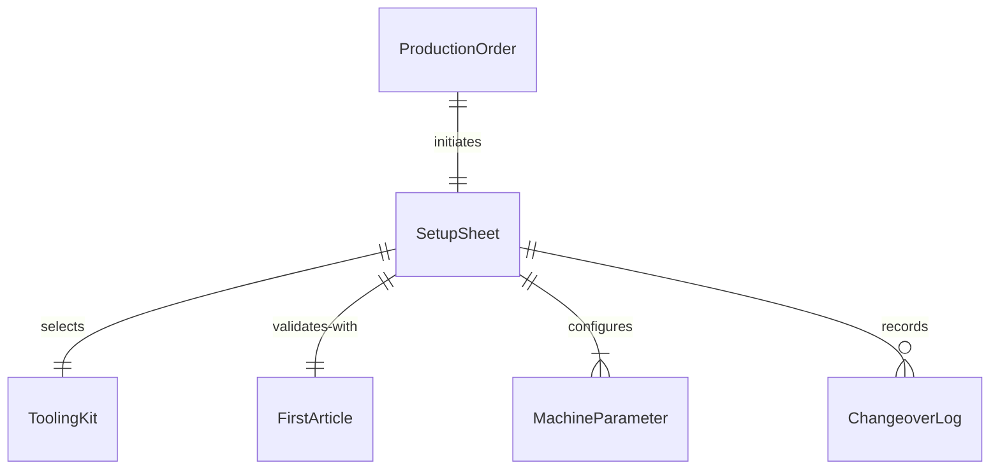
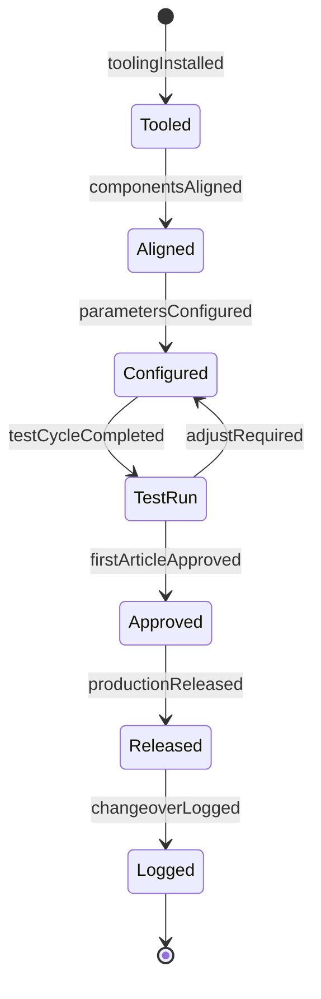
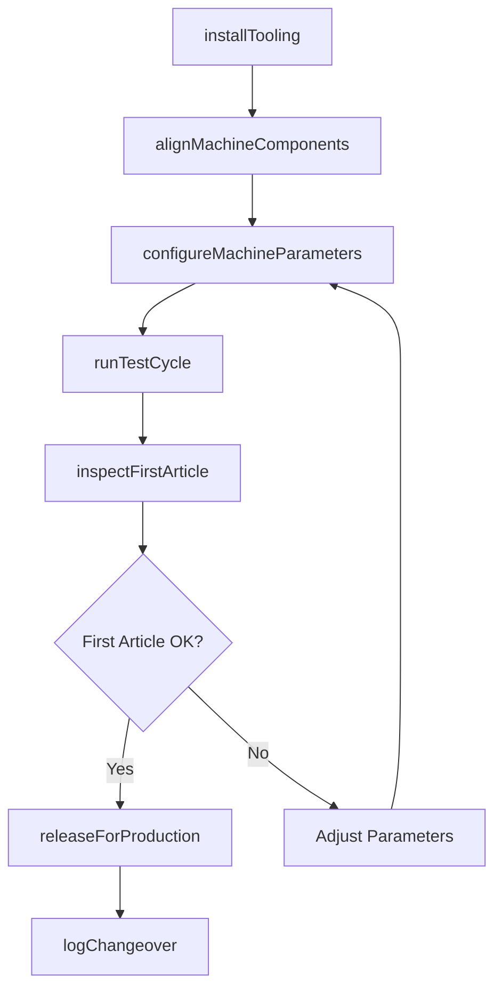
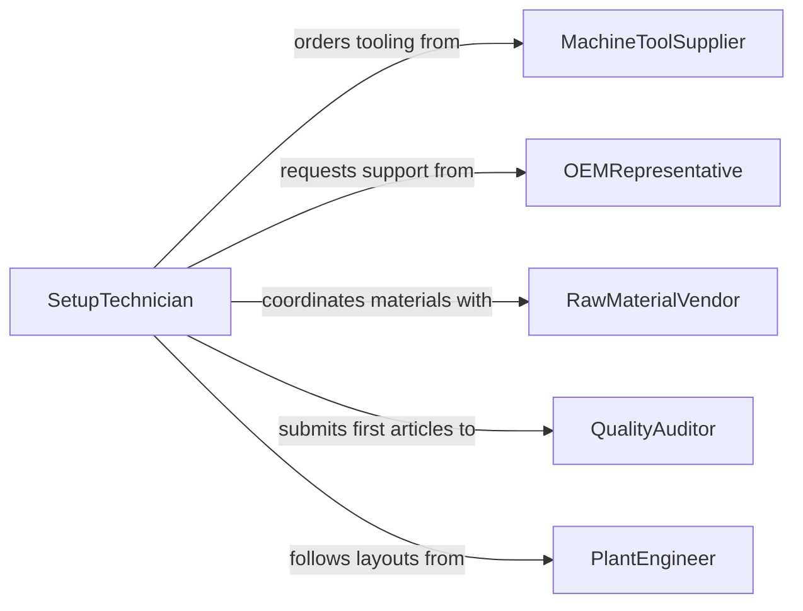

# Set Up Production Processing Equipment

> Business-as-Code definition for setting up production or processing equipment. Models the workflow of installing, aligning, configuring, and validating manufacturing and processing machinery for production runs.

## Overview

Setting up production and processing equipment encompasses the physical installation, alignment, tooling changes, and parameter configuration of manufacturing machinery such as CNC machines, injection molders, conveyor systems, and chemical processing reactors. Setup technicians follow work orders specifying product dimensions, material types, and cycle times, then perform test runs to verify output quality before releasing the line for full production. Efficient equipment setup directly reduces changeover time, minimizes scrap, and increases overall equipment effectiveness across manufacturing and processing operations.

## Actors

| Actor | Description |
|-------|-------------|
| MachineToolSupplier | Provides cutting tools, dies, molds, and replacement parts for production equipment |
| OEMRepresentative | Offers technical support and firmware updates for the equipment manufacturer |
| RawMaterialVendor | Delivers feedstock, chemicals, or raw materials consumed during processing |
| QualityAuditor | Conducts third-party audits of production setup and output conformance |
| PlantEngineer | Designs equipment layouts and specifies utility connections for new installations |

## Roles

| Role | Description |
|------|-------------|
| SetupTechnician | Performs tooling changes, alignment, and parameter configuration on production machinery |
| ProductionSupervisor | Authorizes setup completion and releases the line for full production |
| ProcessEngineer | Develops setup procedures, cycle parameters, and first-article inspection criteria |
| MaintenanceMechanic | Addresses mechanical issues discovered during setup and performs preventive maintenance |

## Entities

| Entity | Description |
|--------|-------------|
| SetupSheet | A document specifying tooling, parameters, and quality targets for a production run |
| ToolingKit | A set of dies, fixtures, cutting tools, or molds required for a specific product |
| ProductionOrder | A work order authorizing a specific quantity and product to be manufactured |
| FirstArticle | The initial part produced after setup, inspected to verify dimensional conformance |
| MachineParameter | A configurable setting such as speed, temperature, pressure, or feed rate |
| ChangeoverLog | A record of setup start time, duration, issues encountered, and sign-off |

## Actions

| Action | Description |
|--------|-------------|
| installTooling | Mount dies, molds, fixtures, or cutting tools onto the machine |
| alignMachineComponents | Adjust guides, stops, and alignment fixtures to meet dimensional specifications |
| configureMachineParameters | Set speed, temperature, pressure, and feed rate per the setup sheet |
| runTestCycle | Execute a trial production cycle to produce a first article for inspection |
| inspectFirstArticle | Measure the initial output against dimensional and quality specifications |
| releaseForProduction | Approve the setup and authorize full-rate production |
| logChangeover | Record setup duration, parameters, issues, and technician sign-off |

## Events

| Event | Description |
|-------|-------------|
| toolingInstalled | Dies, molds, or cutting tools have been mounted and secured |
| componentsAligned | Machine guides and fixtures are positioned within tolerance |
| parametersConfigured | Machine settings have been entered and verified against the setup sheet |
| testCycleCompleted | A trial run has produced a first article for inspection |
| firstArticleApproved | The initial output meets dimensional and quality requirements |
| productionReleased | The line has been authorized for full-rate manufacturing |
| changeoverLogged | Setup details have been recorded in the production management system |

## Searches

| Search | Description |
|--------|-------------|
| findSetupSheets | List setup sheets by product, machine, or creation date |
| getToolingInventory | Retrieve available tooling kits by type, size, or machine compatibility |
| getChangeoverHistory | Look up past changeover records for a specific machine or product line |


## Entity Relationships



## State Diagram



## Workflow



## Actor Relationships



## Usage

### Calling Actions

```typescript
import { setUpProductionProcessingEquipment } from '@headlessly/set-up-production-processing-equipment'

const production = setUpProductionProcessingEquipment()

// Install tooling for a new injection molding run
const tooling = await production.installTooling({
  machineId: 'INJ-MOLD-07',
  toolingKit: 'TK-HOUSING-2026-A',
  productionOrderId: 'PO-2026-3341'
})

// Configure machine parameters from the setup sheet
await production.configureMachineParameters({
  machineId: 'INJ-MOLD-07',
  parameters: {
    injectionPressurePSI: 1200,
    meltTemperatureF: 450,
    coolingTimeSec: 30,
    cycleTimeSec: 55
  }
})

// Run test cycle and inspect the first article
const testRun = await production.runTestCycle({
  machineId: 'INJ-MOLD-07',
  quantity: 3
})

const inspection = await production.inspectFirstArticle({
  firstArticleId: testRun.firstArticleId,
  tolerances: { length: '0.005in', width: '0.003in' }
})
```

### Event-Driven Automation

```typescript
// Notify production supervisor when first article is approved
production.firstArticleApproved(async ({ machineId, productionOrderId }) => {
  await notify({
    to: 'production-supervisor',
    message: `Machine ${machineId} setup verified for order ${productionOrderId} -- ready to release`
  })
})

// Track changeover time for OEE reporting
production.changeoverLogged(async ({ machineId, durationMinutes, productionOrderId }) => {
  await recordOEEMetric({
    machineId,
    metric: 'changeover-time',
    value: durationMinutes,
    productionOrderId,
    timestamp: new Date()
  })
})
```
