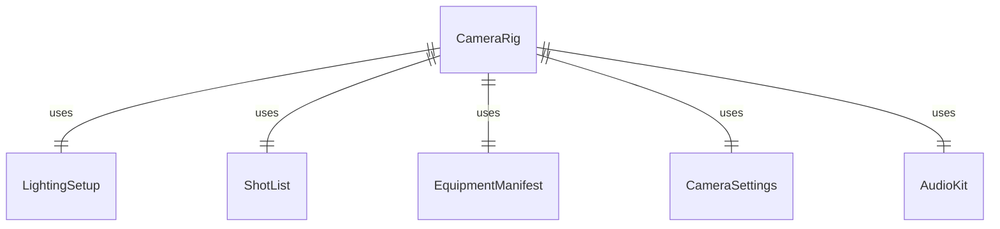
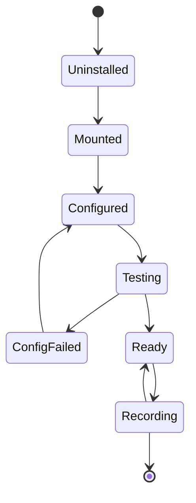
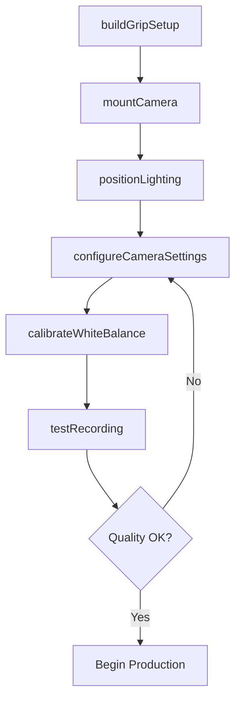
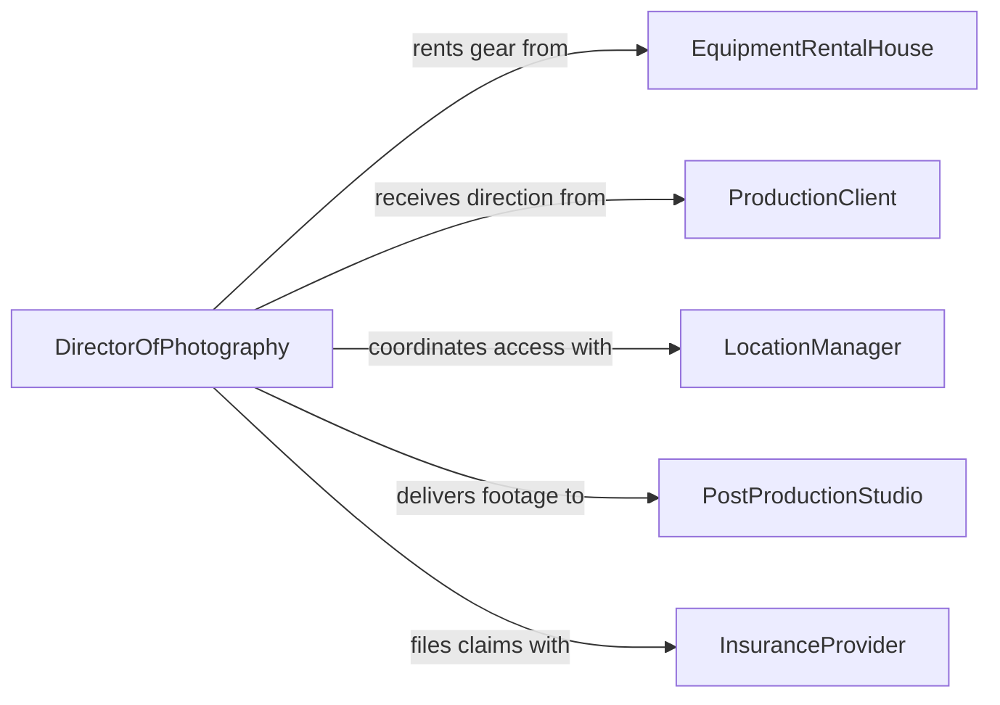

# Set Up Still Video Cameras

> Business-as-Code definition for setting up still and video cameras and related equipment. Models the complete process of positioning, configuring, and testing cameras, lighting, and audio gear for photography and videography productions.

## Overview

Setting up still and video cameras involves selecting the appropriate camera bodies, lenses, and support equipment, then positioning and configuring them for the intended shoot. This includes mounting cameras on tripods, dollies, or stabilizer rigs, adjusting focus, exposure, and white balance settings, and integrating lighting and audio equipment into the production setup. Proper camera setup ensures consistent image quality, reduces reshoots, and supports both studio and field production environments.

## Actors

| Actor | Description |
|-------|-------------|
| EquipmentRentalHouse | Provides cameras, lenses, lighting kits, and grip gear on rental agreements |
| ProductionClient | Commissions the shoot and provides creative direction and shot requirements |
| LocationManager | Grants access to shooting locations and coordinates site logistics |
| PostProductionStudio | Receives captured footage and specifies technical delivery requirements |
| InsuranceProvider | Covers equipment damage, loss, and liability during production |

## Roles

| Role | Description |
|------|-------------|
| DirectorOfPhotography | Determines camera placement, lens selection, and lighting design |
| CameraOperator | Physically sets up, positions, and operates cameras during the shoot |
| GripTechnician | Assembles support structures including tripods, jibs, and dolly tracks |
| GafferLightingTech | Configures and positions lighting instruments to match the DP's vision |

## Entities

| Entity | Description |
|--------|-------------|
| CameraRig | An assembled configuration of camera body, lens, monitor, and support hardware |
| LightingSetup | The arrangement of key, fill, and back lights for a scene |
| ShotList | A document specifying required camera angles, movements, and framing |
| EquipmentManifest | An inventory list of all gear checked out for a production |
| CameraSettings | Stored configuration of ISO, shutter speed, aperture, and white balance |
| AudioKit | Microphones, recorders, and cables integrated into the camera setup |

## Actions

| Action | Description |
|--------|-------------|
| mountCamera | Attach camera body to tripod, dolly, or stabilizer rig |
| configureCameraSettings | Set ISO, shutter speed, aperture, frame rate, and resolution |
| positionLighting | Place and aim lighting instruments according to the lighting plan |
| calibrateWhiteBalance | Adjust color temperature to match the scene's lighting conditions |
| testRecording | Capture a test clip to verify focus, exposure, and audio levels |
| buildGripSetup | Assemble dolly tracks, jib arms, or slider rails for camera movement |
| packDownEquipment | Safely disassemble and store all camera and grip equipment after the shoot |

## Events

| Event | Description |
|-------|-------------|
| cameraMounted | Camera has been secured on its support structure and is stable |
| cameraSettingsConfigured | All exposure and recording parameters have been set |
| lightingPositioned | Lighting instruments are placed, aimed, and powered on |
| whiteBalanceCalibrated | Color temperature has been matched to the current lighting |
| testRecordingCompleted | Test clip has been captured and reviewed for quality |
| gripSetupBuilt | All camera movement hardware is assembled and operational |
| equipmentPackedDown | All gear has been disassembled, inventoried, and stored |

## Searches

| Search | Description |
|--------|-------------|
| findCameraRigs | List camera rigs by production, location, or configuration type |
| getShotList | Retrieve the shot list for a given production or scene |
| getEquipmentManifest | Look up all gear checked out for a specific production date |


## Entity Relationships



## State Diagram



## Workflow



## Actor Relationships



## Usage

### Calling Actions

```typescript
import { setUpStillVideoCameras } from '@headlessly/set-up-still-video-cameras'

const cameras = setUpStillVideoCameras()

// Mount camera for a studio portrait session
const rig = await cameras.mountCamera({
  cameraBody: 'Canon R5',
  lens: 'RF 85mm f/1.2',
  support: 'Manfrotto 055 Tripod',
  location: 'Studio A, Bay 3'
})

// Configure settings for the shoot
await cameras.configureCameraSettings({
  rigId: rig.id,
  settings: {
    iso: 200,
    shutterSpeed: '1/125',
    aperture: 'f/2.8',
    resolution: '8K',
    frameRate: 30
  }
})

// Run a test recording before the talent arrives
const test = await cameras.testRecording({
  rigId: rig.id,
  durationSeconds: 10
})
```

### Event-Driven Automation

```typescript
// Notify the director when the camera rig is ready
cameras.testRecordingCompleted(async ({ rigId, qualityScore }) => {
  if (qualityScore >= 0.95) {
    await notify({
      to: 'director',
      message: `Camera rig ${rigId} passed test recording -- ready for production`
    })
  }
})

// Auto-generate pack-down checklist after production wraps
cameras.equipmentPackedDown(async ({ productionId, equipmentManifestId }) => {
  await createChecklist({
    manifestId: equipmentManifestId,
    type: 'return-inspection',
    dueDate: addDays(new Date(), 1)
  })
})
```
