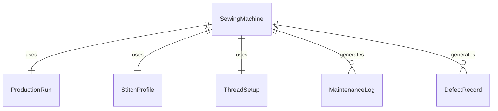
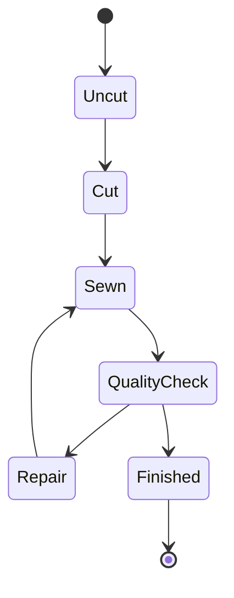
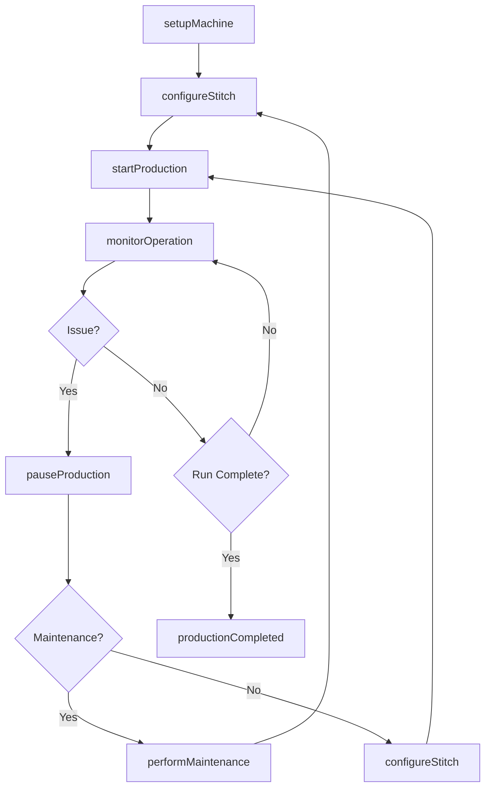
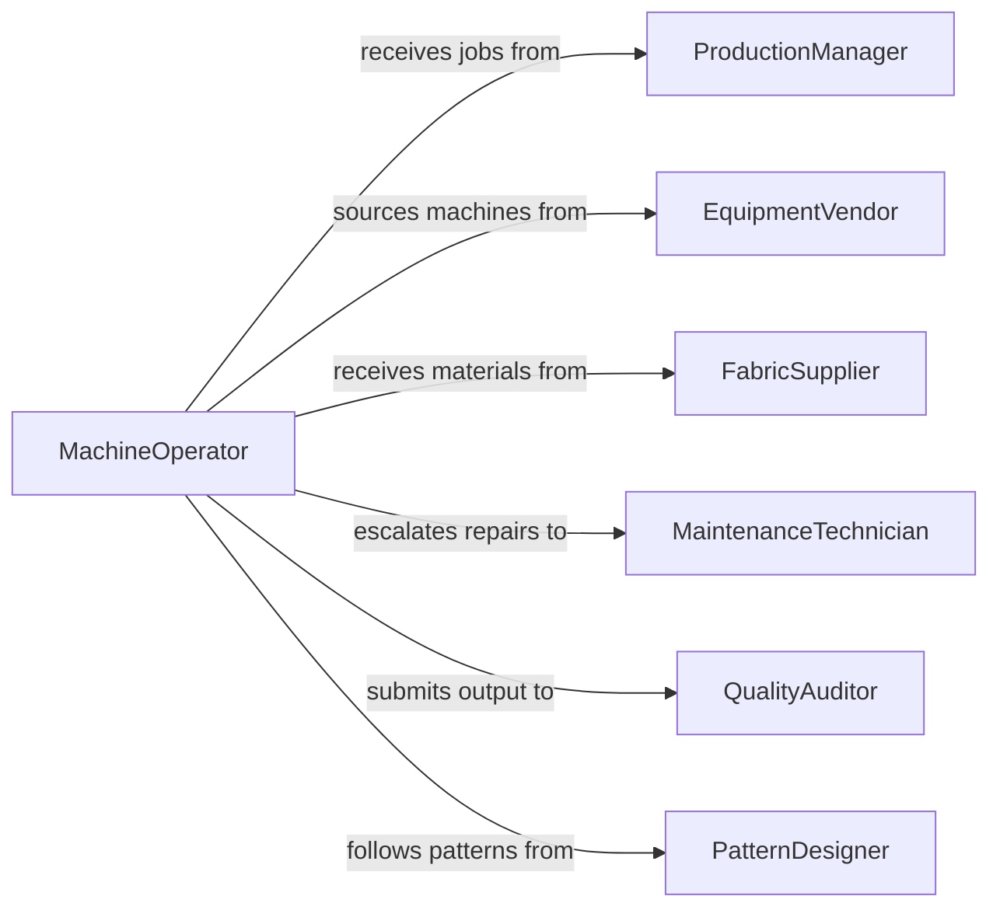

# Operate Sewing Equipment

> Business-as-Code definition for sewing equipment operation. Models the setup, calibration, operation, and maintenance of industrial and commercial sewing machines used in garment and textile production.

## Overview

Sewing equipment operation covers the full lifecycle of running industrial sewing machines, sergers, embroidery machines, and specialty stitching equipment. This definition includes machine setup and threading, stitch parameter configuration, production run execution, and routine equipment maintenance to ensure consistent output quality across manufacturing runs.

## Actors

| Actor | Description |
|-------|-------------|
| ProductionManager | Assigns sewing jobs and sets production targets |
| EquipmentVendor | Supplies sewing machines, parts, and technical support |
| FabricSupplier | Provides materials to be sewn on the equipment |
| MaintenanceTechnician | External service provider for major equipment repairs |
| QualityAuditor | Third-party inspector verifying production standards |
| PatternDesigner | Provides stitch patterns and specifications for production |

## Roles

| Role | Description |
|------|-------------|
| MachineOperator | Sets up and runs sewing equipment during production |
| LineSupervisor | Oversees operators and manages production line flow |
| QualityController | Inspects stitched output for defects and consistency |
| MaintenanceLead | Performs routine equipment servicing and calibration |

## Entities

| Entity | Description |
|--------|-------------|
| SewingMachine | An individual sewing machine or equipment unit |
| ProductionRun | A batch of items to be sewn in a single session |
| StitchProfile | Configuration parameters for stitch type, length, and tension |
| ThreadSetup | Thread type, color, and bobbin configuration for a job |
| MaintenanceLog | Record of servicing, cleaning, and part replacements |
| DefectRecord | Documentation of stitching defects found during production |

## Actions

| Action | Description |
|--------|-------------|
| setupMachine | Thread, calibrate, and configure machine for a production run |
| configureStitch | Set stitch type, length, tension, and speed parameters |
| startProduction | Begin a sewing production run on configured equipment |
| monitorOperation | Track machine performance metrics during active production |
| pauseProduction | Temporarily halt a production run for adjustment or issue |
| performMaintenance | Execute routine cleaning, oiling, and part inspection |
| logDefect | Record a stitching defect discovered during or after production |

## Events

| Event | Description |
|-------|-------------|
| machineSetupComplete | Machine has been threaded, calibrated, and ready for production |
| stitchConfigured | Stitch parameters have been set for the production run |
| productionStarted | A sewing production run has begun |
| productionCompleted | A sewing production run has finished |
| productionPaused | Production has been temporarily halted |
| maintenancePerformed | Routine or corrective maintenance has been completed |
| defectDetected | A stitching defect has been identified during production |

## Searches

| Search | Description |
|--------|-------------|
| findMachines | List sewing machines by type, status, or availability |
| getProductionRuns | Retrieve production runs by date, status, or machine |
| getMaintenanceLogs | Find maintenance records by machine or date range |
| getDefectRecords | List defects by production run, type, or severity |


## Entity Relationships



## State Diagram



## Workflow



## Actor Relationships



## Usage

### Calling Actions

```typescript
import { operateSewingEquipment } from '@headlessly/operate-sewing-equipment'

const equipment = operateSewingEquipment()

// Set up a machine for a production run
const setup = await equipment.setupMachine({
  machineId: 'SM-JUKI-DDL-9000',
  threadColor: 'navy-blue',
  needleType: '14-ballpoint',
  bobbinThread: 'navy-blue-polyester'
})

// Configure stitch parameters
await equipment.configureStitch({
  machineId: setup.machineId,
  stitchType: 'lockstitch',
  stitchLength: 2.5,
  tension: 4.2,
  speedRPM: 4500
})

// Start production
await equipment.startProduction({
  machineId: setup.machineId,
  productionRunId: 'PR-2026-0442',
  targetQuantity: 500
})
```

### Event-Driven Automation

```typescript
// Alert supervisor when defect rate exceeds threshold
equipment.defectDetected(async ({ machineId, productionRunId, defectType }) => {
  const defects = await equipment.getDefectRecords({ productionRunId })
  if (defects.length > 5) {
    await notify({
      to: 'line-supervisor',
      message: `High defect rate on machine ${machineId} - ${defects.length} defects detected`
    })
  }
})

// Schedule maintenance after production milestones
equipment.productionCompleted(async ({ machineId, totalUnits }) => {
  if (totalUnits > 10000) {
    await equipment.performMaintenance({
      machineId,
      type: 'routine-cleaning',
      notes: 'Post-milestone maintenance after 10,000 units'
    })
  }
})
```
