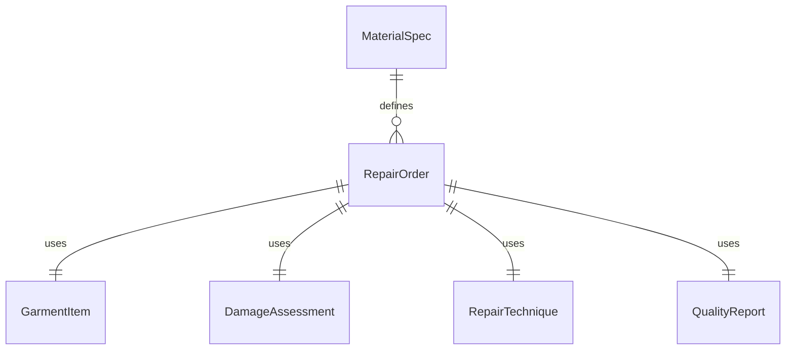
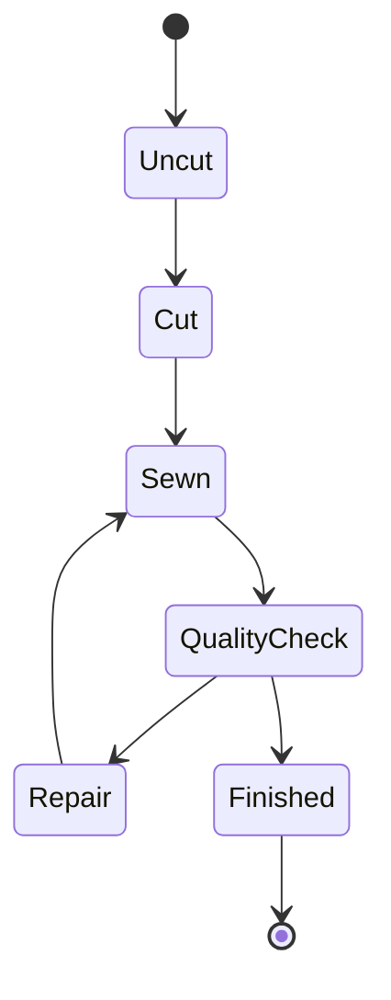
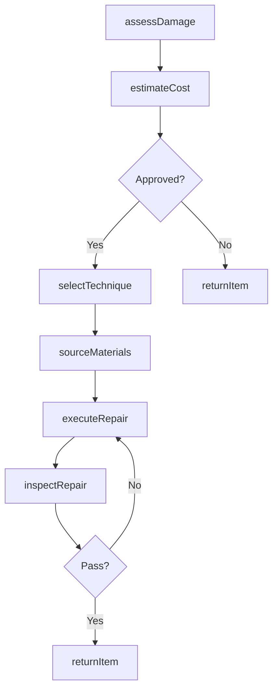
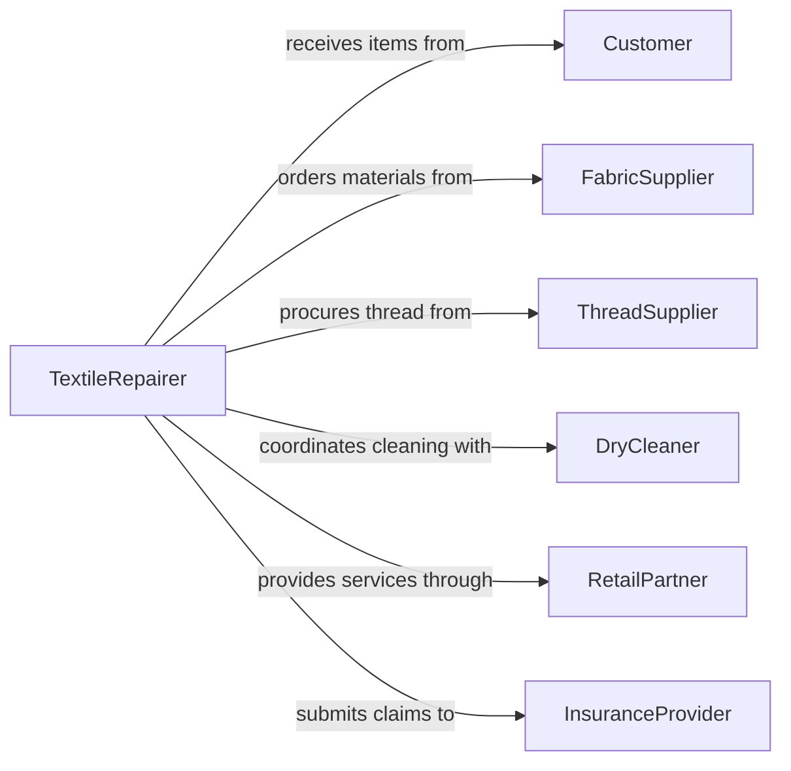

# Repair Textiles Apparel

> Business-as-Code definition for textile and apparel repair operations. Models the end-to-end process of assessing damage, selecting repair techniques, and restoring garments and fabric products to serviceable condition.

## Overview

Textile and apparel repair encompasses mending, patching, darning, re-stitching, and restoring damaged or worn fabric items. This definition covers intake assessment through final quality inspection, including technique selection based on fabric type and damage severity, materials sourcing, and repair execution for garments, upholstery, and industrial textiles.

## Actors

| Actor | Description |
|-------|-------------|
| Customer | Individual or business submitting items for repair |
| FabricSupplier | Provides replacement fabrics, patches, and matching materials |
| ThreadSupplier | Supplies thread, yarn, and stitching materials |
| DryCleaner | Pre-treats or post-treats items requiring specialized cleaning |
| RetailPartner | Retail store offering in-house alteration and repair services |
| InsuranceProvider | Covers repair costs for insured textile damage claims |

## Roles

| Role | Description |
|------|-------------|
| TextileRepairer | Performs hands-on mending, patching, and restoration work |
| RepairAssessor | Evaluates damage and determines appropriate repair methods |
| QualityInspector | Verifies completed repairs meet standards before return |
| ShopManager | Oversees repair shop operations and scheduling |

## Entities

| Entity | Description |
|--------|-------------|
| RepairOrder | A work order tracking an item through the repair process |
| GarmentItem | The specific textile or apparel piece being repaired |
| DamageAssessment | Documented evaluation of damage type, location, and severity |
| RepairTechnique | The method used to restore the item (patching, darning, reweaving) |
| MaterialSpec | Specification for replacement fabric, thread, or notions |
| QualityReport | Final inspection results documenting repair completeness |

## Actions

| Action | Description |
|--------|-------------|
| assessDamage | Evaluate the type, extent, and location of textile damage |
| selectTechnique | Choose the appropriate repair method based on fabric and damage |
| sourceMaterials | Identify and procure matching fabrics, threads, or patches |
| executeRepair | Perform the mending, patching, or restitching work |
| inspectRepair | Verify the completed repair meets quality standards |
| estimateCost | Calculate labor and materials cost for the repair |
| returnItem | Release the repaired item back to the customer |

## Events

| Event | Description |
|-------|-------------|
| damageAssessed | Damage evaluation has been completed and documented |
| techniqueSelected | Repair method has been chosen for the item |
| materialsSourced | Required replacement materials have been procured |
| repairCompleted | The physical repair work has been finished |
| repairInspected | Quality inspection of the repair is complete |
| costEstimated | Repair cost estimate has been generated |
| itemReturned | Repaired item has been returned to the customer |

## Searches

| Search | Description |
|--------|-------------|
| findRepairOrders | List repair orders by status, customer, or date range |
| getRepairTechniques | Retrieve available techniques for a given fabric type |
| getDamageAssessments | Find assessments by damage type or severity level |
| getCompletedRepairs | List finished repairs pending customer pickup |


## Entity Relationships



## State Diagram



## Workflow



## Actor Relationships



## Usage

### Calling Actions

```typescript
import { repairTextilesApparel } from '@headlessly/repair-textiles-apparel'

const repairs = repairTextilesApparel()

// Assess damage on a submitted garment
const assessment = await repairs.assessDamage({
  garmentId: 'GRM-2024-0891',
  damageType: 'tear',
  location: 'left-sleeve-seam',
  fabricType: 'wool-blend',
  severity: 'moderate'
})

// Generate cost estimate
const estimate = await repairs.estimateCost({
  repairOrderId: assessment.repairOrderId,
  technique: 'invisible-reweaving',
  materials: [{ type: 'matching-wool-thread', quantity: 2 }]
})

// Execute the repair
await repairs.executeRepair({
  repairOrderId: assessment.repairOrderId,
  technique: 'invisible-reweaving',
  notes: 'Match original weave pattern at seam junction'
})
```

### Event-Driven Automation

```typescript
// Notify customer when repair is complete
repairs.repairInspected(async ({ repairOrderId, passed }) => {
  if (passed) {
    await notify({
      to: 'customer',
      message: `Your item (order ${repairOrderId}) is ready for pickup.`
    })
  }
})

// Auto-reorder materials when sourcing is triggered
repairs.materialsSourced(async ({ repairOrderId, materials }) => {
  for (const material of materials) {
    if (material.inventoryLevel < material.reorderThreshold) {
      await reorderMaterial({ sku: material.sku, quantity: material.reorderQuantity })
    }
  }
})
```
