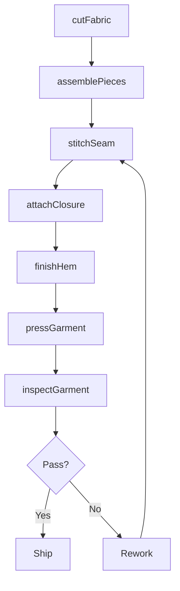
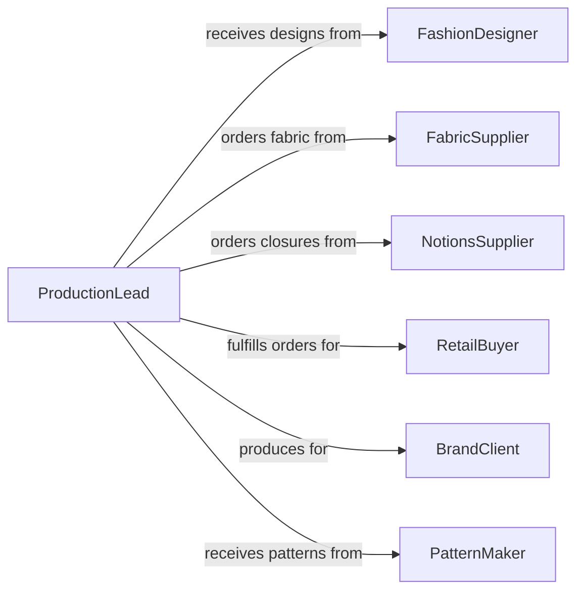

# Sew Clothing Articles

> Business-as-Code definition for sewing clothing and other articles. Models the garment construction process from pattern cutting through final assembly, covering seam joining, hem finishing, and component attachment.

## Overview

Sewing clothing articles involves assembling cut fabric pieces into finished garments and textile products. This definition covers the full construction workflow including pattern layout, piece cutting, seam stitching, closure attachment, hemming, and finishing. It applies to production environments ranging from bespoke tailoring to industrial garment manufacturing lines.

## Actors

| Actor | Description |
|-------|-------------|
| FashionDesigner | Provides garment designs and construction specifications |
| FabricSupplier | Delivers fabric bolts, linings, and interfacing materials |
| NotionsSupplier | Supplies buttons, zippers, snaps, and other closures |
| RetailBuyer | Orders finished garments for retail distribution |
| BrandClient | Commissions garment production under private label agreements |
| PatternMaker | Creates and grades patterns for production cutting |

## Roles

| Role | Description |
|------|-------------|
| Seamstress | Performs garment assembly and stitching operations |
| Cutter | Lays out patterns and cuts fabric pieces for assembly |
| Finisher | Completes hems, buttonholes, pressing, and final details |
| ProductionLead | Coordinates sewing line workflow and output targets |

## Entities

| Entity | Description |
|--------|-------------|
| GarmentOrder | A production order specifying style, quantity, and sizes |
| Pattern | A template defining shape and dimensions of fabric pieces |
| FabricPiece | An individual cut piece of fabric ready for assembly |
| Seam | A stitched joint connecting two or more fabric pieces |
| Garment | The assembled clothing article in progress or completed |
| FinishingSpec | Requirements for hems, closures, pressing, and labeling |

## Actions

| Action | Description |
|--------|-------------|
| cutFabric | Lay out patterns and cut fabric pieces for a garment order |
| assemblePieces | Join cut fabric pieces together following construction sequence |
| stitchSeam | Sew a specific seam joining two fabric panels |
| attachClosure | Install zippers, buttons, snaps, or hook-and-loop fasteners |
| finishHem | Fold and stitch hems on sleeves, pant legs, or garment edges |
| pressGarment | Iron or steam-press the assembled garment for shape |
| inspectGarment | Check completed garment against pattern and quality standards |

## Events

| Event | Description |
|-------|-------------|
| fabricCut | Fabric pieces have been cut and are ready for assembly |
| piecesAssembled | Major garment panels have been joined together |
| seamStitched | A seam has been sewn and secured |
| closureAttached | A closure component has been installed on the garment |
| hemFinished | Hemming has been completed on the garment |
| garmentPressed | The garment has been pressed and shaped |
| garmentInspected | Quality inspection of the finished garment is complete |

## Searches

| Search | Description |
|--------|-------------|
| findGarmentOrders | List production orders by style, status, or delivery date |
| getPatterns | Retrieve patterns by garment type, size range, or designer |
| getProductionProgress | Track assembly completion status across an order |
| getDefects | Find quality issues by garment type, defect category, or line |

## Workflow



## Actor Relationships



## Usage

### Calling Actions

```typescript
import { sewClothingArticles } from '@headlessly/sew-clothing-articles'

const sewing = sewClothingArticles()

// Cut fabric for a production order
const cutPieces = await sewing.cutFabric({
  orderId: 'GO-2026-1150',
  patternId: 'PAT-BLAZER-42R',
  fabricBolt: 'FB-WOOL-CHARCOAL-220',
  quantity: 50
})

// Assemble garment pieces
const garment = await sewing.assemblePieces({
  orderId: 'GO-2026-1150',
  pieces: cutPieces.fabricPieces,
  constructionSequence: ['back-panel', 'front-panels', 'sleeves', 'collar', 'lining']
})

// Attach closures and finish
await sewing.attachClosure({
  garmentId: garment.id,
  closureType: 'button',
  positions: ['center-front-1', 'center-front-2', 'center-front-3'],
  buttonStyle: 'horn-4-hole-20mm'
})
```

### Event-Driven Automation

```typescript
// Move garment to finishing station when assembly completes
sewing.piecesAssembled(async ({ garmentId, orderId }) => {
  await assignToStation({
    garmentId,
    station: 'finishing',
    priority: await getOrderPriority(orderId)
  })
})

// Alert production lead when inspection fails
sewing.garmentInspected(async ({ garmentId, passed, defects }) => {
  if (!passed) {
    await notify({
      to: 'production-lead',
      message: `Garment ${garmentId} failed inspection: ${defects.map(d => d.type).join(', ')}`
    })
  }
})
```
