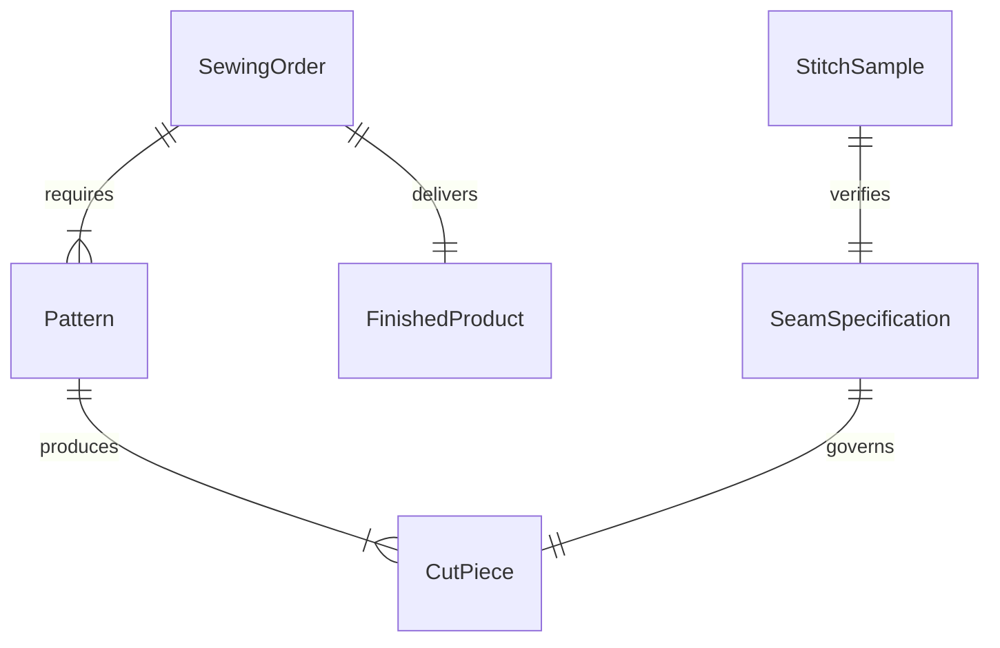
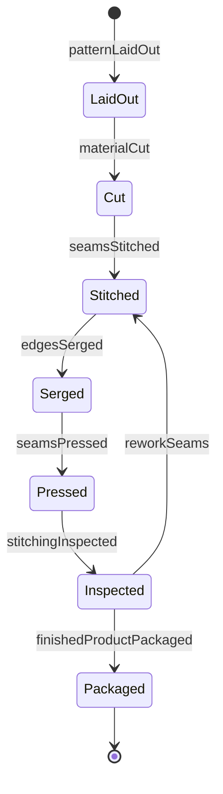
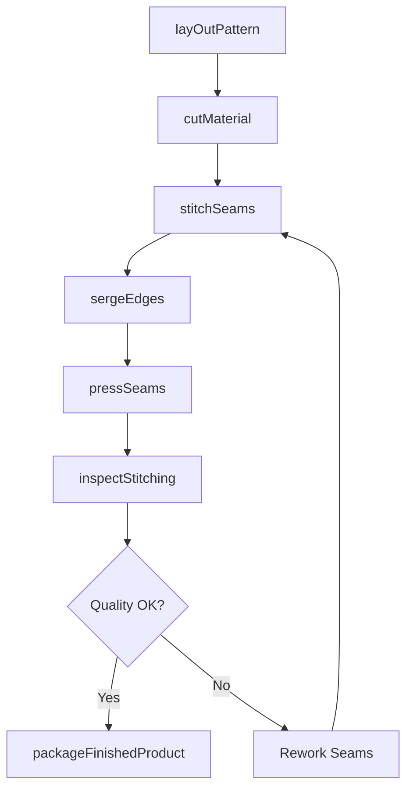
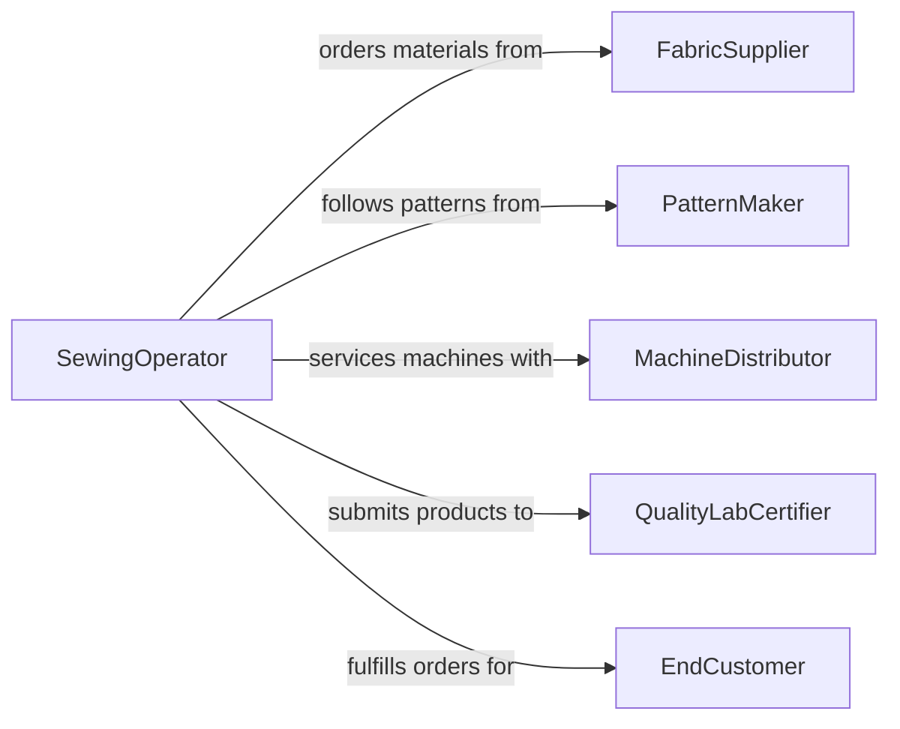

# Sew Materials

> Business-as-Code definition for sewing materials. Models the process of cutting, stitching, assembling, and finishing fabric and non-fabric materials in manufacturing, alteration, and custom fabrication operations.

## Overview

Sewing materials encompasses the cutting, stitching, and assembly of textiles, leather, canvas, upholstery, and industrial fabrics using hand and machine techniques. Operators follow patterns or specifications to join material pieces with appropriate seam types, thread weights, and stitch densities, then perform finishing operations such as hemming, pressing, and quality inspection. This activity supports garment manufacturing, furniture upholstery, sail making, tent fabrication, automotive interiors, and custom alteration services where precision stitching directly affects product durability and appearance.

## Actors

| Actor | Description |
|-------|-------------|
| FabricSupplier | Provides textiles, thread, interfacing, and sewing notions |
| PatternMaker | Creates cutting patterns and assembly instructions for the sewn product |
| MachineDistributor | Sells and services industrial sewing machines, sergers, and cutting equipment |
| QualityLabCertifier | Tests finished products for seam strength, colorfastness, and durability |
| EndCustomer | Orders custom or altered sewn products and provides fit specifications |

## Roles

| Role | Description |
|------|-------------|
| SewingOperator | Operates sewing machines to stitch and assemble material pieces |
| Cutter | Lays out and cuts fabric according to patterns and material optimization plans |
| QualityInspector | Examines stitching, seam alignment, and finished dimensions against specifications |
| ProductionPlanner | Schedules sewing operations across machines and operators to meet delivery dates |

## Entities

| Entity | Description |
|--------|-------------|
| Pattern | A template specifying the shapes to cut from material and how to assemble them |
| CutPiece | A section of material cut from fabric yardage according to a pattern |
| SeamSpecification | Details on seam type, stitch density, thread weight, and seam allowance |
| SewingOrder | A work order listing the product, quantity, materials, and delivery deadline |
| StitchSample | A test swatch used to verify machine settings before the production run |
| FinishedProduct | The completed sewn item after assembly, trimming, pressing, and inspection |

## Actions

| Action | Description |
|--------|-------------|
| layOutPattern | Position pattern pieces on fabric to minimize waste and guide cutting |
| cutMaterial | Cut fabric along pattern lines using shears, rotary cutters, or automated cutters |
| stitchSeams | Sew material pieces together using the specified seam type and stitch density |
| sergeEdges | Finish raw edges with an overlock stitch to prevent fraying |
| pressSeams | Iron or steam seams flat to ensure a clean, professional finish |
| inspectStitching | Examine seam strength, alignment, and stitch consistency against specifications |
| packageFinishedProduct | Fold, tag, and bag the completed item for shipment or customer pickup |

## Events

| Event | Description |
|-------|-------------|
| patternLaidOut | Pattern pieces have been positioned on fabric and marked for cutting |
| materialCut | All pieces have been cut from fabric and are ready for assembly |
| seamsStitched | Material pieces have been joined with the specified seam construction |
| edgesSerged | Raw edges have been finished with overlock stitching |
| seamsPressed | Seams have been ironed or steamed to the required flatness |
| stitchingInspected | Quality inspection of seams and stitching has been completed |
| finishedProductPackaged | The completed item has been tagged, folded, and packaged |

## Searches

| Search | Description |
|--------|-------------|
| findSewingOrders | List sewing orders by product type, due date, or operator assignment |
| getPatterns | Retrieve patterns by product name, size, or material type |
| getStitchSamples | Look up test swatches by machine, thread, and fabric combination |


## Entity Relationships



## State Diagram



## Workflow



## Actor Relationships



## Usage

### Calling Actions

```typescript
import { sewMaterials } from '@headlessly/sew-materials'

const sewing = sewMaterials()

// Lay out and cut material for a batch of canvas tote bags
const cutJob = await sewing.cutMaterial({
  sewingOrderId: 'SO-2026-0771',
  pattern: 'TOTE-LG-V2',
  fabric: 'heavyweight-cotton-canvas',
  yardage: 45,
  quantity: 100
})

// Stitch seams on the cut pieces
await sewing.stitchSeams({
  sewingOrderId: 'SO-2026-0771',
  cutPieceIds: cutJob.cutPieceIds,
  seamSpec: {
    type: 'flat-felled',
    stitchesPerInch: 10,
    threadWeight: '40wt-polyester',
    seamAllowance: 0.5
  }
})

// Inspect stitching quality
const inspection = await sewing.inspectStitching({
  sewingOrderId: 'SO-2026-0771',
  sampleSize: 10,
  criteria: ['seam-strength', 'stitch-alignment', 'thread-tension']
})
```

### Event-Driven Automation

```typescript
// Alert production planner when stitching fails inspection
sewing.stitchingInspected(async ({ sewingOrderId, passed, defects }) => {
  if (!passed) {
    await notify({
      to: 'production-planner',
      message: `Order ${sewingOrderId} stitching defects: ${defects.join(', ')}`
    })
  }
})

// Auto-trigger shipping when products are packaged
sewing.finishedProductPackaged(async ({ sewingOrderId, quantity, customerId }) => {
  await createShipment({
    orderId: sewingOrderId,
    quantity,
    destination: customerId,
    carrier: 'standard-ground'
  })
})
```
