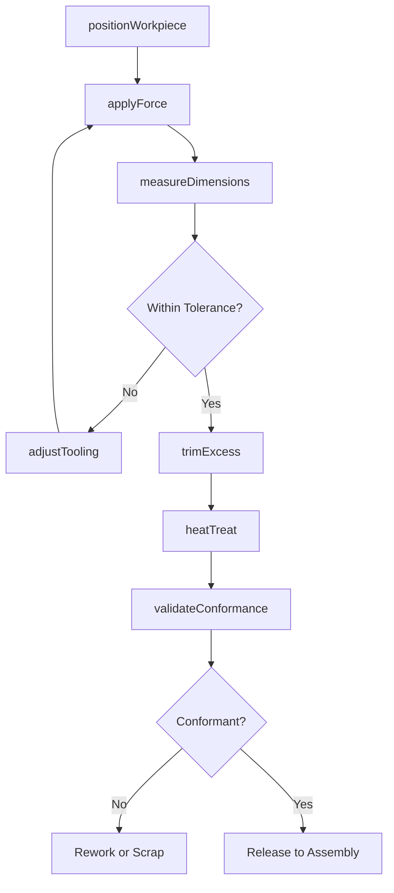
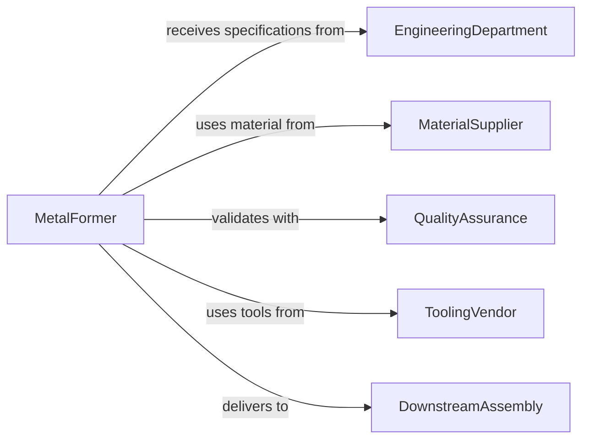

# Reshape Metal Workpieces Established Specifications

> Business-as-Code definition for reshaping metal workpieces through forming, bending, stamping, and forging to meet engineering specifications.

## Overview

Metal workpiece reshaping involves applying force to change the geometry of metal parts while maintaining material integrity and meeting dimensional tolerances. This definition exposes actions for forming operations, measurement verification, and quality control across metalworking and manufacturing facilities.

## Actors

| Actor | Description |
|-------|-------------|
| EngineeringDepartment | Provides specifications and drawings |
| MaterialSupplier | Delivers metal stock for reshaping |
| QualityAssurance | Verifies conformance to specifications |
| ToolingVendor | Supplies dies, molds, and forming tools |
| DownstreamAssembly | Receives shaped parts for assembly |
| MaintenanceDepartment | Services forming equipment |

## Roles

| Role | Description |
|------|-------------|
| MetalFormer | Operates reshaping equipment |
| ToolSetter | Prepares and adjusts forming dies |
| QualityInspector | Measures and validates part dimensions |
| ProductionPlanner | Schedules reshaping operations |

## Entities

| Entity | Description |
|--------|-------------|
| Workpiece | A metal part undergoing reshaping |
| Specification | Engineering requirements for final geometry |
| FormingOperation | A specific reshaping process step |
| Die | A tool that shapes metal through applied force |
| Tolerance | Acceptable deviation from target dimensions |
| Measurement | Dimensional verification data |

## Actions

| Action | Description |
|--------|-------------|
| positionWorkpiece | Place metal part in forming equipment |
| applyForce | Execute forming operation on workpiece |
| measureDimensions | Verify part geometry against specifications |
| adjustTooling | Modify die position or force parameters |
| trimExcess | Remove flash or waste material |
| heatTreat | Apply thermal process to restore properties |
| validateConformance | Confirm part meets all specifications |

## Events

| Event | Description |
|-------|-------------|
| workpiecePositioned | Part placed in forming equipment |
| forceApplied | Reshaping operation executed |
| dimensionsMeasured | Part geometry verified |
| toolingAdjusted | Die or parameters modified |
| excessTrimmed | Waste material removed |
| heatTreatmentApplied | Thermal processing completed |
| conformanceValidated | Part confirmed meeting specifications |

## Searches

| Search | Description |
|--------|-------------|
| findWorkpieces | List parts by specification, status, or batch |
| getSpecifications | Retrieve engineering requirements by part number |
| getFormingOperations | Find process steps by part type |
| getMeasurements | Retrieve dimensional verification data |

## Workflow



## Actor Relationships



## Usage

### Calling Actions

```typescript
import { reshapeMetalWorkpiecesEstablishedSpecifications } from '@headlessly/reshape-metal-workpieces-established-specifications'

const reshaping = reshapeMetalWorkpiecesEstablishedSpecifications()

// Position workpiece in press brake
await reshaping.positionWorkpiece({
  workpieceId: 'sheet-metal-8844',
  equipment: 'press-brake-250-ton',
  dieSet: 'die-90-degree-v-bend',
  orientation: 'long-edge-parallel'
})

// Apply forming force
const forming = await reshaping.applyForce({
  workpieceId: 'sheet-metal-8844',
  operation: 'air-bending',
  force: 180,
  bendAngle: 90,
  bendRadius: 3.2
})

// Measure critical dimensions
const measurements = await reshaping.measureDimensions({
  workpieceId: 'sheet-metal-8844',
  features: [
    { feature: 'bend-angle', method: 'digital-protractor' },
    { feature: 'leg-length-1', method: 'calipers' },
    { feature: 'leg-length-2', method: 'calipers' },
    { feature: 'inside-radius', method: 'radius-gauge' }
  ]
})

// Adjust if out of tolerance
if (measurements.bendAngle < 89.5) {
  await reshaping.adjustTooling({
    equipment: 'press-brake-250-ton',
    adjustment: 'increase-penetration',
    amount: 0.5
  })
}

// Trim excess material
await reshaping.trimExcess({
  workpieceId: 'sheet-metal-8844',
  method: 'shear',
  locations: ['end-tabs', 'corner-notches']
})

// Heat treat to relieve stress
await reshaping.heatTreat({
  workpieceId: 'sheet-metal-8844',
  process: 'stress-relief-anneal',
  temperature: 650,
  duration: 120,
  coolingMethod: 'air-cool'
})

// Final validation
const validation = await reshaping.validateConformance({
  workpieceId: 'sheet-metal-8844',
  specification: 'dwg-8844-rev-c',
  inspector: 'qc-inspector-22'
})
```

### Event-Driven Automation

```typescript
// Auto-adjust tooling on out-of-tolerance measurements
reshaping.dimensionsMeasured(async ({ workpieceId, outOfTolerance }) => {
  if (outOfTolerance.length > 0) {
    for (const dimension of outOfTolerance) {
      await reshaping.adjustTooling({
        workpieceId,
        feature: dimension.feature,
        deviation: dimension.deviation
      })
    }
  }
})

// Alert on repeated conformance failures
reshaping.conformanceValidated(async ({ workpieceId, passed, batchId }) => {
  if (!passed) {
    const failures = await countBatchFailures(batchId)
    if (failures > 3) {
      await notify({
        to: 'production-supervisor',
        priority: 'high',
        message: `Batch ${batchId} has ${failures} conformance failures`
      })
    }
  }
})
```
