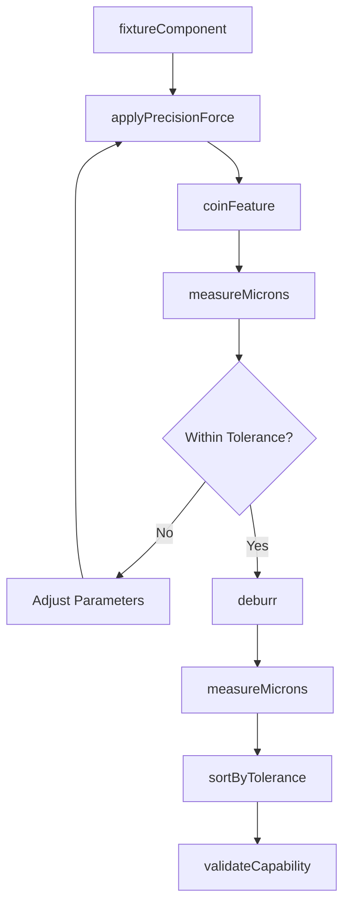
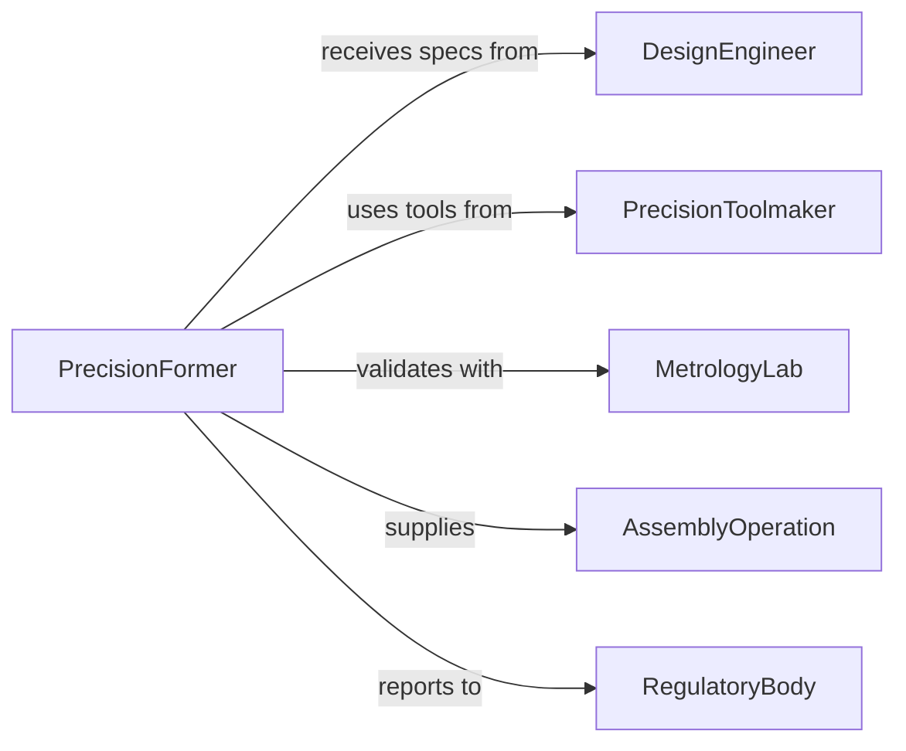

# Reshape Small Metal Components Precision

> Business-as-Code definition for precision reshaping of small metal components including springs, connectors, and fasteners for tight-tolerance assemblies.

## Overview

Precision metal component reshaping involves micro-forming, coining, and fine-bending operations to achieve tight tolerances required for electronics, medical devices, and aerospace assemblies. This definition exposes actions for precision forming, measurement verification, and quality control at micro and meso scales.

## Actors

| Actor | Description |
|-------|-------------|
| DesignEngineer | Provides precision specifications and tolerances |
| PrecisionToolmaker | Fabricates micro-forming dies and fixtures |
| MetrologyLab | Provides high-precision measurement capabilities |
| AssemblyOperation | Uses shaped components in precision assemblies |
| RegulatoryBody | Enforces quality standards for critical applications |
| MaterialScientist | Advises on material behavior at small scales |

## Roles

| Role | Description |
|------|-------------|
| PrecisionFormer | Operates micro-forming equipment |
| InspectionTechnician | Performs dimensional verification |
| ProcessEngineer | Optimizes forming parameters |
| QualityEngineer | Validates process capability |

## Entities

| Entity | Description |
|--------|-------------|
| Component | A small metal part requiring precision reshaping |
| MicroTolerance | Extremely tight dimensional requirements |
| FormingStation | Specialized equipment for small-part forming |
| CoiningOperation | High-pressure forming for precise features |
| OpticalMeasurement | Non-contact dimensional verification |
| ProcessCapability | Statistical measure of forming consistency |

## Actions

| Action | Description |
|--------|-------------|
| fixtureComponent | Secure small part in precision forming station |
| applyPrecisionForce | Execute controlled micro-forming operation |
| coinFeature | Apply high pressure to create precise geometry |
| measureMicrons | Verify dimensions at micrometer resolution |
| deburr | Remove sharp edges without affecting dimensions |
| sortByTolerance | Classify parts by dimensional conformance |
| validateCapability | Assess process precision statistically |

## Events

| Event | Description |
|-------|-------------|
| componentFixtured | Part secured in forming equipment |
| precisionForceApplied | Micro-forming operation executed |
| featureCoinaged | High-pressure forming completed |
| micronsmeasureed | Sub-millimeter dimensions verified |
| componentDeburred | Sharp edges removed |
| toleranceSorted | Parts classified by conformance |
| capabilityValidated | Process precision statistically confirmed |

## Searches

| Search | Description |
|--------|-------------|
| findComponents | List parts by specification, batch, or status |
| getMicroTolerances | Retrieve precision requirements by part number |
| getFormingStations | Find equipment by capability and availability |
| getCapabilityData | Retrieve process control statistics |

## Workflow



## Actor Relationships



## Usage

### Calling Actions

```typescript
import { reshapeSmallMetalComponentsPrecision } from '@headlessly/reshape-small-metal-components-precision'

const precision = reshapeSmallMetalComponentsPrecision()

// Fixture spring contact in micro-forming press
await precision.fixtureComponent({
  componentId: 'spring-contact-8844',
  station: 'micro-press-5-ton',
  fixtureType: 'vacuum-chuck',
  alignment: 'optical-registration'
})

// Apply precision forming force
const forming = await precision.applyPrecisionForce({
  componentId: 'spring-contact-8844',
  operation: 'z-bend',
  force: 450,
  displacement: 0.25,
  controlMode: 'position-controlled'
})

// Coin critical contact feature
await precision.coinFeature({
  componentId: 'spring-contact-8844',
  feature: 'contact-dimple',
  force: 2000,
  dwellTime: 0.5,
  toolRadius: 0.4
})

// Measure with optical comparator
const measurements = await precision.measureMicrons({
  componentId: 'spring-contact-8844',
  method: 'optical-comparator',
  features: [
    { feature: 'contact-height', tolerance: 0.005 },
    { feature: 'bend-angle', tolerance: 0.5 },
    { feature: 'dimple-depth', tolerance: 0.002 }
  ],
  magnification: 100
})

// Remove burrs carefully
await precision.deburr({
  componentId: 'spring-contact-8844',
  method: 'tumble-finishing',
  media: 'ceramic-micro',
  duration: 30,
  verifyDimensions: true
})

// Sort by tolerance grade
await precision.sortByTolerance({
  batchId: 'batch-8844',
  gradingCriteria: {
    gradeA: { allFeatures: 'within-50pct-tolerance' },
    gradeB: { allFeatures: 'within-100pct-tolerance' },
    reject: { anyFeature: 'out-of-tolerance' }
  }
})

// Validate process capability
const capability = await precision.validateCapability({
  batchId: 'batch-8844',
  sampleSize: 30,
  cpkTarget: 1.67,
  features: ['contact-height', 'bend-angle', 'dimple-depth']
})
```

### Event-Driven Automation

```typescript
// Auto-adjust forming parameters on measurement deviation
precision.micronsMeasured(async ({ componentId, deviations }) => {
  for (const deviation of deviations) {
    if (Math.abs(deviation.value) > deviation.tolerance * 0.5) {
      await precision.applyPrecisionForce({
        componentId,
        adjustment: calculateCorrection(deviation)
      })
    }
  }
})

// Alert on process capability below target
precision.capabilityValidated(async ({ batchId, cpk, features }) => {
  const lowCpk = features.filter(f => f.cpk < 1.33)
  if (lowCpk.length > 0) {
    await notify({
      to: 'process-engineering',
      priority: 'high',
      message: `Batch ${batchId} has low Cpk on ${lowCpk.map(f => f.name).join(', ')}`
    })
  }
})
```
