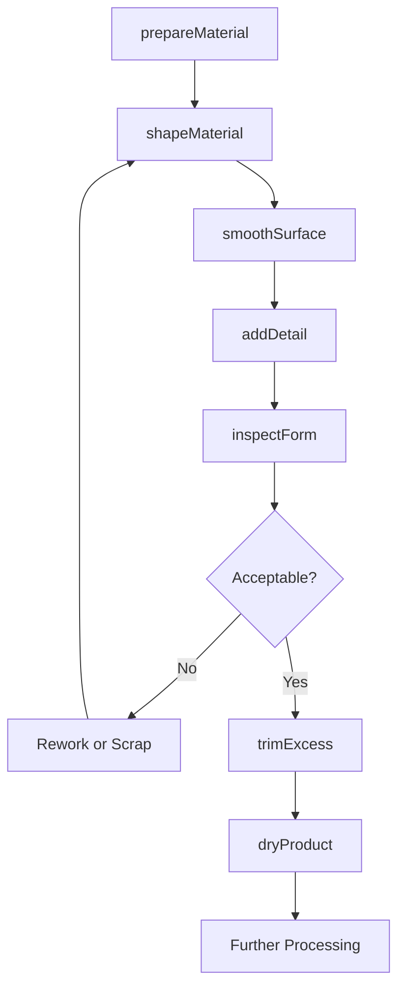
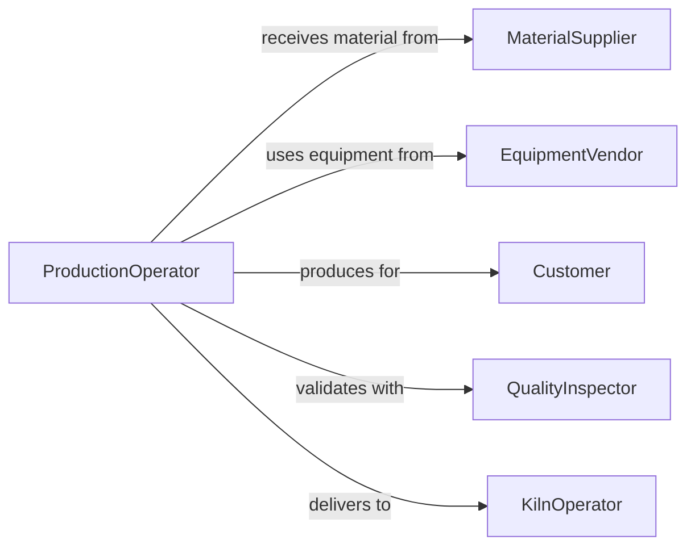

# Shape Clay Dough Create Products

> Business-as-Code definition for shaping clay, dough, and other plastic materials to create ceramic products, baked goods, and formed articles.

## Overview

Clay and dough shaping involves manual and automated forming techniques including throwing, molding, rolling, and extrusion to create functional and decorative products. This definition exposes actions for material preparation, forming operations, and quality verification across ceramic, pottery, and food production operations.

## Actors

| Actor | Description |
|-------|-------------|
| MaterialSupplier | Provides clay, dough, and forming materials |
| EquipmentVendor | Supplies forming tools and machinery |
| Customer | Purchases shaped products |
| QualityInspector | Validates product conformance |
| KilnOperator | Fires ceramic products after forming |
| PackagingDepartment | Prepares formed products for distribution |

## Roles

| Role | Description |
|------|-------------|
| Potter | Shapes clay products on wheel or by hand |
| Baker | Forms dough into bread and pastry products |
| ProductionOperator | Operates automated forming equipment |
| QualityChecker | Inspects formed products for defects |

## Entities

| Entity | Description |
|--------|-------------|
| Material | Clay, dough, or other formable substance |
| FormingMethod | Technique for shaping material into product |
| Product | A shaped article created from material |
| Mold | A form used to shape material |
| Consistency | Material workability and moisture content |
| Defect | A flaw in formed product requiring correction |

## Actions

| Action | Description |
|--------|-------------|
| prepareMaterial | Condition material for optimal forming |
| shapeMaterial | Form material into product geometry |
| smoothSurface | Refine surface finish of formed product |
| addDetail | Apply decorative or functional features |
| inspectForm | Verify product shape and dimensions |
| trimExcess | Remove waste material from formed product |
| dryProduct | Remove moisture to stabilize form |

## Events

| Event | Description |
|-------|-------------|
| materialPrepared | Substance conditioned for forming |
| materialShaped | Product geometry created |
| surfaceSmoothed | Surface finish refined |
| detailAdded | Features applied to product |
| formInspected | Shape and dimensions verified |
| excessTrimmed | Waste material removed |
| productDried | Moisture removed to stabilize |

## Searches

| Search | Description |
|--------|-------------|
| findProducts | List items by type, status, or batch |
| getFormingMethods | Retrieve shaping techniques by product type |
| getMaterialSpecs | Find consistency requirements by product |
| getDefects | Retrieve quality issues by product or batch |

## Workflow



## Actor Relationships



## Usage

### Calling Actions

```typescript
import { shapeClayDoughCreateProducts } from '@headlessly/shape-clay-dough-create-products'

const shaping = shapeClayDoughCreateProducts()

// Prepare clay for pottery
const material = await shaping.prepareMaterial({
  materialType: 'stoneware-clay',
  quantity: 5000,
  targetConsistency: 'plastic',
  wedgingCycles: 20,
  moisture: 22
})

// Shape bowl on potter's wheel
const product = await shaping.shapeMaterial({
  materialId: material.id,
  productType: 'serving-bowl',
  method: 'wheel-throwing',
  targetDimensions: { diameter: 280, height: 80, wallThickness: 8 },
  formingSpeed: 120
})

// Smooth interior and exterior surfaces
await shaping.smoothSurface({
  productId: product.id,
  surfaces: ['interior', 'exterior'],
  tools: ['rib', 'sponge'],
  targetFinish: 'burnished'
})

// Add decorative rim detail
await shaping.addDetail({
  productId: product.id,
  detailType: 'carved-pattern',
  location: 'rim',
  pattern: 'wave-motif',
  depth: 2
})

// Inspect formed bowl
const inspection = await shaping.inspectForm({
  productId: product.id,
  criteria: ['symmetry', 'wall-thickness', 'rim-level', 'no-cracks']
})

// Trim foot ring
await shaping.trimExcess({
  productId: product.id,
  operation: 'foot-ring-trimming',
  toolType: 'trimming-tool',
  targetProfile: 'beveled-foot'
})

// Dry slowly to prevent cracking
await shaping.dryProduct({
  productId: product.id,
  method: 'slow-air-dry',
  environment: 'controlled-humidity',
  duration: 48,
  targetMoisture: 8
})
```

### Event-Driven Automation

```typescript
// Alert on inspection failure
shaping.formInspected(async ({ productId, passed, failures }) => {
  if (!passed) {
    await notify({
      to: 'production-supervisor',
      message: `Product ${productId} failed inspection: ${failures.join(', ')}`
    })
  }
})

// Auto-route to kiln after drying
shaping.productDried(async ({ productId, moisture }) => {
  if (moisture <= 8) {
    await kiln.schedule({
      productId,
      firingType: 'bisque',
      temperature: 1000
    })
  }
})
```
