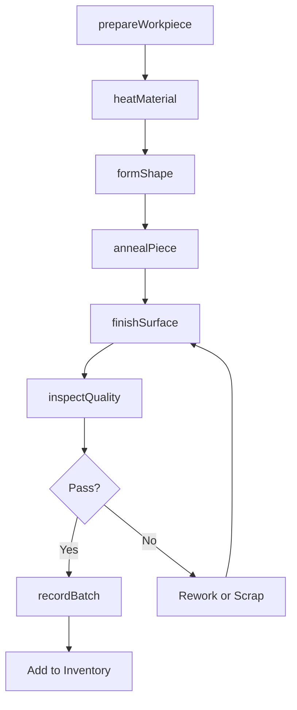
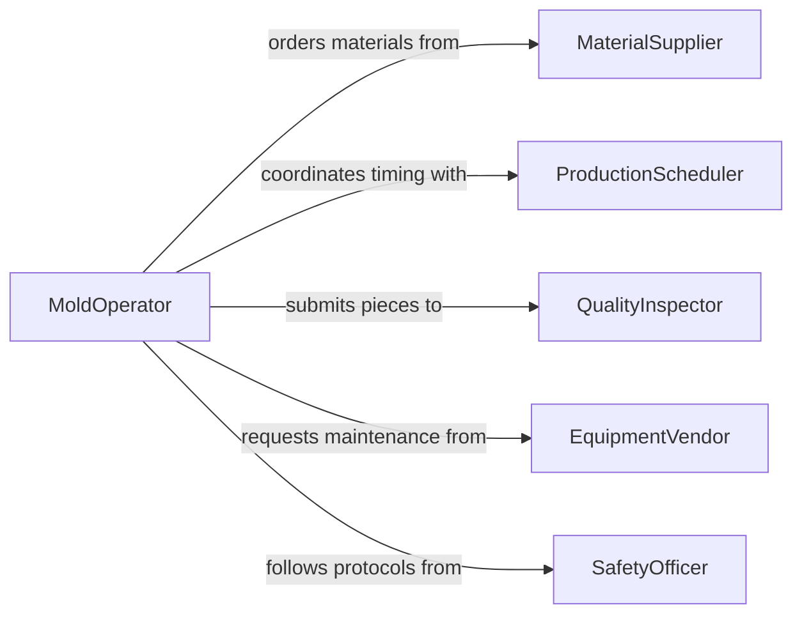

# Shape Glass Similar Materials

> Business-as-Code definition for glass and similar material shaping operations. Models the complete fabrication process from raw material preparation through forming, cooling, and quality verification.

## Overview

Glass shaping operations involve heating, molding, cutting, and finishing glass or ceramic materials to create products ranging from architectural components to decorative items. This definition exposes actions for each phase of the shaping process, events for production automation, and searches for batch tracking and quality control.

## Actors

| Actor | Description |
|-------|-------------|
| MaterialSupplier | Provides raw glass, ceramic, or composite materials |
| QualityInspector | Verifies dimensional accuracy and surface quality |
| ProductionScheduler | Coordinates furnace schedules and batch timing |
| EquipmentVendor | Maintains kilns, molds, and shaping tools |
| Customer | Orders custom shapes or standard products |
| SafetyOfficer | Monitors heat exposure and ventilation compliance |

## Roles

| Role | Description |
|------|-------------|
| GlassBlower | Shapes molten glass using hand tools and breath |
| MoldOperator | Operates casting and pressing equipment |
| FinishingTechnician | Grinds, polishes, and smooths shaped pieces |
| KilnOperator | Controls firing schedules and temperatures |

## Entities

| Entity | Description |
|--------|-------------|
| Workpiece | A piece of glass or ceramic material being shaped |
| Mold | A form used to shape material during heating |
| BatchRecord | Documentation of materials and process parameters |
| QualitySpec | Dimensional and surface finish requirements |
| FiringSchedule | Temperature ramp and hold times for annealing |
| Inventory | Finished pieces ready for shipment or assembly |

## Actions

| Action | Description |
|--------|-------------|
| prepareWorkpiece | Cut and clean raw material for shaping |
| heatMaterial | Raise material temperature to working range |
| formShape | Apply molds, tools, or blowing to create shape |
| annealPiece | Cool material in controlled manner to relieve stress |
| finishSurface | Grind, polish, or etch to meet specifications |
| inspectQuality | Verify dimensions and surface finish |
| recordBatch | Document process parameters and results |

## Events

| Event | Description |
|-------|-------------|
| workpiecePrepared | Material has been cut and cleaned |
| materialHeated | Temperature has reached working range |
| shapeFormed | Material has been molded or blown to shape |
| pieceAnnealed | Cooling cycle is complete |
| surfaceFinished | Grinding and polishing are complete |
| qualityInspected | Inspection has passed or failed |
| batchRecorded | Process record has been saved |

## Searches

| Search | Description |
|--------|-------------|
| findBatches | List production batches by date or material |
| getQualityRecords | Retrieve inspection results for a batch |
| getInventory | Find finished pieces by type or customer |
| getFiringSchedules | List scheduled kiln runs |

## Workflow



## Actor Relationships



## Usage

### Calling Actions

```typescript
import { shapeGlassSimilarMaterials } from '@headlessly/shape-glass-similar-materials'

const glass = shapeGlassSimilarMaterials()

// Prepare raw glass sheet for shaping
const workpiece = await glass.prepareWorkpiece({
  materialType: 'borosilicate',
  dimensions: { length: 500, width: 300, thickness: 10 },
  quantity: 12
})

// Heat material to working temperature
await glass.heatMaterial({
  workpieceId: workpiece.id,
  targetTemp: 1050,
  rampRate: 50
})

// Form shape using compression mold
await glass.formShape({
  workpieceId: workpiece.id,
  method: 'press',
  moldId: 'MOLD-2847',
  pressure: 2000
})

// Controlled cooling to prevent stress fractures
await glass.annealPiece({
  workpieceId: workpiece.id,
  schedule: 'standard-borosilicate',
  peakTemp: 560,
  holdTime: 120
})
```

### Event-Driven Automation

```typescript
// Trigger annealing when forming is complete
glass.shapeFormed(async ({ workpieceId, materialType }) => {
  const schedule = await getAnnealingSchedule(materialType)
  await glass.annealPiece({ workpieceId, schedule })
})

// Alert quality team when batch is ready for inspection
glass.surfaceFinished(async ({ workpieceId, batchId }) => {
  await notify({
    to: 'quality-team',
    message: `Batch ${batchId} ready for inspection`,
    workpieceId
  })
})
```
