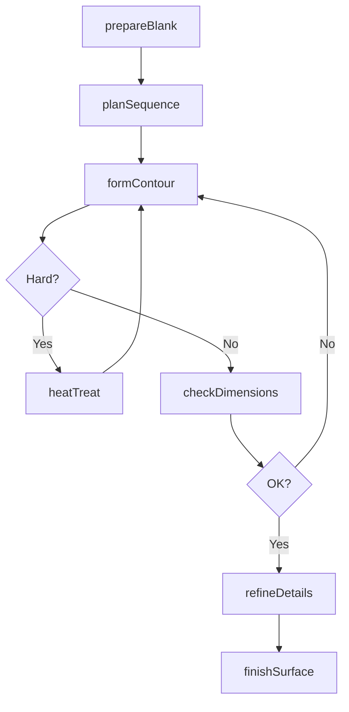
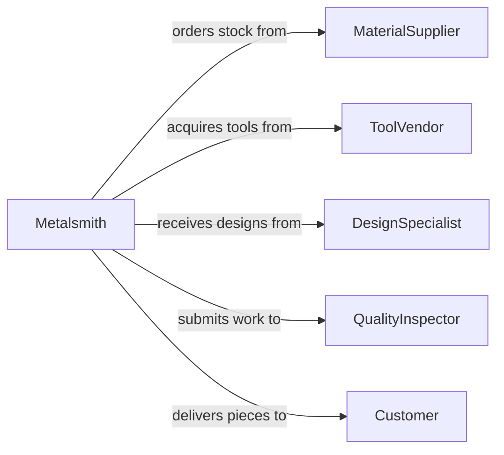

# Shape Metal Workpieces Hammers Small

> Business-as-Code definition for small-scale metal shaping using hammers and hand tools. Models traditional metalworking techniques including forging, planishing, and detail forming for jewelry, ornamental work, and precision components.

## Overview

Hand tool metal shaping involves using hammers, stakes, anvils, and forming tools to shape metal through controlled deformation. This craft-level work requires skill in reading material behavior and planning strike sequences. This definition exposes actions for each stage from blank preparation through final forming and finishing.

## Actors

| Actor | Description |
|-------|-------------|
| MaterialSupplier | Provides sheet metal, wire, and stock materials |
| ToolVendor | Supplies hammers, stakes, anvils, and specialized tools |
| DesignSpecialist | Creates drawings or models for custom pieces |
| QualityInspector | Verifies dimensions and surface finish |
| Customer | Commissions custom metalwork or orders production pieces |
| SafetyOfficer | Monitors hearing protection and ventilation |

## Roles

| Role | Description |
|------|-------------|
| Metalsmith | Shapes metal using hand tools and experience |
| Jeweler | Fabricates small precision pieces in precious metals |
| Ornamentalworker | Creates decorative metalwork for architecture |
| Toolmaker | Produces jigs and fixtures for production work |

## Entities

| Entity | Description |
|--------|-------------|
| Workpiece | A piece of metal being shaped by hand |
| Tool | A hammer, stake, or forming implement |
| Pattern | A template or drawing showing desired shape |
| HeatTreatment | Annealing or hardening record for the workpiece |
| MeasurementRecord | Dimensional checks during forming process |
| FinishedPart | Completed workpiece meeting specifications |

## Actions

| Action | Description |
|--------|-------------|
| prepareBlank | Cut and anneal stock material for forming |
| planSequence | Determine strike order and tool selection |
| formContour | Shape primary curves and surfaces |
| refineDetails | Planish and texture surface features |
| checkDimensions | Measure against pattern or specifications |
| heatTreat | Anneal or harden as needed during process |
| finishSurface | File, sand, or polish to final state |

## Events

| Event | Description |
|-------|-------------|
| blankPrepared | Stock material has been cut and annealed |
| sequencePlanned | Forming steps have been determined |
| contourFormed | Primary shape has been established |
| detailsRefined | Surface texture and features are complete |
| dimensionsChecked | Measurements have been verified |
| heatTreated | Material has been annealed or hardened |
| surfaceFinished | Final polish or texture is complete |

## Searches

| Search | Description |
|--------|-------------|
| findWorkpieces | List active projects by customer or status |
| getPatterns | Retrieve design templates by type or project |
| getMeasurements | Find dimensional records for a workpiece |
| getToolInventory | List available hammers, stakes, and forms |

## Workflow



## Actor Relationships



## Usage

### Calling Actions

```typescript
import { shapeMetalWorkpiecesHammersSmall } from '@headlessly/shape-metal-workpieces-hammers-small'

const metalwork = shapeMetalWorkpiecesHammersSmall()

// Prepare copper blank for decorative bowl
const blank = await metalwork.prepareBlank({
  material: 'copper',
  gauge: 18,
  shape: 'disc',
  diameter: 200
})

// Plan the forming sequence
const sequence = await metalwork.planSequence({
  workpieceId: blank.id,
  targetShape: 'shallow-bowl',
  tools: ['raising-hammer', 'bowl-stake', 'planishing-hammer']
})

// Begin forming the contour
await metalwork.formContour({
  workpieceId: blank.id,
  technique: 'raising',
  passes: 6,
  annealBetweenPasses: true
})

// Check dimensions against pattern
await metalwork.checkDimensions({
  workpieceId: blank.id,
  patternId: 'BOWL-A12',
  tolerance: 2
})
```

### Event-Driven Automation

```typescript
// Auto-schedule annealing when work hardening occurs
metalwork.contourFormed(async ({ workpieceId, passes }) => {
  if (passes >= 5) {
    await metalwork.heatTreat({
      workpieceId,
      process: 'anneal',
      temp: 700,
      duration: 10
    })
  }
})

// Notify customer when piece is ready for review
metalwork.surfaceFinished(async ({ workpieceId, customerId }) => {
  await notify({
    to: customerId,
    message: 'Your custom metalwork piece is complete and ready for pickup'
  })
})
```
