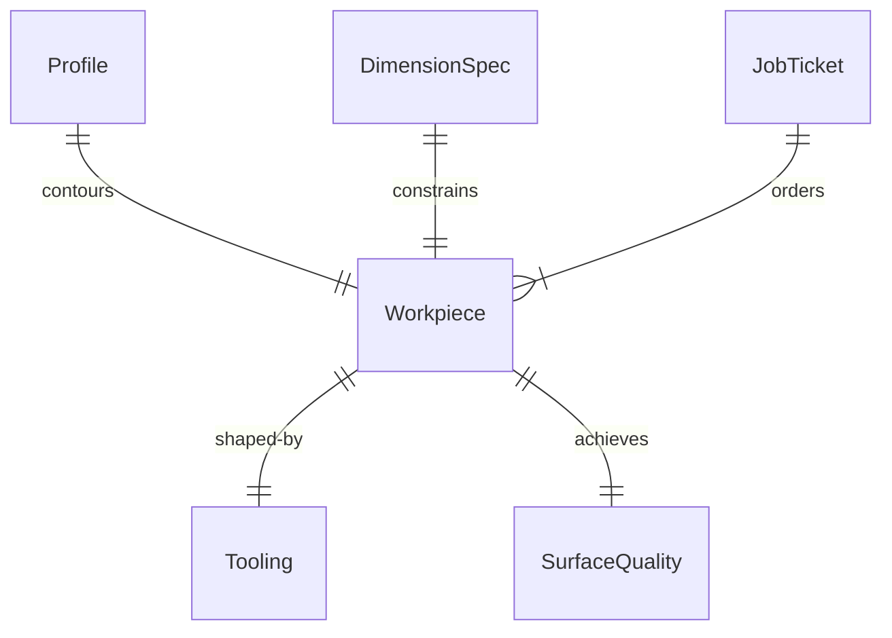
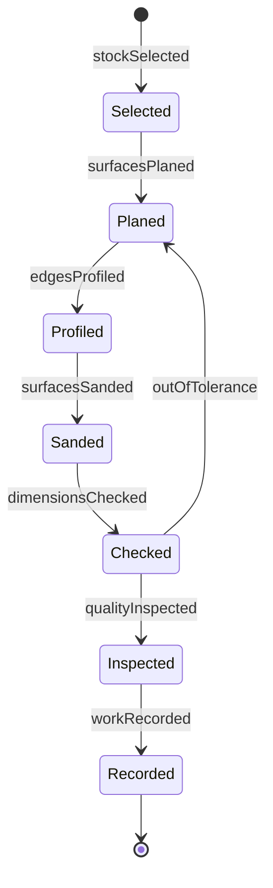
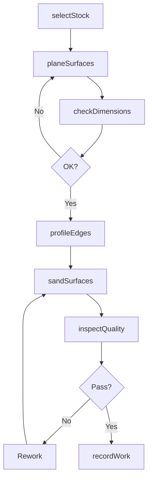
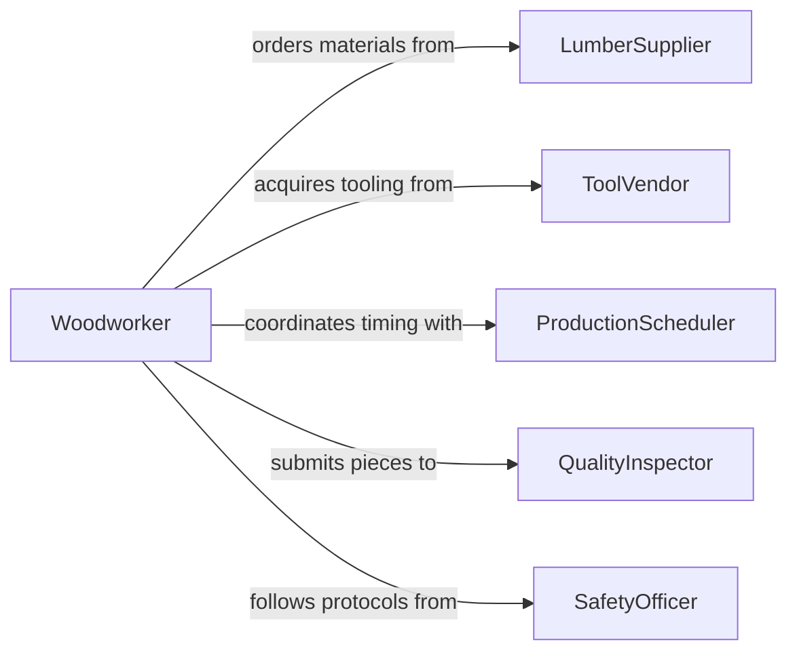

# Shape Surfaces Edges Wood Workpieces

> Business-as-Code definition for wood surface and edge shaping operations. Models planing, routing, sanding, and profiling processes for furniture, cabinetry, millwork, and architectural woodworking.

## Overview

Wood shaping operations refine rough-sawn lumber and assembled pieces into smooth, dimensionally accurate components with decorative or functional profiles. This work involves planers, routers, sanders, and hand tools to achieve precise surface flatness, edge profiles, and joinery fit. This definition exposes actions for preparation, shaping, finishing, and quality control.

## Actors

| Actor | Description |
|-------|-------------|
| LumberSupplier | Provides dimensional lumber and sheet goods |
| ToolVendor | Supplies router bits, blades, and abrasives |
| ProductionScheduler | Coordinates machine availability and batch timing |
| QualityInspector | Verifies dimensions and surface quality |
| Customer | Orders custom woodwork or production pieces |
| SafetyOfficer | Monitors dust collection and machine guarding |

## Roles

| Role | Description |
|------|-------------|
| Woodworker | Shapes wood using power tools and hand tools |
| CabinetMaker | Fabricates furniture and cabinetry components |
| MillwrightOperator | Produces architectural millwork and moldings |
| Finisher | Prepares surfaces for stain or paint |

## Entities

| Entity | Description |
|--------|-------------|
| Workpiece | A piece of wood being shaped or profiled |
| Tooling | Router bits, planer knives, or sanding discs |
| Profile | A cross-sectional shape specification for edges |
| DimensionSpec | Target thickness, width, and length tolerances |
| SurfaceQuality | Smoothness and defect standards |
| JobTicket | Work order with specifications and materials |

## Actions

| Action | Description |
|--------|-------------|
| selectStock | Choose lumber or panels for the job |
| planeSurfaces | Flatten and thickness workpiece to dimension |
| profileEdges | Route or shape edge contours |
| sandSurfaces | Smooth surfaces to specified grit level |
| checkDimensions | Verify thickness, width, and profile accuracy |
| inspectQuality | Examine for tear-out, burns, or defects |
| recordWork | Document dimensions and surface quality |

## Events

| Event | Description |
|-------|-------------|
| stockSelected | Material has been pulled from inventory |
| surfacesPlaned | Workpiece has been flattened and thicknessed |
| edgesProfiled | Edge contours have been routed or shaped |
| surfacesSanded | Smoothing to final grit is complete |
| dimensionsChecked | Measurements have been verified |
| qualityInspected | Surface quality has been approved |
| workRecorded | Job ticket has been completed |

## Searches

| Search | Description |
|--------|-------------|
| findJobs | List active work orders by customer or deadline |
| getProfiles | Retrieve edge profile specifications by name |
| getQualityRecords | Find inspection results for a batch |
| getTooling | List router bits or blades by profile type |


## Entity Relationships



## State Diagram



## Workflow



## Actor Relationships



## Usage

### Calling Actions

```typescript
import { shapeSurfacesEdgesWoodWorkpieces } from '@headlessly/shape-surfaces-edges-wood-workpieces'

const woodshop = shapeSurfacesEdgesWoodWorkpieces()

// Select hardwood for tabletop
const stock = await woodshop.selectStock({
  species: 'white-oak',
  grade: 'FAS',
  quantity: 8,
  roughDimensions: { thickness: 32, width: 150, length: 2400 }
})

// Plane to final thickness
await woodshop.planeSurfaces({
  workpieceId: stock.id,
  targetThickness: 25,
  tolerance: 0.5,
  passes: 3
})

// Route decorative edge profile
await woodshop.profileEdges({
  workpieceId: stock.id,
  profile: 'ogee',
  bitId: 'CMT-855',
  depth: 8
})

// Sand to finish-ready smoothness
await woodshop.sandSurfaces({
  workpieceId: stock.id,
  grits: [80, 120, 180, 220],
  method: 'random-orbital'
})
```

### Event-Driven Automation

```typescript
// Trigger edge profiling when planing is complete and dimensions are verified
woodshop.dimensionsChecked(async ({ workpieceId, dimensionSpec }) => {
  if (dimensionSpec.profile) {
    await woodshop.profileEdges({
      workpieceId,
      profile: dimensionSpec.profile
    })
  }
})

// Alert quality team when sanding is complete
woodshop.surfacesSanded(async ({ workpieceId, jobTicket }) => {
  await notify({
    to: 'quality-team',
    message: `Job ${jobTicket} ready for final inspection`,
    workpieceId
  })
})
```
