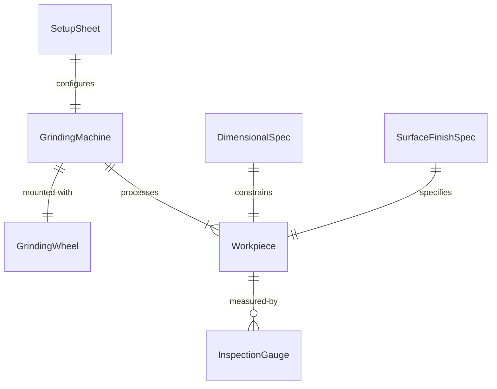
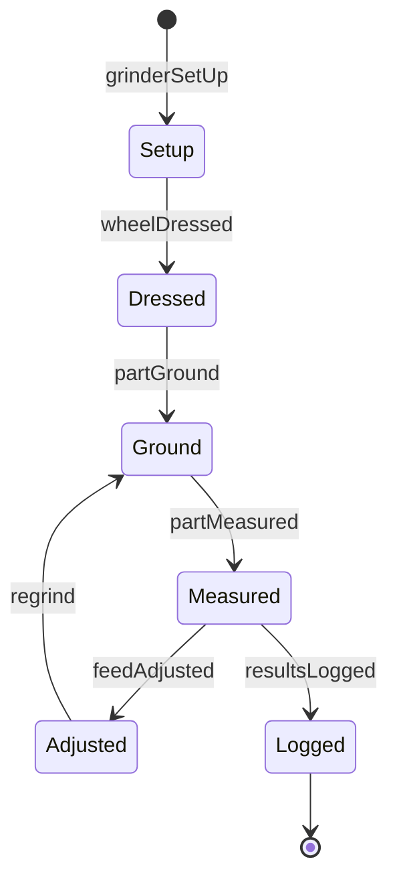
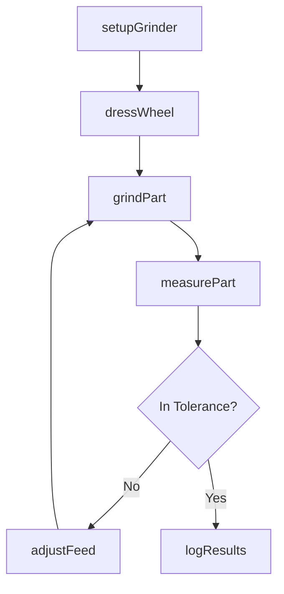
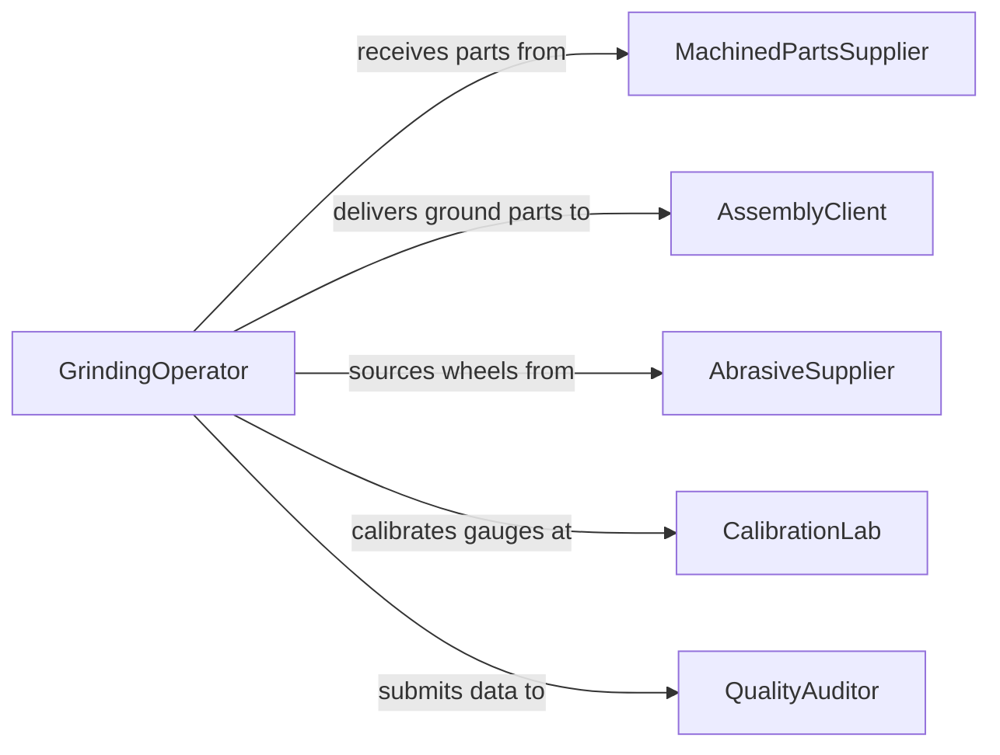

# Grind Parts to Required Dimensions

> Business-as-Code definition for precision grinding operations. Models the setup, operation, and quality verification of grinding processes that bring parts to specified dimensional tolerances.

## Overview

Grinding parts to required dimensions involves selecting grinding wheels, setting up surface, cylindrical, or centerless grinders, and removing material to achieve tight tolerances on hardened or precision components. This definition covers tool and cutter grinding, production grinding for batch runs, and finish grinding for bearing surfaces, shafts, and mating components.

## Actors

| Actor | Description |
|-------|-------------|
| MachinedPartsSupplier | Provides rough-machined parts requiring finish grinding |
| AssemblyClient | Receives ground parts for precision assembly operations |
| AbrasiveSupplier | Provides grinding wheels, belts, and dressing tools |
| CalibrationLab | Certifies measuring instruments used for dimensional verification |
| QualityAuditor | Reviews grinding process capability and part conformance |

## Roles

| Role | Description |
|------|-------------|
| GrindingOperator | Sets up and operates grinding machines to specification |
| ProcessEngineer | Defines grinding parameters, feeds, speeds, and coolant settings |
| QualityInspector | Measures ground parts for dimensional and surface finish compliance |
| ToolroomTechnician | Dresses grinding wheels and maintains machine tooling |

## Entities

| Entity | Description |
|--------|-------------|
| GrindingMachine | A surface, cylindrical, or centerless grinder |
| GrindingWheel | An abrasive disc used to remove material from workpieces |
| Workpiece | A part being ground to specified dimensions |
| DimensionalSpec | Target dimensions with tolerances for the finished part |
| SurfaceFinishSpec | Required roughness average for ground surfaces |
| SetupSheet | Machine parameters, wheel selection, and fixture details |
| InspectionGauge | A precision measuring tool used to verify ground dimensions |

## Actions

| Action | Description |
|--------|-------------|
| setupGrinder | Configure machine, mount grinding wheel, and set workholding |
| dressWheel | True and sharpen the grinding wheel surface |
| grindPart | Execute grinding passes to remove material to dimension |
| measurePart | Check critical dimensions with gauges or CMM |
| adjustFeed | Modify infeed or traverse rate based on measurement feedback |
| logResults | Record dimensions, surface finish, and process parameters |

## Events

| Event | Description |
|-------|-------------|
| grinderSetUp | Machine has been configured for the part program |
| wheelDressed | Grinding wheel has been trued and sharpened |
| partGround | Material removal passes have been completed |
| partMeasured | Dimensional inspection results have been recorded |
| feedAdjusted | Grinding parameters have been modified for correction |
| resultsLogged | Process and quality data have been documented |

## Searches

| Search | Description |
|--------|-------------|
| findSetupSheets | Locate machine setup records by part number or grinder |
| getInspectionData | Retrieve dimensional measurements for ground part batches |
| getWheelUsage | Track grinding wheel life and replacement history |
| findOutOfTolerance | List parts that failed dimensional inspection |


## Entity Relationships



## State Diagram



## Workflow



## Actor Relationships



## Usage

### Calling Actions

```typescript
import { grindPartsRequiredDimensions } from '@headlessly/grind-parts-required-dimensions'

const grinding = grindPartsRequiredDimensions()

// Set up the grinder for a production run
await grinding.setupGrinder({
  machineId: 'CG-04',
  partNumber: 'SHAFT-2024-0091',
  wheelSpec: '32A46-H8VBE',
  fixture: 'between-centers'
})

// Grind and measure
await grinding.grindPart({
  machineId: 'CG-04',
  targetDiameterMm: 25.000,
  toleranceMm: 0.005,
  passes: 3
})

const measurement = await grinding.measurePart({
  partId: 'SHAFT-2024-0091-001',
  gauge: 'outside-micrometer',
  nominalMm: 25.000
})
```

### Event-Driven Automation

```typescript
// Auto-dress wheel after set number of parts
grinding.partGround(async ({ machineId, partsSinceLastDress }) => {
  if (partsSinceLastDress >= 50) {
    await grinding.dressWheel({ machineId, dressDepthMm: 0.02 })
  }
})

// Flag tolerance trends
grinding.partMeasured(async ({ partId, deviation, toleranceMm }) => {
  if (Math.abs(deviation) > toleranceMm * 0.8) {
    await notify({
      to: 'process-engineer',
      message: `Part ${partId} approaching tolerance limit: ${deviation}mm`
    })
  }
})
```
