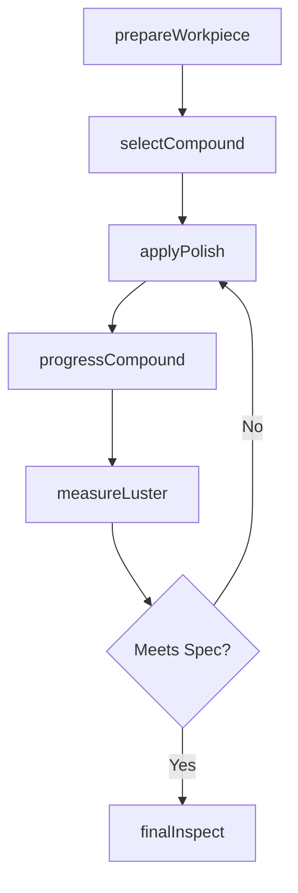
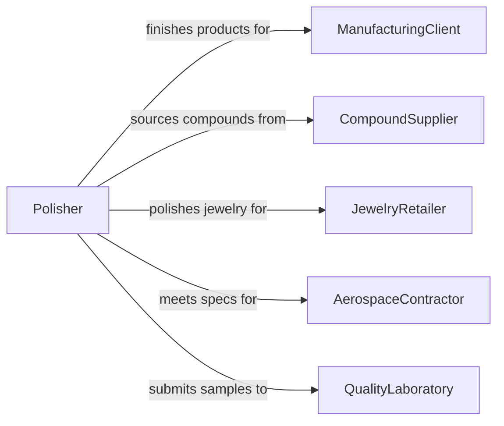

# Polish Materials, Workpieces, or Finished Products

> Business-as-Code definition for polishing operations. Models the buffing, lapping, and mirror-finishing of materials and products to achieve specified luster, reflectivity, or surface smoothness.

## Overview

Polishing materials, workpieces, or finished products involves applying progressively finer abrasive compounds or buffing wheels to achieve a high-gloss or mirror-quality surface finish. This definition covers metal polishing for jewelry and aerospace components, stone and marble finishing, optical lens polishing, and production buffing of consumer goods.

## Actors

| Actor | Description |
|-------|-------------|
| ManufacturingClient | Requires polished components for final assembly or retail sale |
| CompoundSupplier | Provides polishing compounds, rouge, and buffing wheels |
| JewelryRetailer | Sells polished precious metal and gemstone products |
| AerospaceContractor | Specifies mirror-finish requirements for aerospace parts |
| QualityLaboratory | Measures reflectivity and surface roughness of polished items |

## Roles

| Role | Description |
|------|-------------|
| Polisher | Operates buffing wheels and applies polishing compounds |
| FinishingEngineer | Specifies polishing sequences and compound selection |
| QualityInspector | Verifies surface luster and reflectivity against standards |
| ToolMaintainer | Services polishing lathes, buffs, and compound delivery systems |

## Entities

| Entity | Description |
|--------|-------------|
| Workpiece | A material or product being polished |
| PolishingCompound | An abrasive paste or rouge applied during polishing |
| BuffingWheel | A cloth or felt wheel used with compound for polishing |
| LusterSpec | Target reflectivity or gloss level for the finished surface |
| PolishingSequence | An ordered list of compounds and wheels from coarse to fine |
| FinishRecord | Documentation of polishing steps and final quality readings |

## Actions

| Action | Description |
|--------|-------------|
| prepareWorkpiece | Clean and inspect the surface before polishing begins |
| selectCompound | Choose the appropriate polishing compound for the material |
| applyPolish | Buff the workpiece with compound and wheel at specified speed |
| progressCompound | Advance to finer compounds for higher luster |
| measureLuster | Test surface reflectivity or gloss with measurement instruments |
| finalInspect | Verify the polished surface meets all quality criteria |

## Events

| Event | Description |
|-------|-------------|
| workpiecePrepared | Surface has been cleaned and staged for polishing |
| compoundSelected | Polishing compound has been chosen for the material type |
| polishApplied | Buffing pass has been completed |
| compoundProgressed | Finer compound has been introduced for finishing |
| lusterMeasured | Reflectivity or gloss readings have been recorded |
| finalInspected | Polished surface has passed all quality checks |

## Searches

| Search | Description |
|--------|-------------|
| findPolishingOrders | Locate polishing jobs by product, material, or status |
| getLusterData | Retrieve reflectivity measurements for polished items |
| getCompoundUsage | Track compound consumption by type and work order |
| findRejectedFinishes | List items that failed luster or surface quality checks |

## Workflow



## Actor Relationships



## Usage

### Calling Actions

```typescript
import { polishMaterialsWorkpiecesFinishedProducts } from '@headlessly/polish-materials-workpieces-finished-products'

const polishing = polishMaterialsWorkpiecesFinishedProducts()

// Prepare and polish a stainless steel component
await polishing.prepareWorkpiece({
  workpieceId: 'SS-RING-2024-0044',
  material: 'stainless-steel-304',
  cleaningMethod: 'ultrasonic'
})

await polishing.applyPolish({
  workpieceId: 'SS-RING-2024-0044',
  compound: 'tripoli',
  wheelType: 'sisal-buff',
  speedRpm: 1750
})

// Measure the final luster
const luster = await polishing.measureLuster({
  workpieceId: 'SS-RING-2024-0044',
  targetGlossUnits: 90,
  instrument: 'gloss-meter-60deg'
})
```

### Event-Driven Automation

```typescript
// Auto-progress compound when intermediate luster is achieved
polishing.lusterMeasured(async ({ workpieceId, glossUnits, targetGlossUnits }) => {
  if (glossUnits < targetGlossUnits && glossUnits > targetGlossUnits * 0.7) {
    await polishing.progressCompound({
      workpieceId,
      nextCompound: 'jewelers-rouge'
    })
  }
})

// Notify client on final inspection pass
polishing.finalInspected(async ({ workpieceId, orderId }) => {
  await notify({
    to: 'manufacturing-client',
    message: `Order ${orderId}: polished item ${workpieceId} ready for shipment`
  })
})
```
