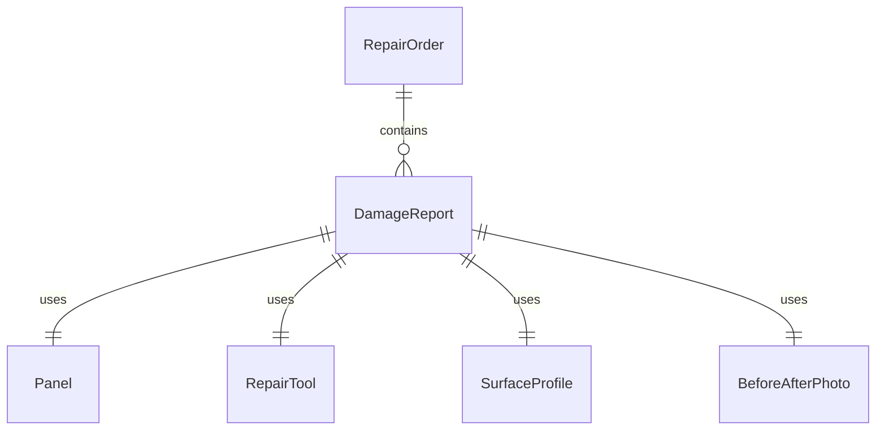
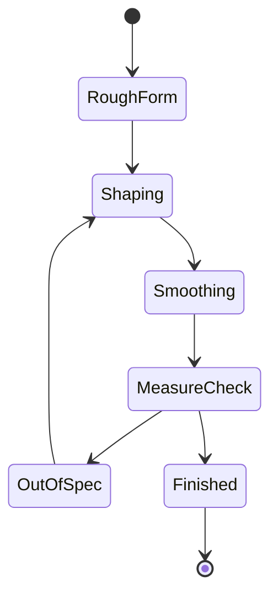
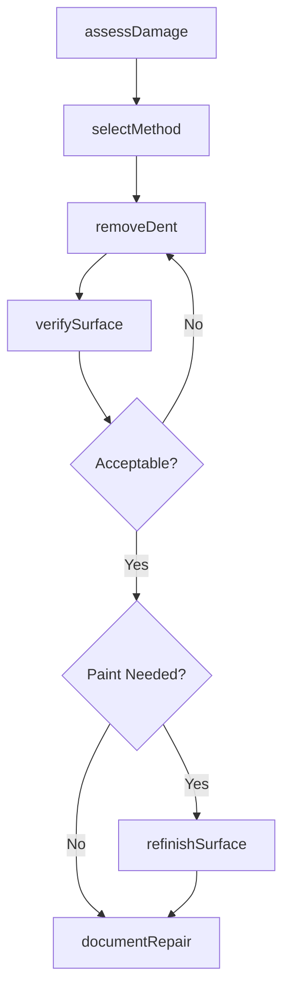
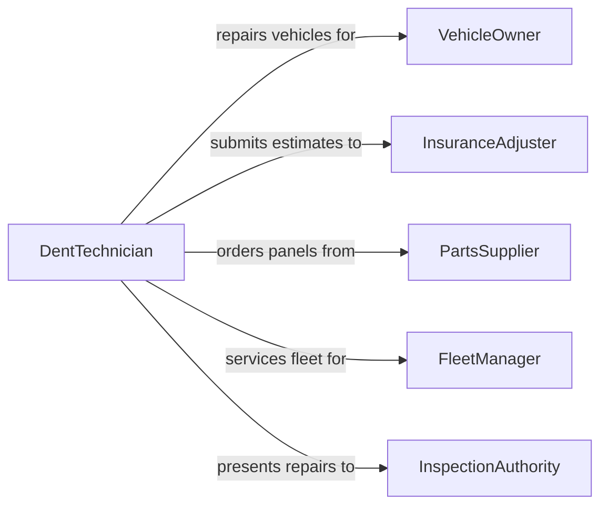

# Remove Dents from Equipment, Materials, Tools, or Structures

> Business-as-Code definition for dent removal and surface restoration. Models the assessment, repair, and verification of dented surfaces on vehicles, industrial equipment, tools, and building structures.

## Overview

Removing dents from equipment, materials, tools, or structures involves identifying deformations, selecting the appropriate repair method (PDR, hammer and dolly, heat shrinking, or hydraulic pressing), restoring the surface to original contour, and verifying the repair meets dimensional and cosmetic standards. This definition covers automotive body repair, sheet metal restoration, industrial equipment panel repair, and structural straightening.

## Actors

| Actor | Description |
|-------|-------------|
| VehicleOwner | Brings a dented vehicle for body repair |
| InsuranceAdjuster | Evaluates damage and authorizes repair costs |
| PartsSupplier | Provides replacement panels when dent repair is not feasible |
| FleetManager | Manages maintenance of multiple vehicles or equipment assets |
| InspectionAuthority | Certifies structural integrity after repairs |

## Roles

| Role | Description |
|------|-------------|
| DentTechnician | Performs paintless dent repair and conventional straightening |
| BodyShopForeman | Estimates repair scope and assigns work orders |
| QualityInspector | Verifies surface contour and finish after dent removal |
| Painter | Applies touch-up or refinish coatings after conventional repair |

## Entities

| Entity | Description |
|--------|-------------|
| DamageReport | An assessment documenting dent location, size, and depth |
| RepairOrder | A work ticket specifying repair method and cost estimate |
| Panel | A metal or composite surface section with a dent |
| RepairTool | PDR rods, hammers, dollies, or hydraulic presses used in repair |
| SurfaceProfile | Measurements of the restored surface contour |
| BeforeAfterPhoto | Visual documentation of the dent before and after repair |

## Actions

| Action | Description |
|--------|-------------|
| assessDamage | Inspect and document dent location, dimensions, and severity |
| selectMethod | Choose PDR, conventional, or replacement based on damage type |
| removeDent | Apply the selected technique to restore surface contour |
| verifySurface | Measure repaired area against original contour specifications |
| refinishSurface | Apply primer, paint, or clear coat if surface was compromised |
| documentRepair | Record repair details, photos, and quality sign-off |

## Events

| Event | Description |
|-------|-------------|
| damageAssessed | Dent damage has been inspected and documented |
| methodSelected | Repair approach has been determined |
| dentRemoved | Surface contour has been restored |
| surfaceVerified | Repaired area meets dimensional and cosmetic standards |
| surfaceRefinished | Paint or coating has been applied to the repair area |
| repairDocumented | Before-after photos and repair data have been filed |

## Searches

| Search | Description |
|--------|-------------|
| findRepairOrders | Locate repair jobs by vehicle, equipment, or status |
| getDamageReports | Retrieve damage assessments by asset or date |
| getRepairHistory | Look up past dent repairs for a specific asset |
| findPendingInspections | List repairs awaiting quality verification |


## Entity Relationships



## State Diagram



## Workflow



## Actor Relationships



## Usage

### Calling Actions

```typescript
import { removeDentsEquipmentMaterialsTools } from '@headlessly/remove-dents-equipment-materials-tools'

const dents = removeDentsEquipmentMaterialsTools()

// Assess damage on a vehicle panel
const damage = await dents.assessDamage({
  assetId: 'VIN-2024-XJ9K2',
  panel: 'driver-door',
  dentCount: 3,
  maxDepthMm: 8
})

// Remove dents using PDR
await dents.removeDent({
  repairOrderId: damage.repairOrderId,
  method: 'paintless-dent-repair',
  tools: ['pdr-rod-set', 'glue-puller']
})

// Verify the repair
const verification = await dents.verifySurface({
  repairOrderId: damage.repairOrderId,
  toleranceMm: 0.5
})
```

### Event-Driven Automation

```typescript
// Notify insurance adjuster on repair completion
dents.surfaceVerified(async ({ repairOrderId, passed }) => {
  if (passed) {
    await notify({
      to: 'insurance-adjuster',
      message: `Repair ${repairOrderId} verified and ready for sign-off`
    })
  }
})

// Auto-schedule refinishing when PDR is insufficient
dents.dentRemoved(async ({ repairOrderId, paintDamaged }) => {
  if (paintDamaged) {
    await dents.refinishSurface({
      repairOrderId,
      coatType: 'basecoat-clearcoat'
    })
  }
})
```
