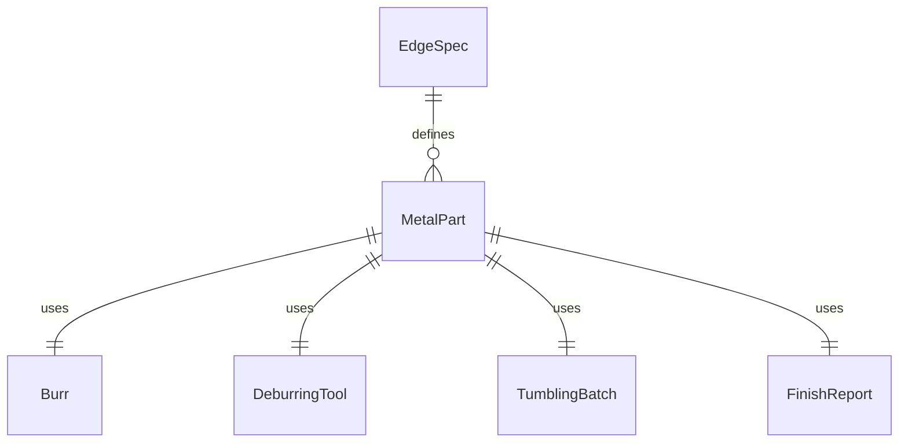
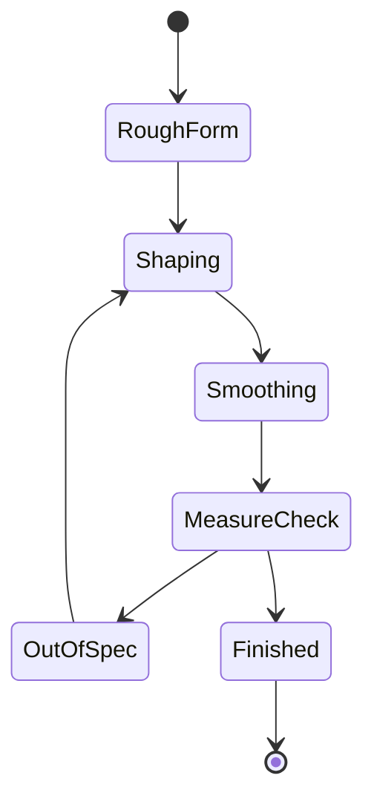
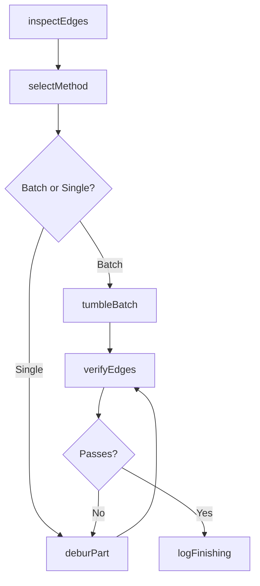
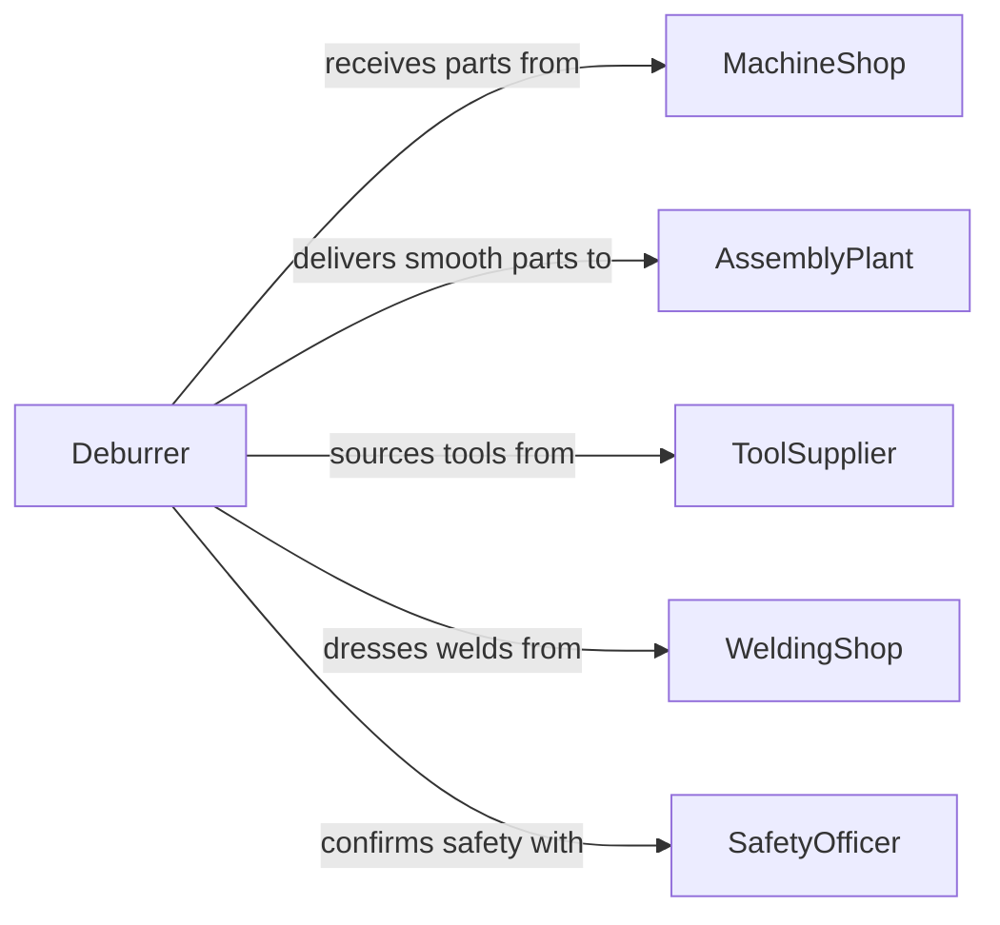

# Smooth Metal Surfaces or Edges

> Business-as-Code definition for metal deburring and edge finishing. Models the removal of burrs, sharp edges, and surface irregularities from metal parts using filing, grinding, and hand finishing techniques.

## Overview

Smoothing metal surfaces or edges involves removing burrs, flash, weld spatter, and sharp edges left by machining, stamping, or welding operations. This definition covers hand deburring with files and scrapers, vibratory tumbling for batch parts, edge breaking on machined components, and weld bead dressing to produce safe, functional, and aesthetically acceptable metal surfaces.

## Actors

| Actor | Description |
|-------|-------------|
| MachineShop | Produces machined parts with burrs requiring removal |
| AssemblyPlant | Receives deburred parts for safe handling and assembly |
| ToolSupplier | Provides files, deburring tools, and tumbling media |
| WeldingShop | Produces welded assemblies needing bead dressing |
| SafetyOfficer | Ensures deburred parts meet handling safety requirements |

## Roles

| Role | Description |
|------|-------------|
| Deburrer | Removes burrs and sharp edges from metal components |
| TumblingOperator | Runs vibratory or rotary tumbling equipment for batch finishing |
| QualityInspector | Verifies edge quality and surface smoothness |
| ProductionLead | Prioritizes deburring work based on assembly schedules |

## Entities

| Entity | Description |
|--------|-------------|
| MetalPart | A component with burrs or sharp edges requiring smoothing |
| Burr | A raised edge or small piece of material remaining after machining |
| DeburringTool | A file, scraper, rotary bit, or abrasive used to remove burrs |
| TumblingBatch | A load of parts processed together in vibratory or rotary equipment |
| EdgeSpec | Requirements for edge radius, chamfer, or break dimensions |
| FinishReport | Documentation of deburring results and quality verification |

## Actions

| Action | Description |
|--------|-------------|
| inspectEdges | Identify burrs, sharp edges, and surface defects on metal parts |
| selectMethod | Choose hand deburring, tumbling, or thermal deburring approach |
| deburPart | Remove burrs and break edges using the selected technique |
| tumbleBatch | Process a batch of parts through vibratory finishing equipment |
| verifyEdges | Check that all edges meet radius and smoothness specifications |
| logFinishing | Record deburring method, time, and quality results |

## Events

| Event | Description |
|-------|-------------|
| edgesInspected | Burr locations and severity have been identified |
| methodSelected | Deburring approach has been determined |
| partDeburred | Burrs and sharp edges have been removed |
| batchTumbled | Vibratory finishing cycle is complete |
| edgesVerified | Edge quality has been confirmed against specification |
| finishingLogged | All deburring data has been documented |

## Searches

| Search | Description |
|--------|-------------|
| findDeburringJobs | Locate deburring tasks by part number, method, or status |
| getEdgeInspections | Retrieve edge quality data for a part or batch |
| getTumblingCycles | Look up vibratory finishing records by batch or date |
| findPendingParts | List parts awaiting deburring by priority |


## Entity Relationships



## State Diagram



## Workflow



## Actor Relationships



## Usage

### Calling Actions

```typescript
import { smoothMetalSurfacesEdges } from '@headlessly/smooth-metal-surfaces-edges'

const finishing = smoothMetalSurfacesEdges()

// Inspect edges on machined parts
const inspection = await finishing.inspectEdges({
  partId: 'BRKT-2024-0221',
  material: 'aluminum-6061',
  burrLocations: ['hole-edges', 'milled-slot']
})

// Deburr individual part
await finishing.deburPart({
  partId: 'BRKT-2024-0221',
  tool: 'rotary-deburring-bit',
  edgeBreakMm: 0.3
})

// Verify edge quality
const result = await finishing.verifyEdges({
  partId: 'BRKT-2024-0221',
  maxBurrHeightMm: 0.05,
  minEdgeRadiusMm: 0.2
})
```

### Event-Driven Automation

```typescript
// Auto-route to tumbling for high-volume batches
finishing.edgesInspected(async ({ partCount, burrSeverity }) => {
  if (partCount > 100 && burrSeverity === 'light') {
    await finishing.tumbleBatch({
      media: 'ceramic-triangles',
      cycleTimeMinutes: 45
    })
  }
})

// Track deburring throughput
finishing.finishingLogged(async ({ partId, method, timeMinutes }) => {
  await production.recordCycleTime({ partId, operation: 'deburring', timeMinutes })
})
```
