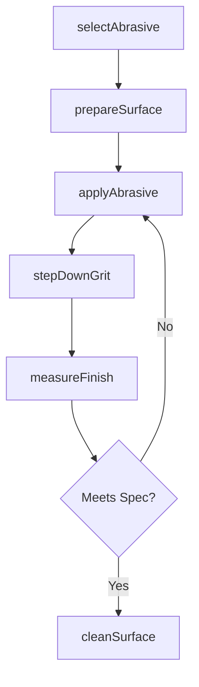
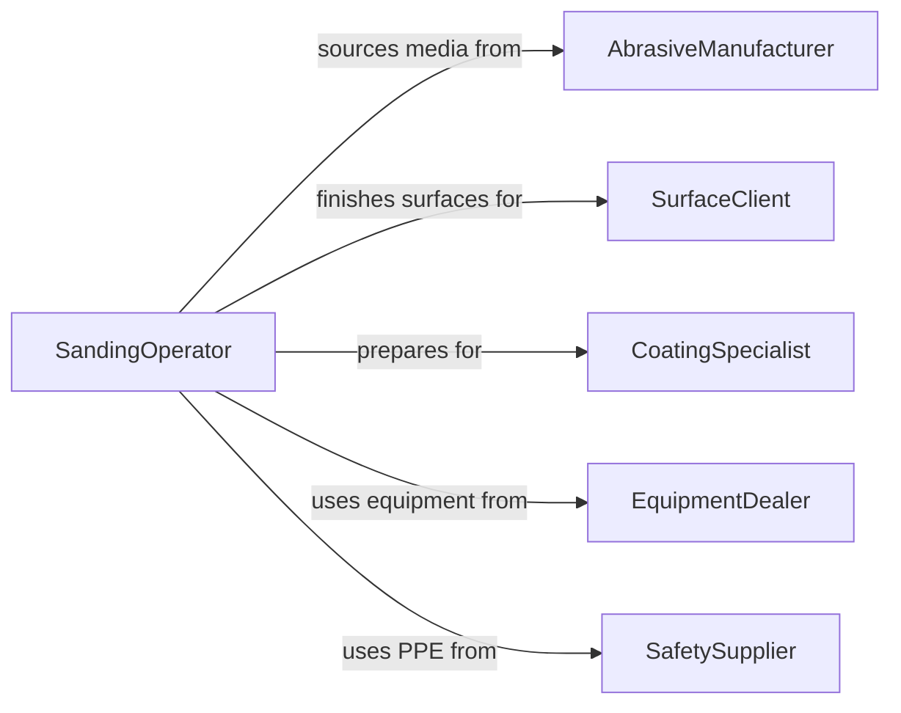

# Smooth Surfaces with Abrasive Materials or Tools

> Business-as-Code definition for abrasive surface finishing. Models the selection, application, and quality control of sandpaper, grinding discs, abrasive pads, and blasting media for surface preparation and finishing.

## Overview

Smoothing surfaces with abrasive materials or tools involves selecting the correct abrasive type and grit, applying it through manual or powered techniques, and progressively refining the surface to the required finish. This definition covers sandblasting for rust and coating removal, wet sanding for automotive refinishing, belt sanding for woodworking, and abrasive pad finishing for composite and plastic parts.

## Actors

| Actor | Description |
|-------|-------------|
| AbrasiveManufacturer | Produces sandpaper, discs, belts, and blasting media |
| SurfaceClient | Requests abrasive finishing on parts, structures, or equipment |
| CoatingSpecialist | Applies finishes to surfaces prepared by abrasive methods |
| EquipmentDealer | Supplies power sanders, blasters, and finishing tools |
| SafetySupplier | Provides dust collection, respiratory protection, and PPE |

## Roles

| Role | Description |
|------|-------------|
| SandingOperator | Performs hand and power sanding on workpieces |
| BlastingTechnician | Operates sandblasting or media blasting equipment |
| QualityInspector | Measures surface roughness and cleanliness after abrasive work |
| ProcessPlanner | Selects abrasive types, grits, and finishing sequences |

## Entities

| Entity | Description |
|--------|-------------|
| AbrasiveProduct | Sandpaper, discs, belts, or blasting media used for smoothing |
| Workpiece | A surface or object being treated with abrasive materials |
| GritSequence | An ordered progression of abrasive grits from coarse to fine |
| SurfacePrep | The condition of a surface after abrasive treatment |
| DustCollection | Equipment capturing airborne particles during abrasive work |
| RoughnessReading | A profilometer measurement of surface texture |
| FinishSpec | Target roughness, cleanliness, and appearance parameters |

## Actions

| Action | Description |
|--------|-------------|
| selectAbrasive | Choose the appropriate type, grit, and form of abrasive material |
| prepareSurface | Clean and mask the workpiece before abrasive application |
| applyAbrasive | Sand, blast, or grind the surface with the selected media |
| stepDownGrit | Progress to a finer abrasive for improved surface quality |
| measureFinish | Check surface roughness with a profilometer or comparator |
| cleanSurface | Remove abrasive residue and dust from the finished surface |

## Events

| Event | Description |
|-------|-------------|
| abrasiveSelected | Abrasive type and grit sequence have been determined |
| surfacePrepared | Workpiece has been cleaned and masked for abrasive work |
| abrasiveApplied | A sanding, blasting, or grinding pass has been completed |
| gritSteppedDown | Finer abrasive has been applied to the surface |
| finishMeasured | Surface roughness readings have been recorded |
| surfaceCleaned | Residue and dust have been removed from the finished surface |

## Searches

| Search | Description |
|--------|-------------|
| findFinishingJobs | Locate abrasive work orders by material, grit, or status |
| getRoughnessData | Retrieve profilometer readings by part or batch |
| getAbrasiveInventory | Check stock levels of sandpaper, discs, and media |
| findFailedFinishes | List surfaces that did not meet roughness specification |

## Workflow



## Actor Relationships



## Usage

### Calling Actions

```typescript
import { smoothSurfacesAbrasiveMaterialsTools } from '@headlessly/smooth-surfaces-abrasive-materials-tools'

const abrasive = smoothSurfacesAbrasiveMaterialsTools()

// Select abrasive and prepare surface
await abrasive.selectAbrasive({
  material: 'mild-steel',
  currentCondition: 'mill-scale',
  targetFinish: 'SSPC-SP6',
  method: 'sandblasting'
})

// Apply abrasive blasting
await abrasive.applyAbrasive({
  workpieceId: 'BEAM-2024-0088',
  media: 'aluminum-oxide-40',
  pressure: 80,
  unit: 'psi'
})

// Measure the resulting finish
const finish = await abrasive.measureFinish({
  workpieceId: 'BEAM-2024-0088',
  targetRoughnessMils: 2.5
})
```

### Event-Driven Automation

```typescript
// Reorder abrasive media when inventory is low
abrasive.abrasiveApplied(async ({ mediaType, remainingKg }) => {
  if (remainingKg < 50) {
    await purchasing.reorder({ item: mediaType, quantityKg: 500 })
  }
})

// Notify coating team when surface prep is complete
abrasive.surfaceCleaned(async ({ workpieceId, roughnessProfile }) => {
  await notify({
    to: 'coating-specialist',
    message: `${workpieceId} prepped to profile ${roughnessProfile} mils`
  })
})
```
