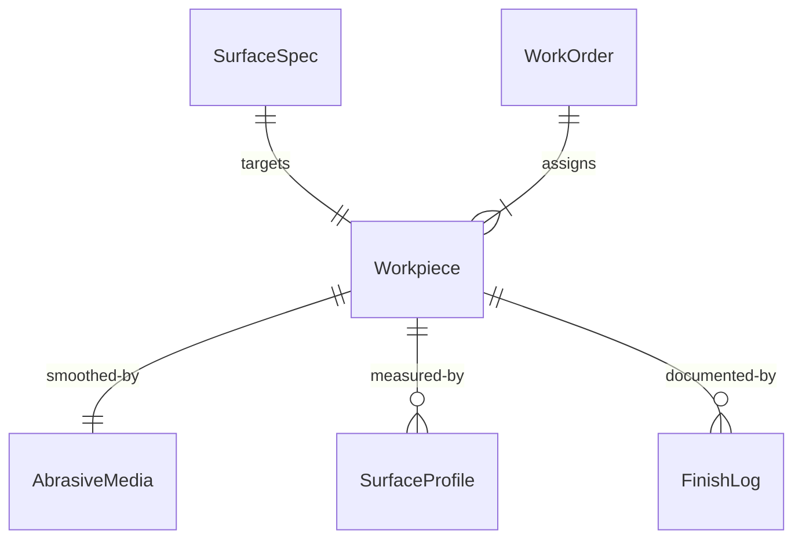
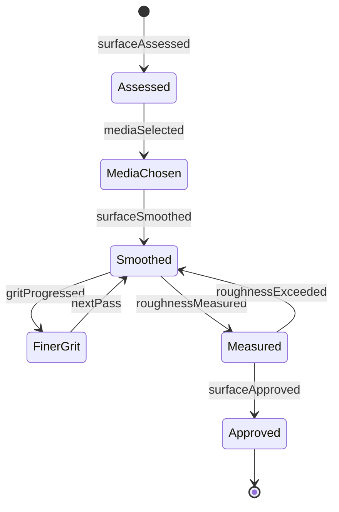
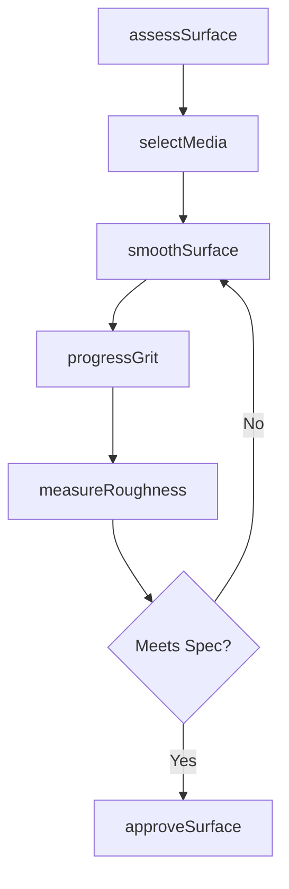
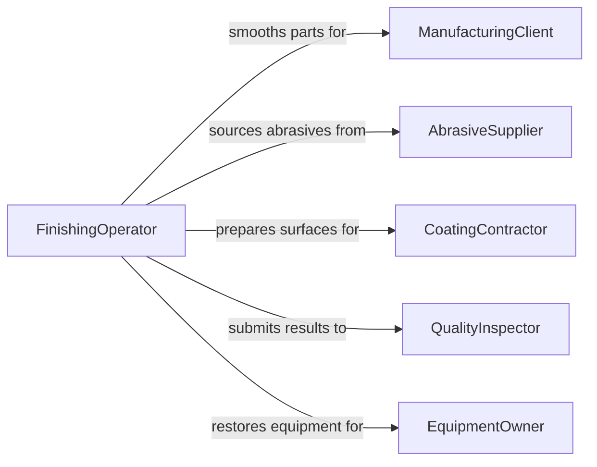

# Smooth Surfaces of Objects or Equipment

> Business-as-Code definition for general surface smoothing operations. Models the sanding, filing, scraping, and finishing of object and equipment surfaces to achieve required texture, flatness, or appearance.

## Overview

Smoothing surfaces of objects or equipment involves removing imperfections, tool marks, burrs, and roughness using manual or powered tools to achieve a specified surface profile. This definition covers woodworking finishing, metal deburring, body filler smoothing, concrete floating, and general surface preparation for painting, coating, or assembly across manufacturing, construction, and restoration trades.

## Actors

| Actor | Description |
|-------|-------------|
| ManufacturingClient | Requires smoothed components for downstream assembly or finishing |
| AbrasiveSupplier | Provides sandpaper, files, scrapers, and finishing tools |
| CoatingContractor | Applies paint or coatings to smoothed surfaces |
| QualityInspector | Verifies surface finish meets specified roughness standards |
| EquipmentOwner | Requests equipment surface restoration or preparation |

## Roles

| Role | Description |
|------|-------------|
| FinishingOperator | Performs sanding, filing, and scraping operations |
| SurfaceSpecialist | Selects methods and grits to achieve target surface profiles |
| QualityTechnician | Measures surface roughness and visual appearance |
| ShopSupervisor | Assigns smoothing tasks and manages workflow priorities |

## Entities

| Entity | Description |
|--------|-------------|
| Workpiece | An object or equipment component being smoothed |
| SurfaceSpec | Target roughness average and visual appearance requirements |
| AbrasiveMedia | Sandpaper, files, stones, or pads used for smoothing |
| SurfaceProfile | Measured roughness values of the finished surface |
| WorkOrder | A task specifying items to smooth and quality targets |
| FinishLog | A record of smoothing method, media used, and results |

## Actions

| Action | Description |
|--------|-------------|
| assessSurface | Inspect the workpiece for roughness, defects, and tool marks |
| selectMedia | Choose the appropriate grit, tool, or technique for smoothing |
| smoothSurface | Apply sanding, filing, or scraping to reduce roughness |
| progressGrit | Advance through finer abrasive grits for final finish |
| measureRoughness | Check surface roughness with a profilometer or comparator |
| approveSurface | Sign off that the surface meets specification |

## Events

| Event | Description |
|-------|-------------|
| surfaceAssessed | Initial roughness and defect evaluation is complete |
| mediaSelected | Abrasive type and grit sequence have been chosen |
| surfaceSmoothed | Material has been removed to reduce roughness |
| gritProgressed | Finer abrasive has been applied for finishing |
| roughnessMeasured | Surface roughness readings have been recorded |
| surfaceApproved | Finished surface has been accepted against specification |

## Searches

| Search | Description |
|--------|-------------|
| findWorkOrders | List smoothing jobs by status, material, or work center |
| getSurfaceProfiles | Retrieve roughness measurement data by part or batch |
| getMediaConsumption | Track abrasive usage by type and work order |
| findRejectedSurfaces | Identify parts that failed roughness inspection |


## Entity Relationships



## State Diagram



## Workflow



## Actor Relationships



## Usage

### Calling Actions

```typescript
import { smoothSurfacesObjectsEquipment } from '@headlessly/smooth-surfaces-objects-equipment'

const smoothing = smoothSurfacesObjectsEquipment()

// Assess surface condition
const assessment = await smoothing.assessSurface({
  workpieceId: 'WP-2024-0334',
  material: 'oak-hardwood',
  currentRoughnessRa: 6.3
})

// Smooth through progressive grits
await smoothing.smoothSurface({
  workpieceId: 'WP-2024-0334',
  grit: 120,
  method: 'orbital-sander'
})

await smoothing.progressGrit({
  workpieceId: 'WP-2024-0334',
  gritSequence: [180, 220, 320]
})

// Measure and approve
const reading = await smoothing.measureRoughness({
  workpieceId: 'WP-2024-0334',
  targetRa: 1.6
})
```

### Event-Driven Automation

```typescript
// Auto-notify coating contractor when surface is approved
smoothing.surfaceApproved(async ({ workpieceId, roughnessRa }) => {
  await notify({
    to: 'coating-contractor',
    message: `Part ${workpieceId} ready for coating at Ra ${roughnessRa}`
  })
})

// Track abrasive consumption for reordering
smoothing.gritProgressed(async ({ mediaType, remainingPercent }) => {
  if (remainingPercent < 20) {
    await purchasing.reorder({ item: mediaType, urgency: 'standard' })
  }
})
```
