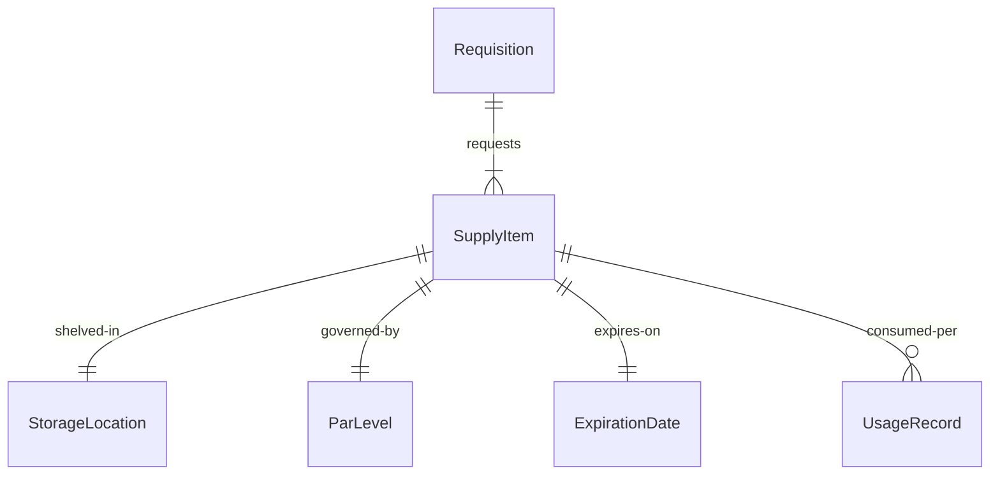
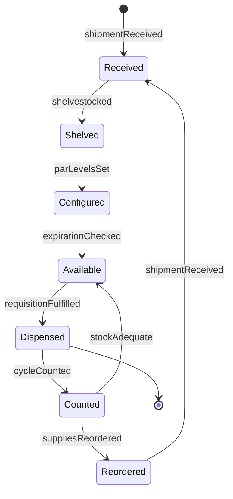
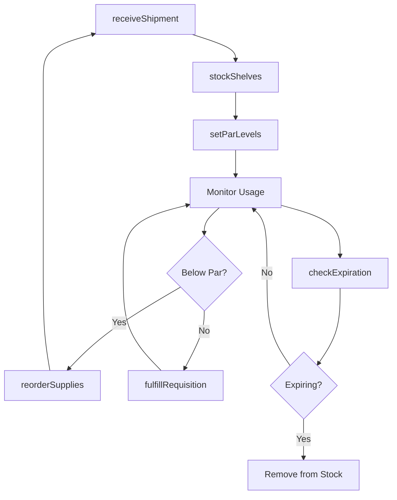
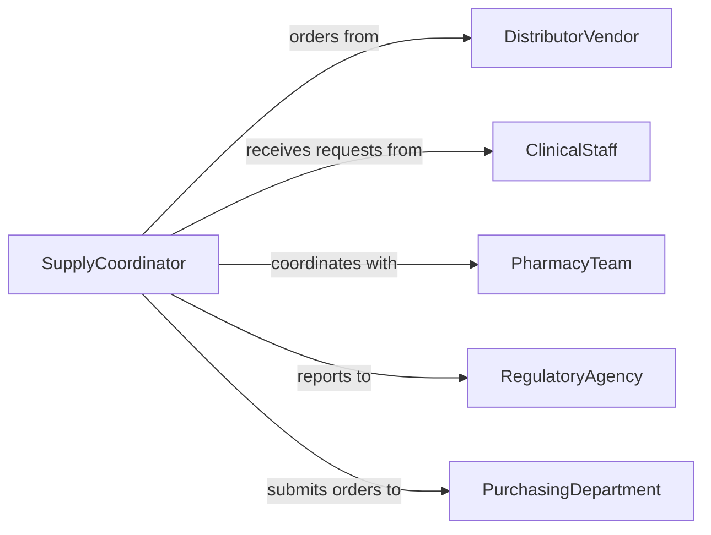

# Stock Medical Patient Care Supplies

> Business-as-Code definition for managing medical and patient care supply inventory. Models the complete lifecycle of receiving, storing, distributing, and replenishing clinical supplies in hospitals, clinics, and care facilities.

## Overview

Medical supply stocking involves maintaining appropriate levels of consumables, instruments, and patient care items across clinical departments. This work requires tracking expiration dates, managing controlled substances, ensuring regulatory compliance, and responding to urgent supply requests. This definition exposes actions for inventory management, distribution, and compliance.

## Actors

| Actor | Description |
|-------|-------------|
| DistributorVendor | Supplies medical products and equipment |
| ClinicalStaff | Requests and consumes medical supplies |
| PharmacyTeam | Manages medication inventory and controlled substances |
| RegulatoryAgency | Audits compliance with storage and handling rules |
| PurchasingDepartment | Approves and places supply orders |
| WasteDisposal | Collects expired or contaminated supplies |

## Roles

| Role | Description |
|------|-------------|
| SupplyCoordinator | Oversees inventory levels and distribution |
| CentralSupplyTech | Receives, inspects, and shelves supplies |
| FloorStockTech | Replenishes unit-based supply rooms |
| InventoryAuditor | Conducts cycle counts and expiration checks |

## Entities

| Entity | Description |
|--------|-------------|
| SupplyItem | A medical product or patient care item |
| StorageLocation | A shelf, cabinet, or refrigerator location |
| ParLevel | Minimum and maximum quantities for an item |
| Requisition | A request for supplies from a department |
| ExpirationDate | The date after which an item cannot be used |
| UsageRecord | Documentation of supply consumption |

## Actions

| Action | Description |
|--------|-------------|
| receiveShipment | Accept and inspect incoming supply deliveries |
| stockShelves | Place items in designated storage locations |
| setParLevels | Define min/max quantities for automated reordering |
| fulfillRequisition | Pick and deliver supplies to requesting department |
| checkExpiration | Scan inventory for items nearing expiration |
| cycleCount | Verify physical inventory against system records |
| reorderSupplies | Generate purchase orders for depleted items |

## Events

| Event | Description |
|-------|-------------|
| shipmentReceived | Delivery has been accepted and inspected |
| shelvestocked | Items have been placed in storage |
| parLevelsSet | Reorder thresholds have been configured |
| requisitionFulfilled | Supplies have been delivered to department |
| expirationChecked | Expiration scan is complete |
| cycleCounted | Physical count has been reconciled |
| suppliesReordered | Purchase orders have been generated |

## Searches

| Search | Description |
|--------|-------------|
| findItems | List supply items by category or department |
| getLowStock | Retrieve items below par level |
| getExpiring | Find items expiring within specified days |
| getRequisitions | List pending supply requests by department |


## Entity Relationships



## State Diagram



## Workflow



## Actor Relationships



## Usage

### Calling Actions

```typescript
import { stockMedicalPatientCareSupplies } from '@headlessly/stock-medical-patient-care-supplies'

const supplies = stockMedicalPatientCareSupplies()

// Receive shipment of surgical supplies
const shipment = await supplies.receiveShipment({
  vendorId: 'MEDLINE-001',
  poNumber: 'PO-48392',
  items: [
    { sku: 'SG-9274', quantity: 100, lot: 'L2048', expiration: '2028-06-15' },
    { sku: 'GL-2845', quantity: 500, lot: 'L9482', expiration: '2027-12-01' }
  ]
})

// Stock items on shelves
await supplies.stockShelves({
  shipmentId: shipment.id,
  locations: [
    { sku: 'SG-9274', location: 'A-12-3' },
    { sku: 'GL-2845', location: 'B-05-1' }
  ]
})

// Set par levels for automated reordering
await supplies.setParLevels({
  sku: 'SG-9274',
  minQuantity: 50,
  maxQuantity: 200,
  reorderQuantity: 150
})

// Fulfill department supply request
await supplies.fulfillRequisition({
  requisitionId: 'REQ-8471',
  department: 'OR-3',
  items: [
    { sku: 'SG-9274', quantity: 25 },
    { sku: 'GL-2845', quantity: 50 }
  ]
})
```

### Event-Driven Automation

```typescript
// Auto-reorder when inventory falls below par level
supplies.cycleCounted(async ({ sku, quantity, parLevel }) => {
  if (quantity < parLevel.minQuantity) {
    await supplies.reorderSupplies({
      sku,
      quantity: parLevel.reorderQuantity
    })
  }
})

// Alert supply team when items are nearing expiration
supplies.expirationChecked(async ({ items }) => {
  const expiringSoon = items.filter(i => i.daysUntilExpiration <= 30)
  if (expiringSoon.length > 0) {
    await notify({
      to: 'supply-team',
      message: `${expiringSoon.length} items expiring within 30 days`,
      items: expiringSoon
    })
  }
})
```
