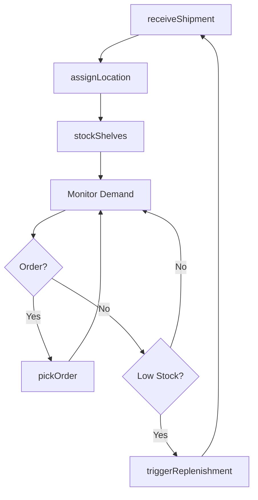
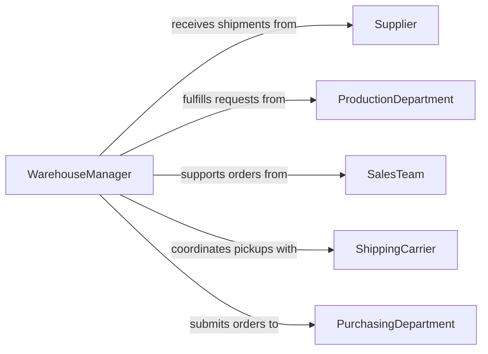

# Stock Products Parts

> Business-as-Code definition for managing product and parts inventory. Models receiving, shelving, picking, and replenishing stock in warehouses, distribution centers, and manufacturing facilities.

## Overview

Product and parts stocking involves maintaining optimal inventory levels of finished goods, components, and spare parts to support sales, production, and service operations. This work includes receiving shipments, organizing storage, fulfilling orders, and monitoring stock levels. This definition exposes actions for inventory control, location management, and replenishment.

## Actors

| Actor | Description |
|-------|-------------|
| Supplier | Ships products and parts to facility |
| ProductionDepartment | Requests components for assembly operations |
| SalesTeam | Generates orders that require stock fulfillment |
| ShippingCarrier | Picks up outbound shipments |
| QualityAssurance | Inspects incoming goods for defects |
| PurchasingDepartment | Places replenishment orders |

## Roles

| Role | Description |
|------|-------------|
| WarehouseManager | Oversees inventory accuracy and space utilization |
| ReceivingClerk | Accepts and inspects incoming shipments |
| StockAssociate | Shelves products and picks orders |
| CycleCounter | Performs periodic physical inventory audits |

## Entities

| Entity | Description |
|--------|-------------|
| Product | A finished good or component part |
| BinLocation | A specific storage position in the warehouse |
| StockLevel | Current quantity on hand for a product |
| PickList | An order requiring items to be pulled from stock |
| ReplenishmentOrder | A purchase order for restocking depleted items |
| InventoryTransaction | A record of stock movement |

## Actions

| Action | Description |
|--------|-------------|
| receiveShipment | Accept incoming delivery and verify contents |
| assignLocation | Determine bin placement for received items |
| stockShelves | Place products in assigned storage locations |
| pickOrder | Pull items from stock to fulfill orders |
| adjustInventory | Correct stock levels based on physical counts |
| triggerReplenishment | Generate purchase orders for low stock items |
| relocateStock | Move products to optimize space or picking efficiency |

## Events

| Event | Description |
|-------|-------------|
| shipmentReceived | Delivery has been accepted and verified |
| locationAssigned | Storage bin has been determined for items |
| shelvesStocked | Products have been placed in locations |
| orderPicked | Items have been pulled for fulfillment |
| inventoryAdjusted | Stock levels have been corrected |
| replenishmentTriggered | Purchase order has been created |
| stockRelocated | Products have been moved to new locations |

## Searches

| Search | Description |
|--------|-------------|
| findProducts | List products by SKU, category, or supplier |
| getLowStock | Retrieve items below reorder point |
| getLocations | Find bin locations for a product |
| getPickLists | List pending orders by priority or customer |

## Workflow



## Actor Relationships



## Usage

### Calling Actions

```typescript
import { stockProductsParts } from '@headlessly/stock-products-parts'

const inventory = stockProductsParts()

// Receive shipment from supplier
const shipment = await inventory.receiveShipment({
  supplierId: 'SUP-2847',
  poNumber: 'PO-19283',
  items: [
    { sku: 'PART-4821', quantity: 500, lot: 'L9482' },
    { sku: 'PART-5293', quantity: 250, lot: 'L9483' }
  ]
})

// Assign storage locations
await inventory.assignLocation({
  shipmentId: shipment.id,
  assignments: [
    { sku: 'PART-4821', location: 'A-12-05' },
    { sku: 'PART-5293', location: 'B-08-12' }
  ]
})

// Stock shelves
await inventory.stockShelves({
  shipmentId: shipment.id,
  stockedBy: 'user-1847',
  timestamp: new Date()
})

// Pick order for production
await inventory.pickOrder({
  pickListId: 'PL-8471',
  items: [
    { sku: 'PART-4821', quantity: 50, location: 'A-12-05' },
    { sku: 'PART-5293', quantity: 25, location: 'B-08-12' }
  ]
})
```

### Event-Driven Automation

```typescript
// Trigger replenishment when stock falls below reorder point
inventory.orderPicked(async ({ sku, newStockLevel, reorderPoint }) => {
  if (newStockLevel <= reorderPoint) {
    await inventory.triggerReplenishment({
      sku,
      quantity: reorderPoint * 2
    })
  }
})

// Notify warehouse team when shipment is ready for stocking
inventory.locationAssigned(async ({ shipmentId, items }) => {
  await notify({
    to: 'warehouse-team',
    message: `Shipment ${shipmentId} ready for stocking`,
    itemCount: items.length
  })
})
```
