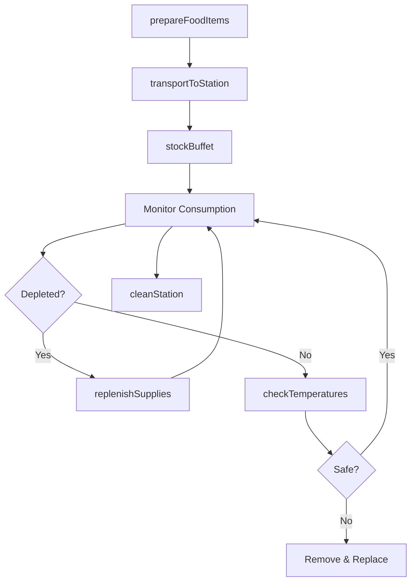
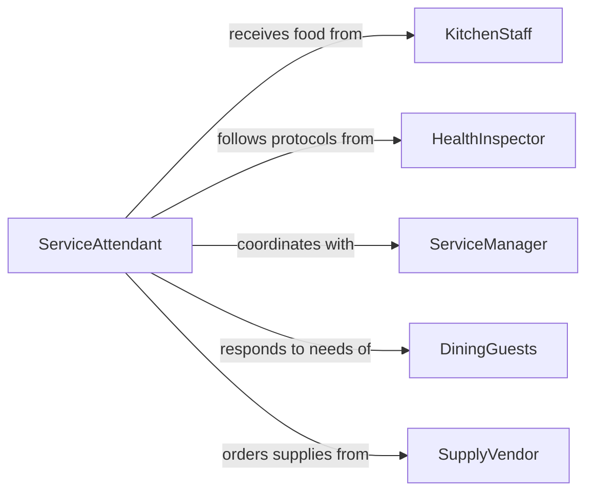

# Stock Serving Stations Dining Areas

> Business-as-Code definition for stocking food service areas with food and supplies. Models the complete process of preparing, transporting, and replenishing buffets, service lines, condiment stations, and dining areas in restaurants, cafeterias, and catering operations.

## Overview

Serving station stocking involves ensuring continuous availability of food, beverages, utensils, condiments, and service supplies throughout meal periods. This work requires monitoring consumption rates, maintaining proper temperatures, following food safety protocols, and responding quickly to depletion. This definition exposes actions for preparation, replenishment, and compliance.

## Actors

| Actor | Description |
|-------|-------------|
| FoodSupplier | Provides ingredients and prepared foods |
| KitchenStaff | Prepares food for serving stations |
| HealthInspector | Audits food safety and sanitation practices |
| ServiceManager | Coordinates dining area operations |
| DiningGuests | Consume food and supplies from stations |
| SupplyVendor | Delivers disposables, utensils, and serviceware |

## Roles

| Role | Description |
|------|-------------|
| ServiceAttendant | Stocks and maintains serving stations |
| LineCook | Produces food items for replenishment |
| BusStaff | Clears tables and restocks dining area supplies |
| FOHManager | Oversees front-of-house service operations |

## Entities

| Entity | Description |
|--------|-------------|
| ServingStation | A buffet, service line, or self-service area |
| FoodItem | A prepared dish or ingredient available for service |
| SupplyItem | Utensils, napkins, condiments, or serviceware |
| TemperatureLog | Hot and cold holding temperature records |
| ParLevel | Minimum quantities to maintain for each item |
| ReplenishmentSchedule | Timing plan for restocking during service |

## Actions

| Action | Description |
|--------|-------------|
| prepareFoodItems | Portion and label food for serving stations |
| transportToStation | Move food and supplies from kitchen to service area |
| stockBuffet | Arrange food items in serving dishes with proper labeling |
| replenishSupplies | Refill utensils, napkins, condiments, and serviceware |
| checkTemperatures | Verify food is held at safe hot or cold temperatures |
| rotateStock | Move older items forward and add fresh items behind |
| cleanStation | Wipe surfaces and remove empty containers |

## Events

| Event | Description |
|-------|-------------|
| foodItemsPrepared | Portioned food is ready for transport |
| transportedToStation | Food and supplies have arrived at service area |
| buffetStocked | Serving dishes have been arranged and labeled |
| suppliesReplenished | Utensils and serviceware have been refilled |
| temperaturesChecked | Temperature logs have been completed |
| stockRotated | Fresh items have been added using FIFO method |
| stationCleaned | Service area has been sanitized |

## Searches

| Search | Description |
|--------|-------------|
| findStations | List serving stations by meal period or location |
| getParLevels | Retrieve minimum stock levels for station items |
| getTemperatureLogs | Find temperature records by station or date |
| getReplenishmentSchedule | List scheduled restocking times |

## Workflow



## Actor Relationships



## Usage

### Calling Actions

```typescript
import { stockServingStationsDiningAreas } from '@headlessly/stock-serving-stations-dining-areas'

const service = stockServingStationsDiningAreas()

// Prepare food items for lunch buffet
const prep = await service.prepareFoodItems({
  mealPeriod: 'lunch',
  items: [
    { dish: 'grilled-chicken', quantity: 50, pan: 'full-steam' },
    { dish: 'roasted-vegetables', quantity: 30, pan: 'half-steam' },
    { dish: 'pasta-primavera', quantity: 40, pan: 'full-steam' }
  ]
})

// Transport to serving station
await service.transportToStation({
  prepId: prep.id,
  station: 'main-buffet',
  time: '11:15'
})

// Stock buffet line
await service.stockBuffet({
  station: 'main-buffet',
  items: prep.items,
  labelTemperatures: true,
  arrangementStyle: 'flow-layout'
})

// Replenish utensils and supplies
await service.replenishSupplies({
  station: 'main-buffet',
  supplies: [
    { item: 'serving-spoons', quantity: 12 },
    { item: 'dinner-plates', quantity: 50 },
    { item: 'napkins', quantity: 200 }
  ]
})
```

### Event-Driven Automation

```typescript
// Auto-replenish when items fall below par level
service.stockRotated(async ({ station, item, currentLevel, parLevel }) => {
  if (currentLevel < parLevel.minimum) {
    await service.replenishSupplies({
      station,
      supplies: [{ item, quantity: parLevel.target - currentLevel }]
    })
  }
})

// Alert when temperature is out of safe range
service.temperaturesChecked(async ({ station, item, temp, range }) => {
  if (temp < range.min || temp > range.max) {
    await notify({
      to: 'foh-manager',
      priority: 'urgent',
      message: `Temperature violation: ${item} at ${temp}F (safe: ${range.min}-${range.max}F)`,
      station
    })
  }
})
```
