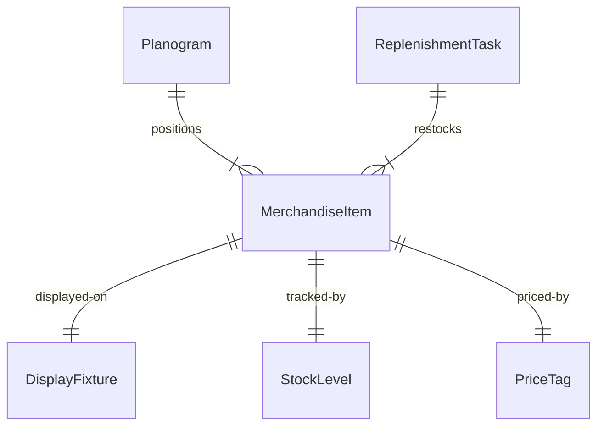
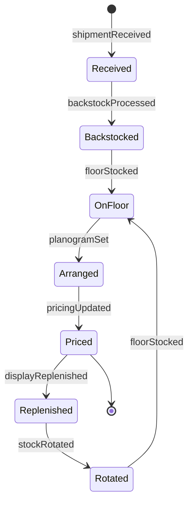
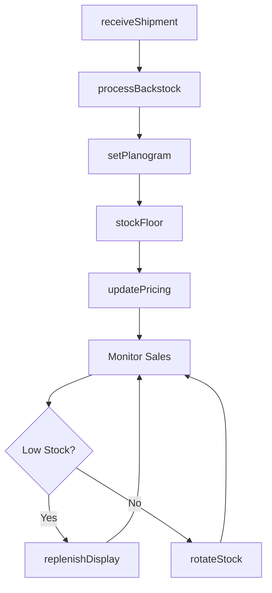
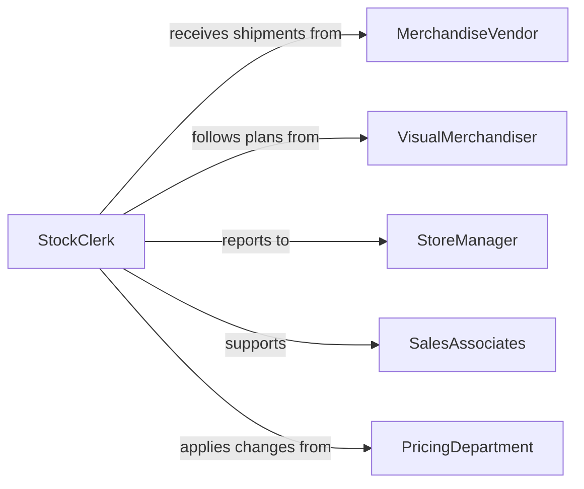

# Stock Supplies Merchandise

> Business-as-Code definition for retail merchandise and supply stocking operations. Models receiving, merchandising, replenishment, and display maintenance in retail stores, showrooms, and sales environments.

## Overview

Retail stocking operations ensure that merchandise is attractively displayed, properly priced, and consistently available to customers. This work includes unpacking shipments, organizing backroom inventory, merchandising sales floors, and maintaining visual standards. This definition exposes actions for inventory management, visual merchandising, and sales floor maintenance.

## Actors

| Actor | Description |
|-------|-------------|
| MerchandiseVendor | Supplies products for retail sale |
| VisualMerchandiser | Designs product displays and floor layouts |
| StoreManager | Oversees inventory and sales performance |
| SalesAssociates | Assist customers and monitor stock levels |
| PricingDepartment | Sets and updates product pricing |
| LossPrevention | Monitors inventory shrinkage and security |

## Roles

| Role | Description |
|------|-------------|
| StockClerk | Receives, unpacks, and shelves merchandise |
| FloorAssociate | Maintains displays and restocks during business hours |
| BackroomLead | Organizes and manages backstock inventory |
| MerchandiseCoordinator | Plans and executes product placement strategies |

## Entities

| Entity | Description |
|--------|-------------|
| MerchandiseItem | A product available for sale |
| DisplayFixture | A shelf, rack, table, or endcap for product presentation |
| Planogram | A diagram showing product placement and facing counts |
| StockLevel | Current quantity on floor and in backroom |
| PriceTag | Label showing current retail price and promotions |
| ReplenishmentTask | Work order to restock depleted items |

## Actions

| Action | Description |
|--------|-------------|
| receiveShipment | Accept and process incoming merchandise |
| processBackstock | Organize inventory in backroom storage |
| stockFloor | Place merchandise on sales floor displays |
| setPlanogram | Arrange products according to merchandising plan |
| updatePricing | Apply new price tags and promotional signage |
| replenishDisplay | Refill depleted items from backstock |
| rotateStock | Move older merchandise forward to ensure FIFO |

## Events

| Event | Description |
|-------|-------------|
| shipmentReceived | Merchandise has been delivered and verified |
| backstockProcessed | Inventory has been organized in backroom |
| floorStocked | Products have been placed on sales floor |
| planogramSet | Display has been arranged per visual standards |
| pricingUpdated | Price tags and signage have been refreshed |
| displayReplenished | Items have been restocked from backroom |
| stockRotated | Older items have been moved to front positions |

## Searches

| Search | Description |
|--------|-------------|
| findMerchandise | List products by category, vendor, or SKU |
| getLowStock | Retrieve items needing replenishment |
| getPlanograms | Find display plans by department or fixture |
| getBackstock | List items available in backroom storage |


## Entity Relationships



## State Diagram



## Workflow



## Actor Relationships



## Usage

### Calling Actions

```typescript
import { stockSuppliesMerchandise } from '@headlessly/stock-supplies-merchandise'

const retail = stockSuppliesMerchandise()

// Receive shipment from vendor
const shipment = await retail.receiveShipment({
  vendorId: 'VENDOR-4821',
  poNumber: 'PO-29384',
  items: [
    { sku: 'SHIRT-8471', quantity: 48, cartons: 4 },
    { sku: 'PANTS-2948', quantity: 36, cartons: 3 }
  ]
})

// Process backstock and organize
await retail.processBackstock({
  shipmentId: shipment.id,
  storageArea: 'softlines-backroom',
  sortBy: 'sku'
})

// Set up display according to planogram
await retail.setPlanogram({
  fixtureId: 'ENDCAP-12',
  planogramId: 'PLG-SPRING-2026',
  category: 'mens-casual'
})

// Stock floor with merchandise
await retail.stockFloor({
  fixtureId: 'ENDCAP-12',
  items: [
    { sku: 'SHIRT-8471', quantity: 12, facing: 3 },
    { sku: 'PANTS-2948', quantity: 8, facing: 2 }
  ]
})
```

### Event-Driven Automation

```typescript
// Trigger replenishment when sales associate reports low stock
retail.floorStocked(async ({ fixtureId, items }) => {
  for (const item of items) {
    if (item.quantity < item.minDisplay) {
      await retail.replenishDisplay({
        fixtureId,
        sku: item.sku,
        targetQuantity: item.maxDisplay
      })
    }
  }
})

// Notify visual merchandising team when planogram is complete
retail.planogramSet(async ({ fixtureId, planogramId }) => {
  await notify({
    to: 'visual-team',
    message: `Planogram ${planogramId} completed on fixture ${fixtureId}`,
    readyForReview: true
  })
})
```
