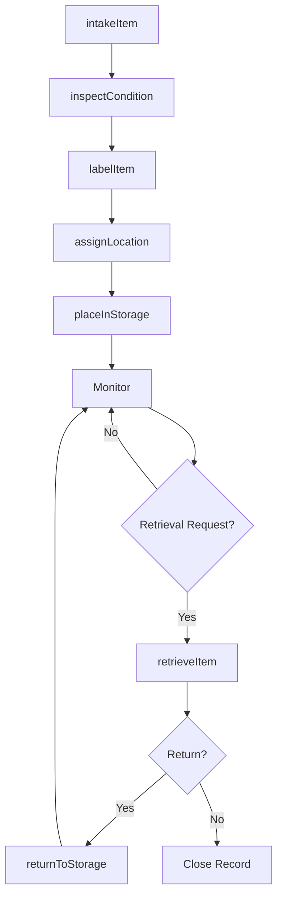
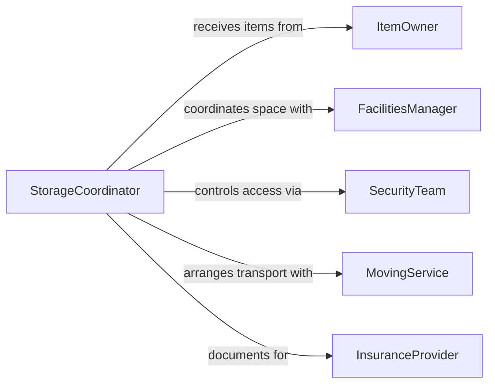

# Store Items

> Business-as-Code definition for general item storage operations. Models the process of receiving, organizing, protecting, and retrieving items in storage facilities, warehouses, and organizational spaces.

## Overview

Item storage operations involve systematically placing and maintaining physical goods in designated locations to ensure protection, accessibility, and efficient retrieval. This work applies across industries including warehousing, archival management, equipment storage, and facilities maintenance. This definition exposes actions for intake, organization, preservation, and retrieval.

## Actors

| Actor | Description |
|-------|-------------|
| ItemOwner | Individual or department that owns stored items |
| FacilitiesManager | Oversees storage space allocation and conditions |
| SecurityTeam | Controls access and monitors stored assets |
| MovingService | Transports items to and from storage |
| InsuranceProvider | Covers loss or damage to stored items |
| ComplianceOfficer | Ensures storage meets regulatory requirements |

## Roles

| Role | Description |
|------|-------------|
| StorageCoordinator | Manages intake, organization, and retrieval |
| WarehouseWorker | Physically handles and places items in storage |
| InventoryClerk | Maintains records of stored items and locations |
| ClimateMonitor | Tracks temperature and humidity for sensitive items |

## Entities

| Entity | Description |
|--------|-------------|
| StoredItem | A physical object placed in storage |
| StorageLocation | A shelf, bay, cage, or room for item placement |
| StorageRecord | Documentation of item details and location |
| AccessLog | Record of who retrieved or returned items |
| ConditionReport | Assessment of item state before and after storage |
| RetrievalRequest | A request to access a stored item |

## Actions

| Action | Description |
|--------|-------------|
| intakeItem | Accept item for storage and create record |
| assignLocation | Determine optimal storage position |
| placeInStorage | Physically position item in assigned location |
| labelItem | Apply identification tags or barcodes |
| inspectCondition | Document item state at intake and retrieval |
| retrieveItem | Locate and remove item from storage |
| returnToStorage | Replace item after temporary removal |

## Events

| Event | Description |
|-------|-------------|
| itemIntaken | Item has been accepted and documented |
| locationAssigned | Storage position has been determined |
| placedInStorage | Item is secured in assigned location |
| itemLabeled | Identification has been applied |
| conditionInspected | Item state has been documented |
| itemRetrieved | Item has been removed from storage |
| returnedToStorage | Item has been replaced in storage |

## Searches

| Search | Description |
|--------|-------------|
| findItems | List stored items by owner, category, or date |
| getLocations | Retrieve storage positions for specific items |
| getAccessLogs | Find retrieval history by item or person |
| getAvailableSpace | List unoccupied storage locations |

## Workflow



## Actor Relationships



## Usage

### Calling Actions

```typescript
import { storeItems } from '@headlessly/store-items'

const storage = storeItems()

// Accept equipment for storage
const item = await storage.intakeItem({
  description: 'Conference room projector',
  owner: 'marketing-dept',
  category: 'av-equipment',
  serialNumber: 'PRJ-8471',
  expectedDuration: '6-months'
})

// Inspect condition at intake
await storage.inspectCondition({
  itemId: item.id,
  phase: 'intake',
  condition: 'good',
  notes: 'Minor scuff on housing, fully functional',
  photos: ['intake-001.jpg', 'intake-002.jpg']
})

// Assign storage location
const location = await storage.assignLocation({
  itemId: item.id,
  requirements: { climate: 'standard', security: 'medium' },
  preferredZone: 'building-a'
})

// Place in storage
await storage.placeInStorage({
  itemId: item.id,
  locationId: location.id,
  handledBy: 'worker-1847',
  timestamp: new Date()
})
```

### Event-Driven Automation

```typescript
// Automatically label items after intake
storage.itemIntaken(async ({ itemId, serialNumber }) => {
  await storage.labelItem({
    itemId,
    barcodeType: 'qr-code',
    includeSerial: true
  })
})

// Alert owner when retrieval request is fulfilled
storage.itemRetrieved(async ({ itemId, owner, requestId }) => {
  await notify({
    to: owner,
    message: `Your stored item is ready for pickup`,
    requestId,
    pickupLocation: 'receiving-desk'
  })
})
```
