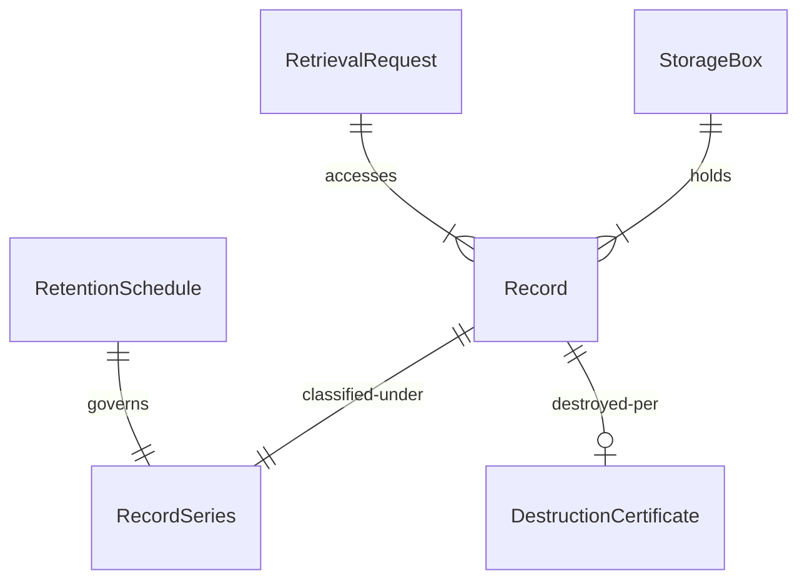
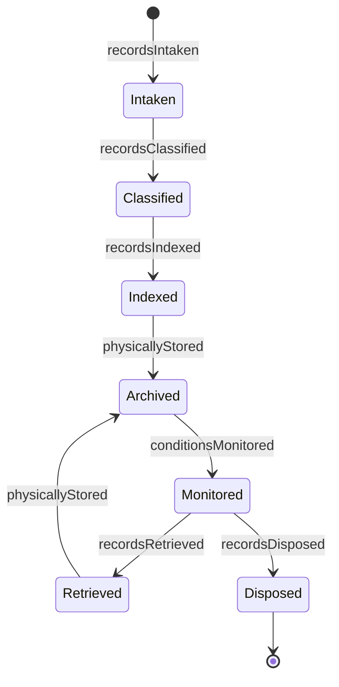
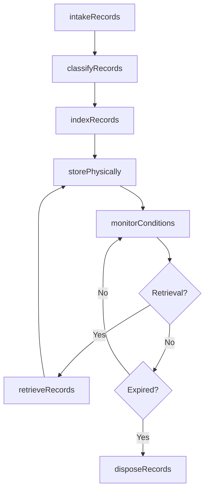
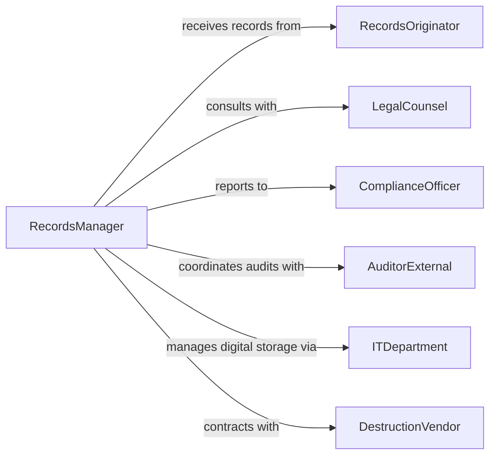

# Store Records Related Materials

> Business-as-Code definition for records and document storage management. Models the lifecycle of physical and digital records from intake through archival, retrieval, and disposition in compliance with retention policies.

## Overview

Records storage operations ensure that business documents, legal files, medical records, and other materials are organized, preserved, and retrievable according to retention schedules and compliance requirements. This work includes classification, indexing, environmental control, and audit trails. This definition exposes actions for records management, compliance, and information governance.

## Actors

| Actor | Description |
|-------|-------------|
| RecordsOriginator | Department or individual creating records |
| LegalCounsel | Advises on retention requirements and legal holds |
| ComplianceOfficer | Ensures adherence to regulatory retention policies |
| AuditorExternal | Reviews records management practices |
| ITDepartment | Manages digital storage infrastructure |
| DestructionVendor | Securely disposes of expired records |

## Roles

| Role | Description |
|------|-------------|
| RecordsManager | Oversees entire records lifecycle |
| Archivist | Organizes and preserves long-term records |
| FileClerk | Processes, stores, and retrieves records |
| ComplianceAnalyst | Monitors retention schedules and policies |

## Entities

| Entity | Description |
|--------|-------------|
| Record | A document or file requiring managed storage |
| RecordSeries | A category of records with common retention rules |
| StorageBox | A container holding multiple physical records |
| RetentionSchedule | Rules defining how long records must be kept |
| RetrievalRequest | A request to access archived records |
| DestructionCertificate | Proof of secure records disposal |

## Actions

| Action | Description |
|--------|-------------|
| intakeRecords | Accept records for archival storage |
| classifyRecords | Assign records to appropriate series and schedules |
| indexRecords | Create searchable metadata for retrieval |
| storePhysically | Place records in secure storage facility |
| monitorConditions | Track environmental factors for preservation |
| retrieveRecords | Locate and provide access to stored records |
| disposeRecords | Securely destroy records per retention schedule |

## Events

| Event | Description |
|-------|-------------|
| recordsIntaken | Records have been accepted for storage |
| recordsClassified | Series and retention rules have been assigned |
| recordsIndexed | Metadata has been created for searchability |
| physicallyStored | Records are secured in storage facility |
| conditionsMonitored | Environmental metrics have been logged |
| recordsRetrieved | Records have been provided to requester |
| recordsDisposed | Records have been securely destroyed |

## Searches

| Search | Description |
|--------|-------------|
| findRecords | List records by series, date, or originator |
| getRetentionSchedule | Retrieve retention rules for a record series |
| getPendingDisposal | Find records eligible for destruction |
| getRetrievalHistory | List access logs for audit trail |


## Entity Relationships



## State Diagram



## Workflow



## Actor Relationships



## Usage

### Calling Actions

```typescript
import { storeRecordsRelatedMaterials } from '@headlessly/store-records-related-materials'

const records = storeRecordsRelatedMaterials()

// Accept employee personnel files for archival
const intake = await records.intakeRecords({
  originator: 'human-resources',
  recordType: 'personnel-files',
  quantity: 147,
  boxes: 12,
  dateRange: { start: '2015-01-01', end: '2020-12-31' }
})

// Classify according to retention schedule
await records.classifyRecords({
  intakeId: intake.id,
  series: 'HR-PERSONNEL',
  retentionPeriod: '7-years-after-separation',
  confidentialityLevel: 'confidential'
})

// Create searchable index
await records.indexRecords({
  intakeId: intake.id,
  metadata: [
    { field: 'employeeName', extractFrom: 'folder-label' },
    { field: 'hireDate', extractFrom: 'first-document' },
    { field: 'separationDate', extractFrom: 'last-document' }
  ]
})

// Store in secure facility
await records.storePhysically({
  intakeId: intake.id,
  facility: 'off-site-archive-a',
  location: 'section-12-rack-8',
  accessLevel: 'restricted'
})
```

### Event-Driven Automation

```typescript
// Auto-classify records using AI when intake is complete
records.recordsIntaken(async ({ intakeId, recordType }) => {
  const series = await determineRecordSeries(recordType)
  await records.classifyRecords({
    intakeId,
    series: series.code,
    retentionPeriod: series.retention
  })
})

// Alert compliance team when records are eligible for disposal
records.conditionsMonitored(async ({ recordId, retentionExpiry }) => {
  const daysUntilExpiry = calculateDays(retentionExpiry)
  if (daysUntilExpiry <= 30) {
    await notify({
      to: 'compliance-team',
      message: `Record ${recordId} eligible for disposal in ${daysUntilExpiry} days`,
      requiresApproval: true
    })
  }
})
```
