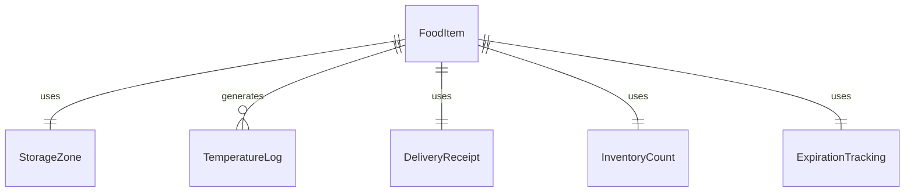
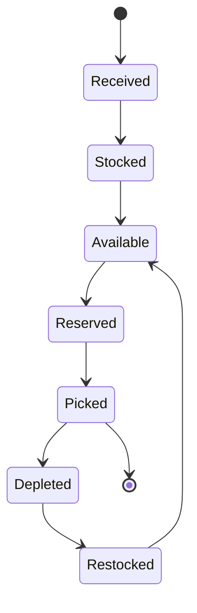
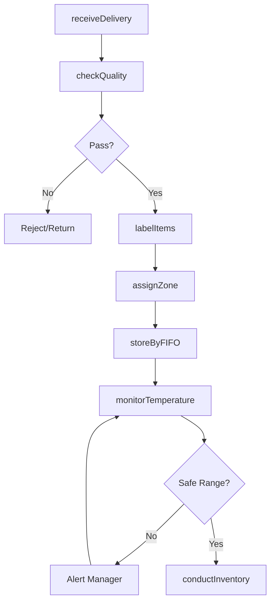
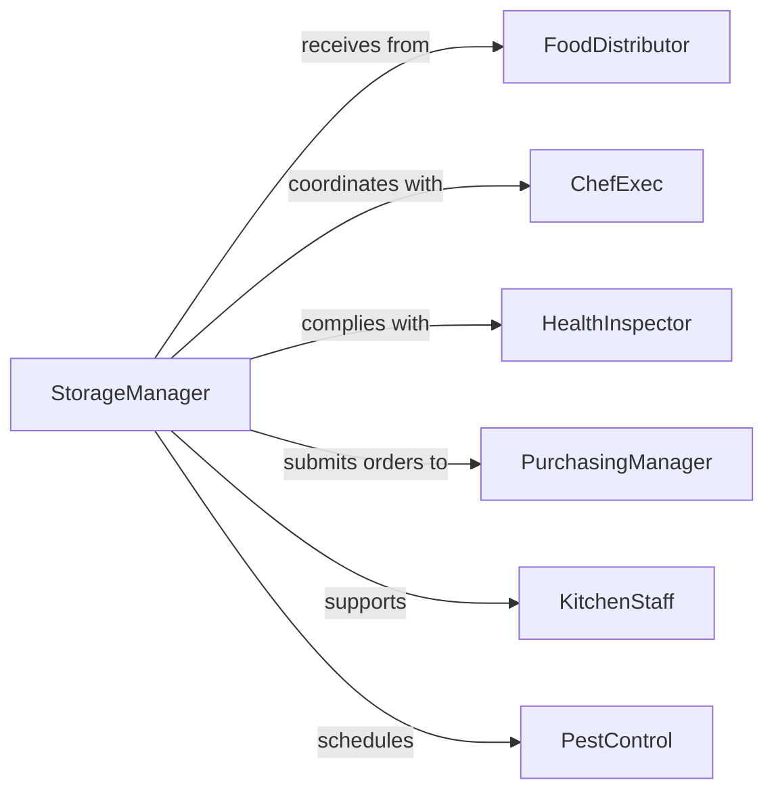

# Store Supplies Goods Kitchens Storage

> Business-as-Code definition for kitchen and food service storage operations. Models receiving, organizing, preserving, and managing food ingredients, supplies, and equipment in commercial kitchens, restaurants, and food service facilities.

## Overview

Kitchen storage operations ensure that food ingredients remain fresh, supplies are accessible, and storage areas meet health code requirements. This work involves proper temperature management, rotation procedures, inventory tracking, and sanitation. This definition exposes actions for receiving, organizing, preservation, and compliance monitoring.

## Actors

| Actor | Description |
|-------|-------------|
| FoodDistributor | Delivers ingredients and dry goods |
| ChefExec | Plans menus and determines ingredient needs |
| HealthInspector | Audits storage practices and food safety compliance |
| PurchasingManager | Orders supplies and negotiates with vendors |
| KitchenStaff | Retrieves ingredients for meal preparation |
| PestControl | Monitors and treats storage areas for infestations |

## Roles

| Role | Description |
|------|-------------|
| StorageManager | Oversees kitchen storage operations |
| ReceivingClerk | Accepts and inspects food deliveries |
| StockHandler | Organizes ingredients in proper storage zones |
| InventoryCoordinator | Tracks stock levels and expiration dates |

## Entities

| Entity | Description |
|--------|-------------|
| FoodItem | An ingredient or prepared food in storage |
| StorageZone | Walk-in cooler, freezer, dry storage, or prep area |
| TemperatureLog | Record of cooling and freezing temperatures |
| DeliveryReceipt | Documentation of received goods and quality check |
| InventoryCount | Physical verification of stock quantities |
| ExpirationTracking | System for monitoring product shelf life |

## Actions

| Action | Description |
|--------|-------------|
| receiveDelivery | Accept and inspect incoming food and supplies |
| checkQuality | Verify freshness, temperature, and packaging condition |
| labelItems | Mark with receiving date and expiration information |
| assignZone | Determine appropriate storage location by type |
| storeByFIFO | Place new items behind existing stock for rotation |
| monitorTemperature | Log cooler and freezer temperatures |
| conductInventory | Count and verify stock levels |

## Events

| Event | Description |
|-------|-------------|
| deliveryReceived | Food shipment has been accepted |
| qualityChecked | Ingredients have passed inspection |
| itemsLabeled | Date and expiration labels have been applied |
| zoneAssigned | Storage location has been determined |
| storedByFIFO | Items have been rotated properly |
| temperatureMonitored | Temperature logs have been completed |
| inventoryConducted | Physical count has been reconciled |

## Searches

| Search | Description |
|--------|-------------|
| findItems | List stored items by category or storage zone |
| getExpiring | Retrieve items nearing expiration date |
| getTemperatureLogs | Find temperature records by zone or date |
| getLowStock | List items below reorder threshold |


## Entity Relationships



## State Diagram



## Workflow



## Actor Relationships



## Usage

### Calling Actions

```typescript
import { storeSuppliesGoodsKitchensStorage } from '@headlessly/store-supplies-goods-kitchens-storage'

const kitchen = storeSuppliesGoodsKitchensStorage()

// Receive morning produce delivery
const delivery = await kitchen.receiveDelivery({
  vendorId: 'SYSCO-4821',
  deliveryId: 'DEL-29384',
  items: [
    { product: 'romaine-lettuce', quantity: 12, unit: 'case', temp: 38 },
    { product: 'chicken-breast', quantity: 40, unit: 'lb', temp: 35 },
    { product: 'tomatoes-roma', quantity: 8, unit: 'case', temp: 42 }
  ]
})

// Check quality on arrival
await kitchen.checkQuality({
  deliveryId: delivery.id,
  checks: [
    { product: 'romaine-lettuce', freshness: 'good', damage: 'none' },
    { product: 'chicken-breast', temp: 35, packaging: 'sealed' },
    { product: 'tomatoes-roma', ripeness: 'optimal', bruising: 'minimal' }
  ]
})

// Label with dates
await kitchen.labelItems({
  deliveryId: delivery.id,
  receivedDate: new Date(),
  useByDays: { 'romaine-lettuce': 7, 'chicken-breast': 3, 'tomatoes-roma': 5 }
})

// Store in appropriate zones
await kitchen.assignZone({
  deliveryId: delivery.id,
  assignments: [
    { product: 'romaine-lettuce', zone: 'walk-in-cooler-1' },
    { product: 'chicken-breast', zone: 'meat-cooler' },
    { product: 'tomatoes-roma', zone: 'produce-cooler' }
  ]
})
```

### Event-Driven Automation

```typescript
// Auto-rotate stock when new items are stored
kitchen.zoneAssigned(async ({ deliveryId, assignments }) => {
  for (const item of assignments) {
    await kitchen.storeByFIFO({
      product: item.product,
      zone: item.zone,
      placement: 'back-of-shelf'
    })
  }
})

// Alert when temperature is out of safe range
kitchen.temperatureMonitored(async ({ zone, temp, safeRange }) => {
  if (temp < safeRange.min || temp > safeRange.max) {
    await notify({
      to: 'storage-manager',
      priority: 'urgent',
      message: `Temperature violation in ${zone}: ${temp}F (safe: ${safeRange.min}-${safeRange.max}F)`
    })
  }
})
```
