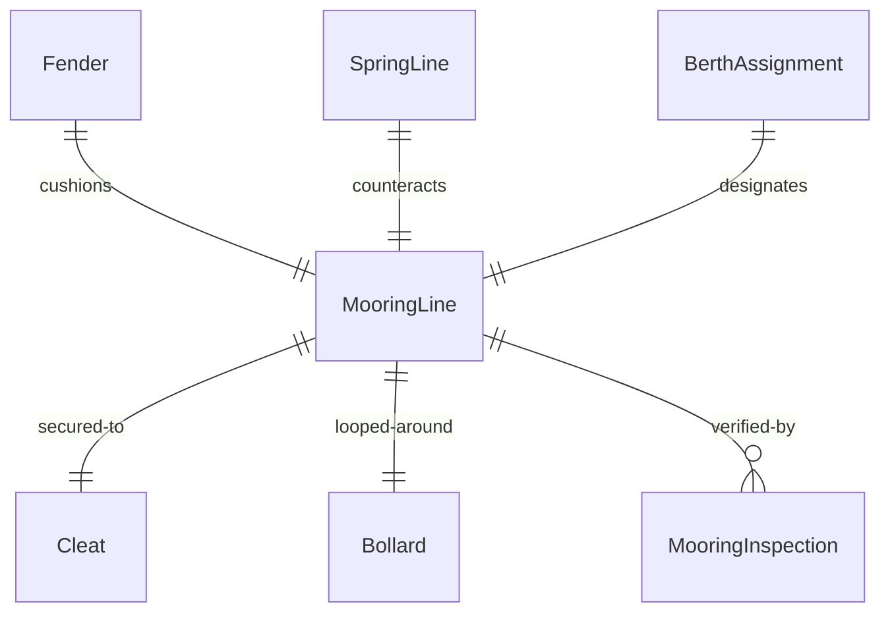
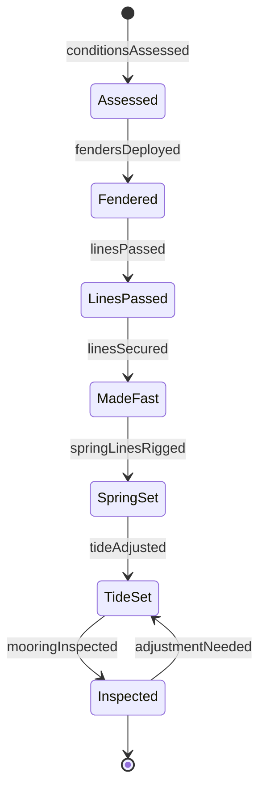
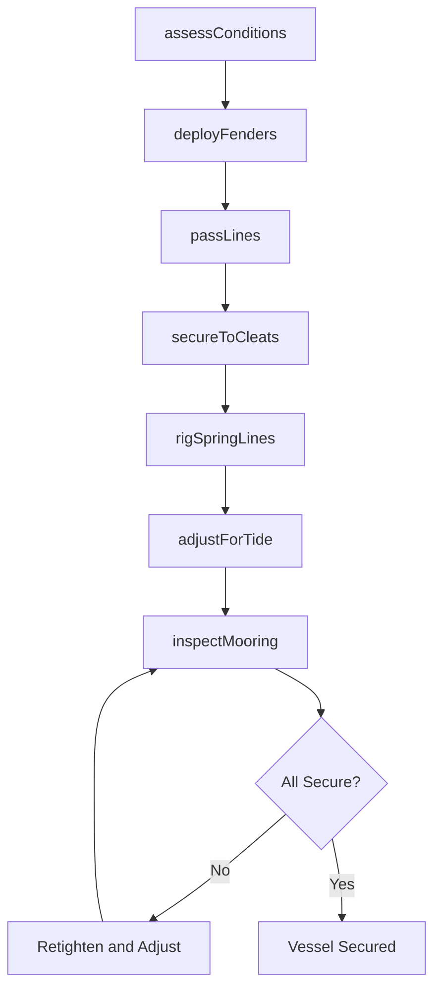
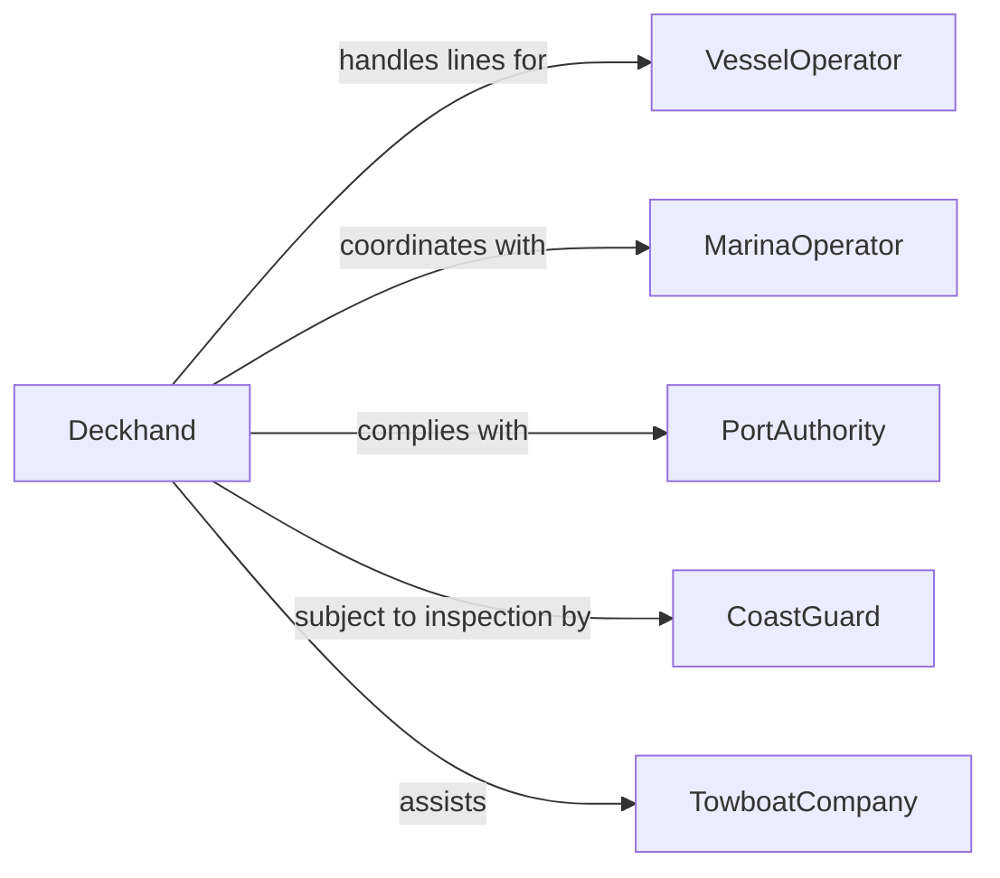

# Secure Watercraft to Docks, Wharves, or Other Vessels

> Business-as-Code definition for watercraft securing operations. Models the approach assessment, line handling, fender deployment, cleat and bollard securing, spring line rigging, and post-mooring inspection for boats, ships, barges, and floating equipment at docks, wharves, piers, and alongside other vessels.

## Overview

Securing watercraft to docks, wharves, or other vessels involves assessing wind, current, and tide conditions, preparing mooring lines and fenders, maneuvering the vessel into position, deploying bow and stern lines to cleats or bollards, rigging spring lines to prevent surge, adjusting for tidal range, and inspecting all connections for security. This definition covers recreational boat docking at marinas, commercial vessel mooring at port terminals, barge fleeting and lashing operations, vessel-to-vessel rafting for offshore transfer, and emergency tie-up procedures during storms.

## Actors

| Actor | Description |
|-------|-------------|
| VesselOperator | Commands the watercraft being secured and directs the approach |
| MarinaOperator | Manages dock facilities, slip assignments, and shoreside infrastructure |
| PortAuthority | Regulates vessel mooring positions, safety zones, and port traffic |
| CoastGuard | Enforces maritime safety standards and responds to mooring emergencies |
| TowboatCompany | Positions barges and assists large vessels with docking maneuvers |

## Roles

| Role | Description |
|------|-------------|
| Deckhand | Handles mooring lines, deploys fenders, and secures connections on deck |
| Dockmaster | Assigns berths, coordinates arrivals, and oversees shoreside line handling |
| LineTender | Receives and secures mooring lines on the dock or wharf side |
| Helmsman | Maneuvers the vessel during approach, holding position while lines are made fast |

## Entities

| Entity | Description |
|--------|-------------|
| MooringLine | A rope or hawser connecting the vessel to a dock, bollard, or another vessel |
| Fender | A cushioning device deployed between the hull and dock to prevent damage |
| Cleat | A deck or dock fitting around which mooring lines are secured |
| Bollard | A heavy post on a wharf or pier used to receive and hold vessel lines |
| SpringLine | A line rigged at an angle to prevent the vessel from surging fore or aft |
| BerthAssignment | A designated slip or dock position allocated to a specific vessel |
| MooringInspection | A check confirming all lines are secure, chafe guards are in place, and fenders are positioned |

## Actions

| Action | Description |
|--------|-------------|
| assessConditions | Evaluate wind, current, tide, and traffic before approaching the dock |
| deployFenders | Position fenders along the hull to protect against contact with the dock |
| passLines | Send mooring lines from the vessel to the dock or receiving vessel |
| secureToCleats | Make lines fast to cleats or bollards using proper hitches and wraps |
| rigSpringLines | Set spring lines at opposing angles to prevent fore-and-aft surge |
| adjustForTide | Set lines with enough scope to accommodate tidal rise and fall |
| inspectMooring | Walk the deck and dock checking line tension, chafe guards, and fender position |

## Events

| Event | Description |
|-------|-------------|
| conditionsAssessed | Wind, current, and tide have been evaluated for the approach |
| fendersDeployed | Fenders have been positioned along the hull at contact points |
| linesPassed | Mooring lines have been sent from the vessel to the dock |
| linesSecured | All mooring lines have been made fast to cleats or bollards |
| springLinesRigged | Spring lines have been set to prevent vessel surge |
| tideAdjusted | Line scope has been set to accommodate expected tidal range |
| mooringInspected | All connections, chafe guards, and fenders have been verified secure |

## Searches

| Search | Description |
|--------|-------------|
| findBerthAssignments | Locate available berths by vessel length, draft, and arrival time |
| getMooringHistory | Retrieve docking records for a specific vessel at a facility |
| getTideSchedule | Look up predicted tidal heights and current conditions for the mooring location |
| findActiveVessels | List vessels currently secured at a dock or wharf facility |
| getMooringInspections | Retrieve inspection records by vessel, berth, or date |


## Entity Relationships



## State Diagram



## Workflow



## Actor Relationships



## Usage

### Calling Actions

```typescript
import { secureWatercraftDocksWharvesVessels } from '@headlessly/secure-watercraft-docks-wharves-vessels'

const mooring = secureWatercraftDocksWharvesVessels()

// Assess and prepare
await mooring.assessConditions({
  vesselId: 'VSL-2024-MV-HORIZON',
  berth: 'Pier-7-Slip-12',
  windSpeed: 15,
  windDirection: 'NW',
  currentKnots: 1.2,
  tideState: 'incoming-mid',
  vesselLength: 42,
  unit: 'feet'
})

await mooring.deployFenders({
  vesselId: 'VSL-2024-MV-HORIZON',
  side: 'port',
  fenderCount: 4,
  positions: ['bow-quarter', 'forward-midship', 'aft-midship', 'stern-quarter']
})

// Secure lines
await mooring.secureToCleats({
  vesselId: 'VSL-2024-MV-HORIZON',
  lines: [
    { type: 'bow-line', dockCleat: 'C-12-FWD', wraps: 3 },
    { type: 'stern-line', dockCleat: 'C-12-AFT', wraps: 3 },
    { type: 'forward-spring', dockCleat: 'C-12-MID', angle: 'aft-leading' },
    { type: 'aft-spring', dockCleat: 'C-12-MID', angle: 'forward-leading' }
  ]
})
```

### Event-Driven Automation

```typescript
// Notify marina office when vessel is secured
mooring.mooringInspected(async ({ vesselId, berth, allSecure }) => {
  if (allSecure) {
    await marina.logArrival({
      vesselId,
      berth,
      securedAt: new Date().toISOString(),
      status: 'moored'
    })
  }
})

// Alert deckhand when tidal conditions require line adjustment
mooring.tideAdjusted(async ({ vesselId, expectedRangeFt }) => {
  if (expectedRangeFt > 6) {
    await alerts.send({
      to: 'deckhand-on-watch',
      message: `High tidal range (${expectedRangeFt}ft) expected. Check lines on ${vesselId} every 2 hours.`
    })
  }
})
```
