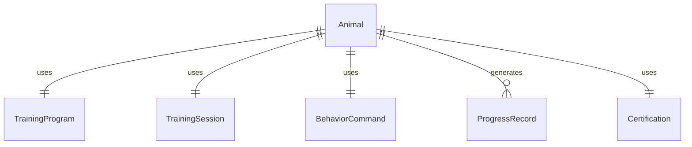
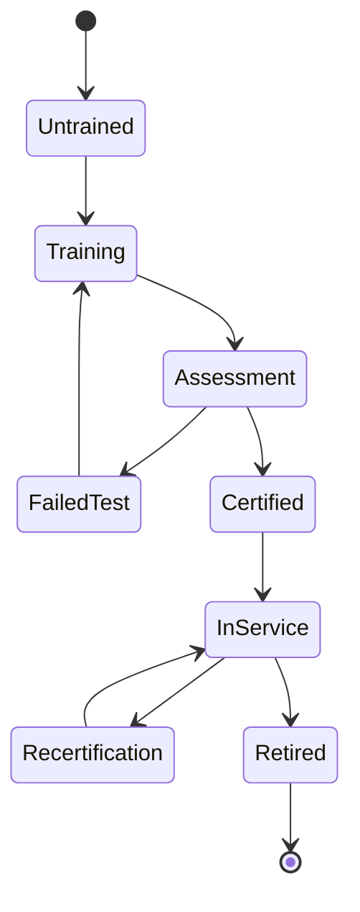
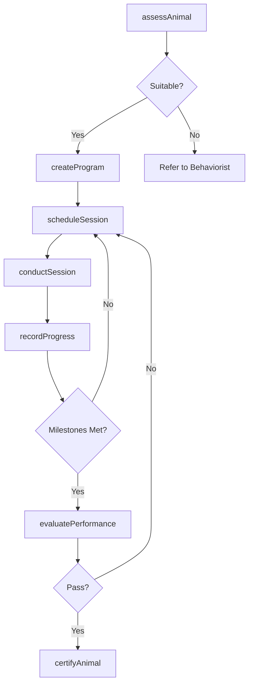
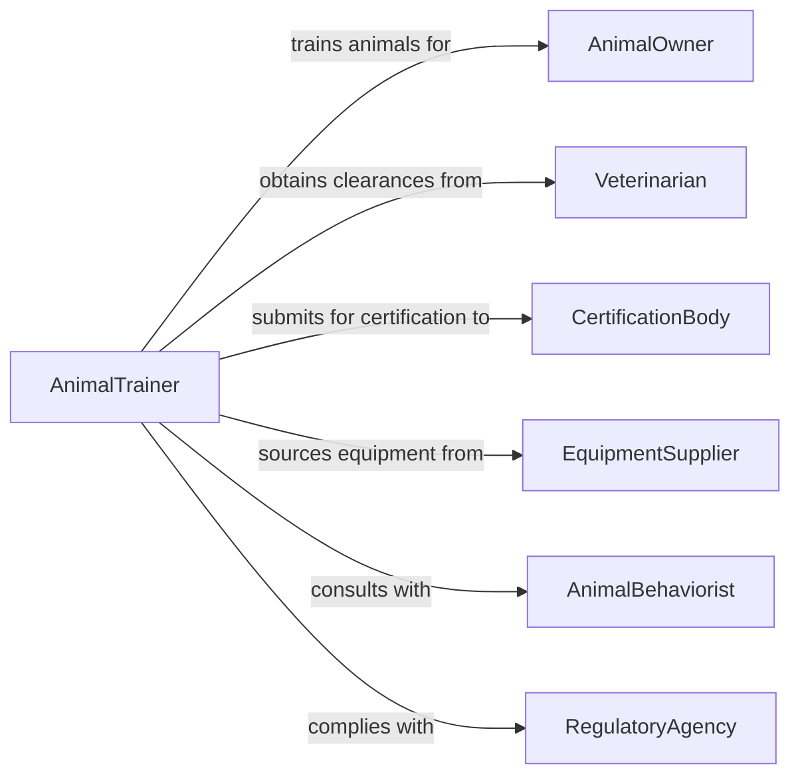

# Train Animals

> Business-as-Code definition for animal training operations. Models the structured process of behavioral conditioning, skill development, and performance evaluation for working, service, and companion animals.

## Overview

Animal training involves systematically teaching animals specific behaviors, commands, and tasks through conditioning techniques, reinforcement schedules, and progressive skill building. This definition covers training program design, session planning, behavioral assessment, progress tracking, and certification for applications including service animals, law enforcement K-9 units, livestock working dogs, equestrian performance, and companion animal obedience.

## Actors

| Actor | Description |
|-------|-------------|
| AnimalOwner | Individual or organization that owns the animal being trained |
| Veterinarian | Provides health clearances and monitors training-related injuries |
| CertificationBody | Issues credentials for trained service, therapy, or working animals |
| EquipmentSupplier | Provides training equipment such as leads, harnesses, and obstacles |
| AnimalBehaviorist | Consults on complex behavioral issues requiring specialized intervention |
| RegulatoryAgency | Enforces animal welfare standards during training activities |

## Roles

| Role | Description |
|------|-------------|
| AnimalTrainer | Designs and conducts training sessions with the animal |
| TrainingAssistant | Supports training exercises by managing equipment and environment |
| BehaviorEvaluator | Assesses animal temperament and progress through standardized tests |
| ProgramDirector | Oversees training programs and curriculum development |

## Entities

| Entity | Description |
|--------|-------------|
| Animal | The individual animal enrolled in a training program |
| TrainingProgram | A structured curriculum of skills and behaviors to be taught |
| TrainingSession | A single scheduled training event with defined objectives |
| BehaviorCommand | A specific command or cue the animal is being trained to respond to |
| ProgressRecord | Documented assessment of the animal's skill development over time |
| Certification | Formal credential issued upon completing a training program |

## Actions

| Action | Description |
|--------|-------------|
| assessAnimal | Evaluate an animal's temperament, health, and training readiness |
| createProgram | Design a training curriculum with goals, timeline, and milestones |
| scheduleSession | Plan a training session with specific exercises and objectives |
| conductSession | Execute a training session using designated techniques and commands |
| recordProgress | Document behaviors learned, response rates, and areas for improvement |
| evaluatePerformance | Administer formal skill assessments or certification tests |
| certifyAnimal | Issue completion credentials for a training program |

## Events

| Event | Description |
|-------|-------------|
| animalAssessed | Initial behavioral and health evaluation has been completed |
| programCreated | A training program has been designed and approved |
| sessionScheduled | A training session has been planned and assigned |
| sessionCompleted | A training session has been executed and documented |
| progressRecorded | Training progress has been logged for the animal |
| performanceEvaluated | Formal skill assessment has been completed |
| animalCertified | Training certification has been issued for the animal |

## Searches

| Search | Description |
|--------|-------------|
| findAnimals | List animals by species, training program, or progress status |
| getTrainingPrograms | Retrieve programs by type, duration, or completion rate |
| getSessionHistory | Find training sessions by animal, trainer, or date range |
| getProgressRecords | Query progress data by animal, skill, or evaluation score |


## Entity Relationships



## State Diagram



## Workflow



## Actor Relationships



## Usage

### Calling Actions

```typescript
import { trainAnimals } from '@headlessly/train-animals'

const training = trainAnimals()

// Assess an animal for training readiness
const assessment = await training.assessAnimal({
  animalId: 'K9-GSD-ZEUS-042',
  species: 'canine',
  breed: 'German Shepherd',
  age: 18,
  healthClearance: 'VET-CLR-2026-0221',
  temperamentTest: 'standard-working-dog'
})

// Create a training program
const program = await training.createProgram({
  animalId: assessment.animalId,
  programType: 'service-dog-obedience',
  duration: 12,
  durationUnit: 'weeks',
  commands: ['sit', 'stay', 'heel', 'down', 'come', 'leave-it', 'place'],
  milestones: [
    { week: 4, skills: ['basic-obedience'] },
    { week: 8, skills: ['advanced-obedience', 'public-access'] },
    { week: 12, skills: ['task-specific', 'certification-ready'] }
  ]
})

// Conduct a training session
await training.conductSession({
  programId: program.id,
  animalId: assessment.animalId,
  exercises: ['heel-walk', 'sit-stay-duration', 'recall-with-distractions'],
  duration: 45,
  reinforcementType: 'positive-reward'
})
```

### Event-Driven Automation

```typescript
// Schedule certification test when milestones are met
training.progressRecorded(async ({ animalId, programId, milestonesCompleted }) => {
  const program = await training.getTrainingPrograms({ programId })
  if (milestonesCompleted >= program.totalMilestones) {
    await training.evaluatePerformance({
      animalId,
      programId,
      evaluationType: 'final-certification'
    })
  }
})

// Notify owner when certification is issued
training.animalCertified(async ({ animalId, certificationId, programType }) => {
  const animal = await training.findAnimals({ animalId })
  await notify({
    to: animal.ownerId,
    message: `${animal.name} has completed ${programType} training. Certification: ${certificationId}`
  })
})
```
