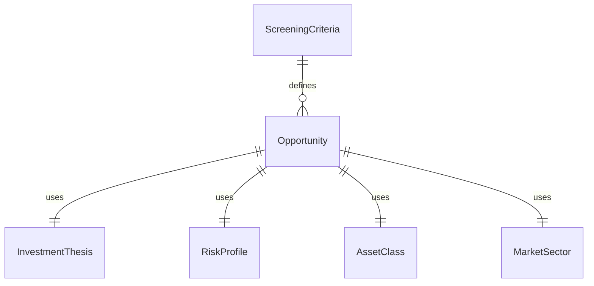
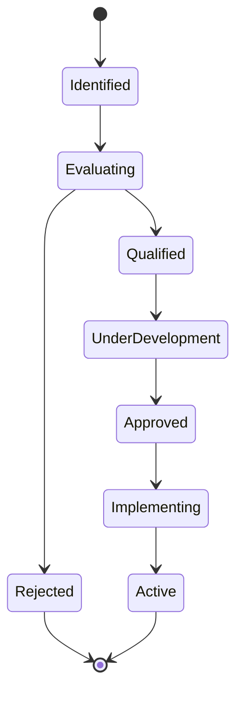
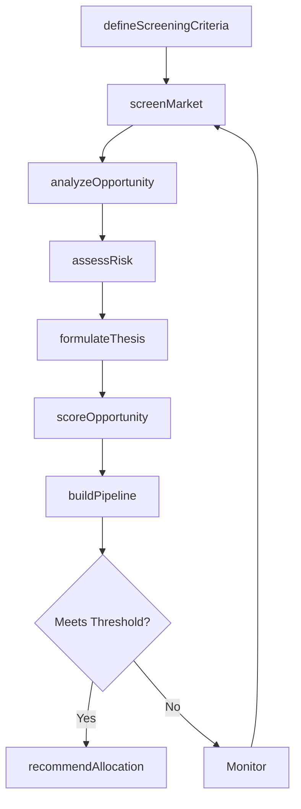
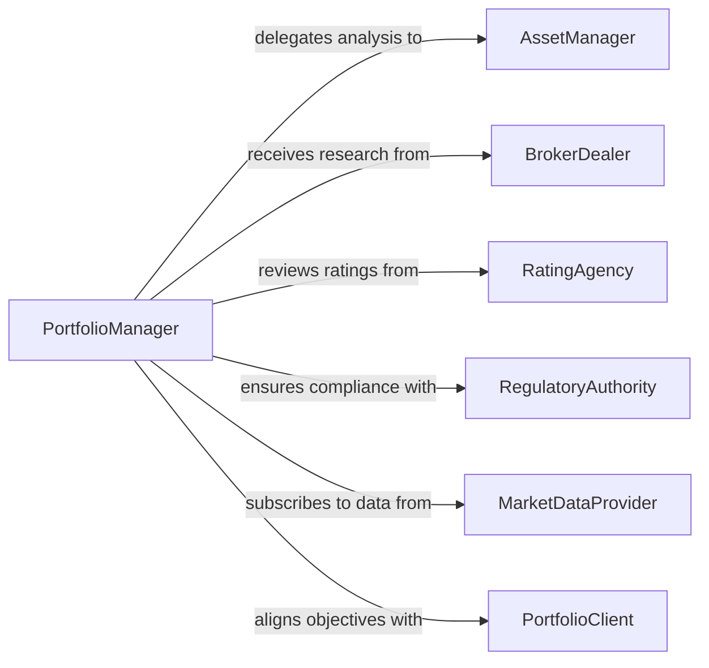

# Identify Investment Opportunities or Strategies

> Business-as-Code definition for identifying investment opportunities and strategies. Models the process of screening markets, analyzing asset classes, evaluating risk-return profiles, and building investment theses for portfolio allocation decisions.

## Overview

Identifying investment opportunities or strategies involves scanning capital markets, alternative asset classes, and emerging sectors to discover investments that align with portfolio objectives and risk tolerances. This definition provides actions for market screening, fundamental and technical analysis, strategy formulation, and opportunity pipeline management. It supports equities, fixed income, real estate, venture capital, and other asset classes across domestic and international markets.

## Actors

| Actor | Description |
|-------|-------------|
| AssetManager | Manages investment portfolios and seeks allocation opportunities |
| BrokerDealer | Provides market access, research reports, and trade execution |
| RatingAgency | Issues credit ratings and investment grade assessments |
| RegulatoryAuthority | Enforces securities laws and disclosure requirements |
| MarketDataProvider | Supplies real-time and historical pricing, volume, and fundamental data |
| PortfolioClient | Defines investment objectives, risk tolerances, and return expectations |

## Roles

| Role | Description |
|------|-------------|
| InvestmentAnalyst | Conducts fundamental and technical analysis on potential investments |
| PortfolioManager | Makes allocation decisions based on identified opportunities |
| RiskOfficer | Evaluates risk exposure and compliance of proposed investments |
| ResearchDirector | Oversees the investment research process and thesis development |
| QuantitativeAnalyst | Builds models for screening and scoring investment opportunities |

## Entities

| Entity | Description |
|--------|-------------|
| Opportunity | A specific investment that has been identified for evaluation |
| InvestmentThesis | A documented rationale for why an opportunity merits allocation |
| ScreeningCriteria | A set of quantitative and qualitative filters for identifying candidates |
| RiskProfile | An assessment of the volatility, drawdown, and correlation characteristics of an investment |
| AssetClass | A category of investment such as equity, fixed income, or real estate |
| MarketSector | An industry or thematic segment within an asset class |
| Valuation | A quantitative assessment of an investment's intrinsic worth |
| OpportunityPipeline | A ranked list of investments under active evaluation |

## Actions

| Action | Description |
|--------|-------------|
| defineScreeningCriteria | Set quantitative and qualitative filters for opportunity identification |
| screenMarket | Scan available investments against defined screening criteria |
| analyzeOpportunity | Conduct fundamental, technical, or quantitative analysis on a candidate |
| assessRisk | Evaluate the risk-return profile of a potential investment |
| formulateThesis | Document the investment rationale, catalysts, and target allocation |
| scoreOpportunity | Assign a composite attractiveness rating to an investment candidate |
| buildPipeline | Organize scored opportunities into a prioritized evaluation queue |
| recommendAllocation | Propose a specific investment for inclusion in a portfolio |

## Events

| Event | Description |
|-------|-------------|
| screeningCriteriaDefined | New screening parameters have been established |
| marketScreened | A market scan has completed and candidates have been identified |
| opportunityAnalyzed | Detailed analysis of an investment candidate is complete |
| riskAssessed | A risk-return evaluation has been finalized |
| thesisFormulated | An investment thesis has been documented and reviewed |
| opportunityScored | A candidate has received a composite attractiveness score |
| pipelineUpdated | The opportunity pipeline has been reprioritized |
| allocationRecommended | A specific investment has been proposed for portfolio inclusion |

## Searches

| Search | Description |
|--------|-------------|
| findOpportunities | Search the pipeline by asset class, sector, score, or status |
| getScreenResults | Retrieve candidates from the most recent market screening |
| getTheses | Look up documented investment theses by sector or analyst |
| getRiskProfiles | Query risk assessments for opportunities in the pipeline |
| getValuations | Retrieve valuation models and metrics for specific candidates |
| getSectorTrends | Access market data and performance trends for a given sector |


## Entity Relationships



## State Diagram



## Workflow



## Actor Relationships



## Usage

### Calling Actions

```typescript
import { identifyInvestmentOpportunitiesStrategies } from '@headlessly/identify-investment-opportunities-strategies'

const investments = identifyInvestmentOpportunitiesStrategies()

// Define screening criteria for mid-cap growth equities
const criteria = await investments.defineScreeningCriteria({
  assetClass: 'equity',
  marketCap: { min: 2000000000, max: 10000000000 },
  revenueGrowth: { min: 0.15 },
  peRatio: { max: 35 },
  sectors: ['Technology', 'Healthcare', 'Clean Energy']
})

// Screen the market and analyze top candidates
const candidates = await investments.screenMarket({
  criteriaId: criteria.id,
  universe: 'US-Listed',
  limit: 50
})

const analysis = await investments.analyzeOpportunity({
  opportunityId: candidates.items[0].id,
  methods: ['dcf', 'comparableCompanies', 'technicalMomentum']
})

// Formulate and score the investment thesis
await investments.formulateThesis({
  opportunityId: candidates.items[0].id,
  catalyst: 'Regulatory tailwind from infrastructure spending bill',
  targetReturn: 0.25,
  timeHorizon: '18-months'
})
```

### Event-Driven Automation

```typescript
// Alert the portfolio team when a high-conviction opportunity surfaces
investments.opportunityScored(async ({ opportunityId, score, assetClass }) => {
  if (score.conviction >= 9) {
    await notify({
      to: 'investment-committee',
      message: `High-conviction ${assetClass} opportunity scored ${score.conviction}/10`
    })
  }
})

// Auto-generate a recommendation memo when thesis is approved
investments.thesisFormulated(async ({ opportunityId, analyst, thesis }) => {
  await documents.generate({
    template: 'investment-recommendation-memo',
    data: { opportunityId, analyst, thesis },
    distribute: ['portfolio-manager', 'risk-officer']
  })
})
```
