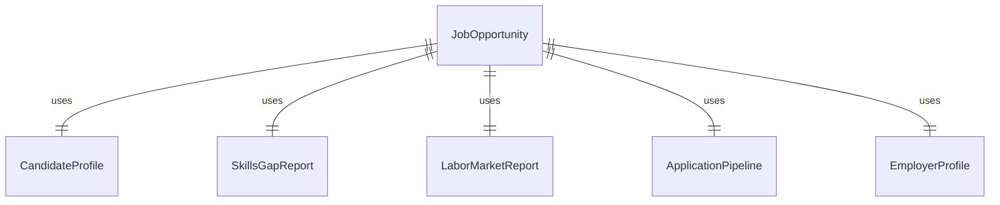
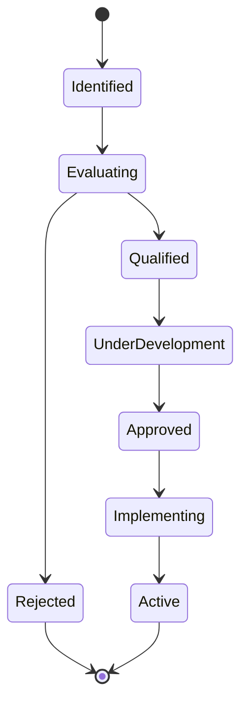
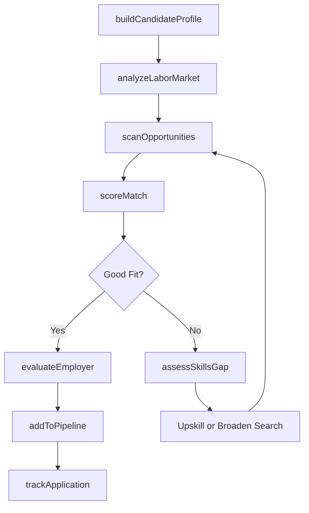
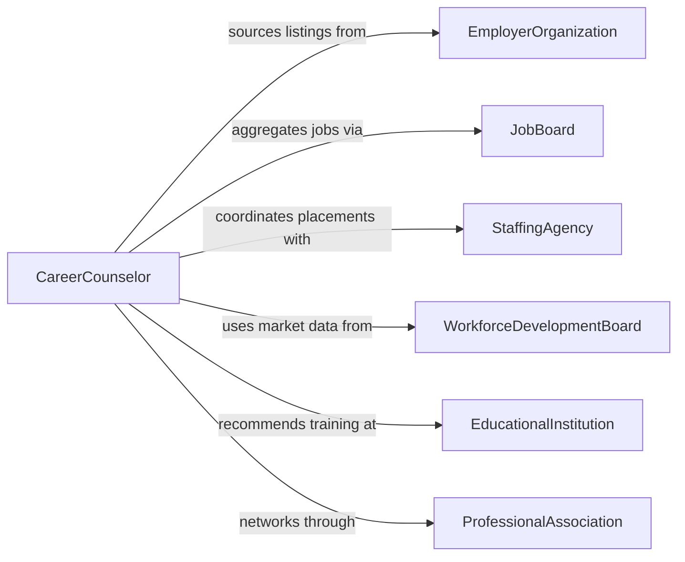

# Identify Job or Employment Opportunities

> Business-as-Code definition for identifying job and employment opportunities. Models the process of scanning labor markets, matching skills to openings, evaluating employer fit, and building a pipeline of qualified career opportunities for job seekers or workforce development programs.

## Overview

Identifying job or employment opportunities involves researching labor market conditions, scanning job boards and employer databases, matching candidate qualifications to open positions, and evaluating organizational culture and compensation fit. This definition supports both individual job seekers and workforce development agencies by providing actions for market analysis, opportunity discovery, skills gap assessment, and application pipeline management. It integrates with job aggregators, employer databases, and labor market information systems.

## Actors

| Actor | Description |
|-------|-------------|
| EmployerOrganization | Posts open positions and defines hiring requirements |
| JobBoard | Aggregates and distributes employment listings from multiple sources |
| StaffingAgency | Matches candidates to temporary, contract, or permanent positions |
| WorkforceDevelopmentBoard | Provides labor market data and career transition resources |
| EducationalInstitution | Offers training programs and credential pathways aligned to market needs |
| ProfessionalAssociation | Publishes industry job trends and networking opportunities |

## Roles

| Role | Description |
|------|-------------|
| CareerCounselor | Guides individuals through the job opportunity identification process |
| WorkforceAnalyst | Studies labor market trends and employment projections |
| RecruitmentSpecialist | Sources and matches candidates to employment opportunities |
| JobSeeker | The individual actively searching for employment opportunities |

## Entities

| Entity | Description |
|--------|-------------|
| JobOpportunity | An open position or employment listing under consideration |
| CandidateProfile | A record of skills, experience, credentials, and career preferences |
| SkillsGapReport | An analysis of the difference between candidate qualifications and job requirements |
| LaborMarketReport | Data on employment trends, wage levels, and demand by occupation or region |
| ApplicationPipeline | A tracked list of opportunities a candidate is pursuing |
| EmployerProfile | Information about an organization's culture, benefits, and growth trajectory |
| MatchScore | A composite rating of how well a candidate fits a given opportunity |
| CareerPathway | A recommended sequence of roles or credentials for long-term career advancement |

## Actions

| Action | Description |
|--------|-------------|
| analyzeLaborMarket | Research employment trends, demand projections, and wage data by occupation |
| scanOpportunities | Search job boards, employer sites, and staffing agencies for matching positions |
| buildCandidateProfile | Document skills, experience, credentials, and career preferences |
| assessSkillsGap | Compare candidate qualifications against the requirements of target opportunities |
| scoreMatch | Rate the fit between a candidate profile and a specific job opportunity |
| evaluateEmployer | Research an organization's culture, compensation, growth, and stability |
| addToPipeline | Add a qualified opportunity to the candidate's active application pipeline |
| trackApplication | Monitor the status and progress of a submitted application |

## Events

| Event | Description |
|-------|-------------|
| laborMarketAnalyzed | Employment trend data has been compiled and summarized |
| opportunitiesScanned | A search for matching job listings has been completed |
| candidateProfileBuilt | A candidate's qualifications and preferences have been documented |
| skillsGapAssessed | A comparison between candidate skills and job requirements is complete |
| matchScored | A fit rating has been calculated for a candidate-opportunity pair |
| employerEvaluated | Research on an employer's profile and work environment is complete |
| opportunityAdded | A job listing has been added to the application pipeline |
| applicationSubmitted | An application has been submitted for a specific opportunity |

## Searches

| Search | Description |
|--------|-------------|
| findOpportunities | Search job listings by title, location, salary range, or skill requirements |
| getMarketTrends | Retrieve labor market data by occupation, industry, or region |
| getSkillsGaps | Query skills gap reports for a candidate or occupation |
| getPipeline | List all opportunities in a candidate's active application pipeline |
| getEmployerProfiles | Look up employer information by industry, size, or location |


## Entity Relationships



## State Diagram



## Workflow



## Actor Relationships



## Usage

### Calling Actions

```typescript
import { identifyJobEmploymentOpportunities } from '@headlessly/identify-job-employment-opportunities'

const careers = identifyJobEmploymentOpportunities()

// Build a candidate profile
const profile = await careers.buildCandidateProfile({
  skills: ['project-management', 'data-analysis', 'stakeholder-communication'],
  experience: { years: 5, industry: 'Healthcare IT' },
  credentials: ['PMP', 'CAPM'],
  preferences: { location: 'Remote', salaryMin: 95000, type: 'full-time' }
})

// Scan the labor market for matching opportunities
const market = await careers.analyzeLaborMarket({
  occupations: ['Project Manager', 'Program Manager', 'Business Analyst'],
  region: 'US-National'
})

const jobs = await careers.scanOpportunities({
  profileId: profile.id,
  sources: ['LinkedIn', 'Indeed', 'Glassdoor'],
  limit: 25
})

// Score and evaluate top matches
for (const job of jobs.items.slice(0, 5)) {
  await careers.scoreMatch({ profileId: profile.id, opportunityId: job.id })
  await careers.evaluateEmployer({ employerId: job.employerId })
}
```

### Event-Driven Automation

```typescript
// Auto-add high-scoring matches to the pipeline
careers.matchScored(async ({ profileId, opportunityId, score }) => {
  if (score.overall >= 85) {
    await careers.addToPipeline({ profileId, opportunityId, priority: 'high' })
    await notify({
      to: 'job-seeker',
      message: `Strong match found: ${score.overall}% fit - added to your pipeline`
    })
  }
})

// Alert when a skills gap blocks multiple opportunities
careers.skillsGapAssessed(async ({ profileId, gaps }) => {
  const criticalGaps = gaps.filter(g => g.frequency >= 3)
  if (criticalGaps.length > 0) {
    await notify({
      to: 'career-counselor',
      message: `Candidate has recurring gaps in: ${criticalGaps.map(g => g.skill).join(', ')}`
    })
  }
})
```
