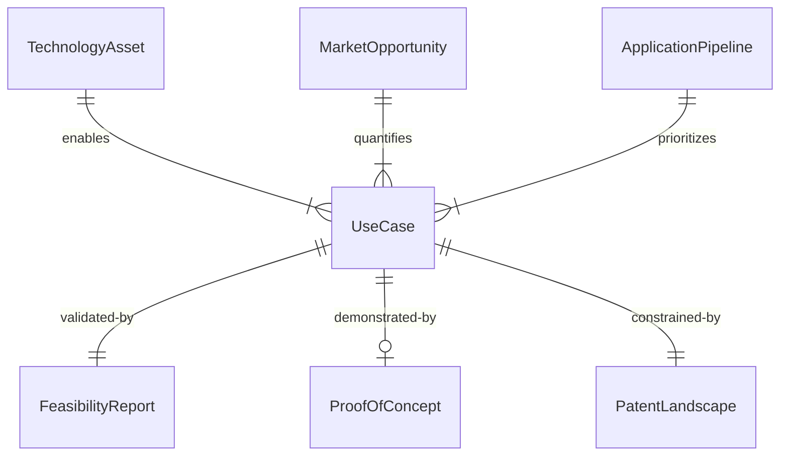
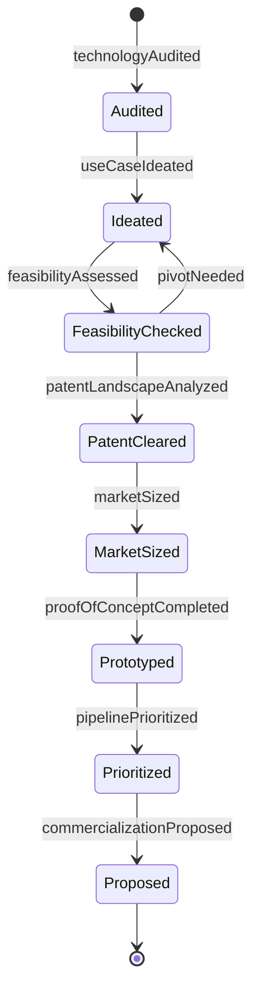
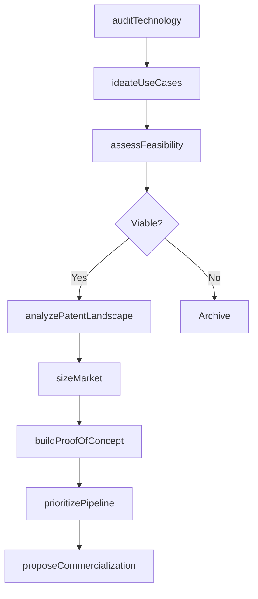
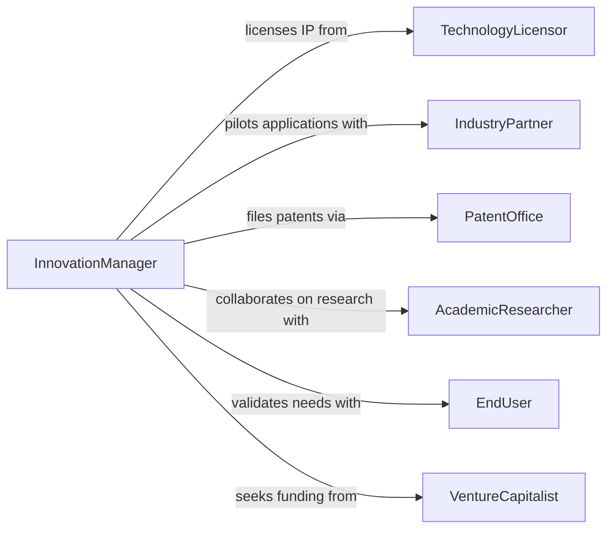

# Identify New Applications for Existing Technologies

> Business-as-Code definition for identifying new applications for existing technologies. Models the process of cataloging organizational technology assets, mapping them to unmet market needs, and validating novel use cases that can unlock additional revenue or operational value.

## Overview

Identifying new applications for existing technologies involves surveying an organization's current technology portfolio and matching capabilities against emerging market demands, adjacent industries, and internal operational challenges. This definition provides actions for technology audit, use case ideation, feasibility assessment, and proof-of-concept planning. It helps organizations maximize the return on prior technology investments by extending platforms, algorithms, or processes into new domains.

## Actors

| Actor | Description |
|-------|-------------|
| TechnologyLicensor | Holds intellectual property rights for technologies under evaluation |
| IndustryPartner | Collaborates to pilot technology in a new vertical or application domain |
| PatentOffice | Handles intellectual property filings for novel technology applications |
| AcademicResearcher | Provides scientific insights and validation for new use cases |
| EndUser | Represents the target customer or user for a new application |
| VentureCapitalist | Evaluates and funds the commercialization of technology in new markets |

## Roles

| Role | Description |
|------|-------------|
| TechnologyScout | Surveys internal capabilities and external trends for application opportunities |
| InnovationManager | Leads the ideation and evaluation of new technology applications |
| ProductManager | Assesses market demand and defines product requirements for new use cases |
| ResearchEngineer | Validates technical feasibility through prototyping and experimentation |

## Entities

| Entity | Description |
|--------|-------------|
| TechnologyAsset | An existing platform, algorithm, process, or tool available for reapplication |
| UseCase | A specific scenario describing how a technology can address a new need |
| FeasibilityReport | An assessment of technical, market, and financial viability for a use case |
| ProofOfConcept | A minimal implementation demonstrating the technology in a new context |
| PatentLandscape | An analysis of existing intellectual property relevant to the proposed application |
| MarketOpportunity | A quantified estimate of the addressable market for a new application |
| ApplicationPipeline | A prioritized list of new use cases under evaluation |

## Actions

| Action | Description |
|--------|-------------|
| auditTechnology | Catalog existing technology assets and their current applications |
| ideateUseCases | Generate potential new applications through structured brainstorming and research |
| assessFeasibility | Evaluate the technical, market, and financial viability of a proposed use case |
| analyzePatentLandscape | Survey existing patents to identify freedom to operate and IP opportunities |
| sizeMarket | Estimate the total addressable market for a proposed technology application |
| buildProofOfConcept | Develop a minimal prototype demonstrating the technology in the new context |
| prioritizePipeline | Rank new applications by strategic value, feasibility, and time to market |
| proposeCommercialization | Present a validated application for commercialization funding |

## Events

| Event | Description |
|-------|-------------|
| technologyAudited | An inventory of technology assets and capabilities is complete |
| useCaseIdeated | A new potential application has been documented |
| feasibilityAssessed | A technical and market viability assessment has been finalized |
| patentLandscapeAnalyzed | An IP landscape review for the proposed application is complete |
| marketSized | An addressable market estimate for the new application is available |
| proofOfConceptCompleted | A prototype has been built and validated for the new use case |
| pipelinePrioritized | New applications have been ranked and the pipeline is updated |
| commercializationProposed | A validated application has been submitted for funding |

## Searches

| Search | Description |
|--------|-------------|
| findTechnologyAssets | List technology assets by type, domain, or readiness level |
| getUseCases | Retrieve ideated use cases filtered by technology, market, or status |
| getFeasibilityReports | Query feasibility assessments by use case or outcome |
| getMarketOpportunities | Look up market sizing data by application or sector |
| getPipeline | Retrieve the current prioritized application pipeline |


## Entity Relationships



## State Diagram



## Workflow



## Actor Relationships



## Usage

### Calling Actions

```typescript
import { identifyNewApplicationsExistingTechnologies } from '@headlessly/identify-new-applications-existing-technologies'

const innovation = identifyNewApplicationsExistingTechnologies()

// Audit current technology portfolio
const assets = await innovation.auditTechnology({
  organization: 'acme-corp',
  categories: ['machine-learning', 'computer-vision', 'natural-language-processing']
})

// Ideate new use cases for a computer vision platform
const useCase = await innovation.ideateUseCases({
  technologyId: assets.items[0].id,
  targetIndustries: ['Agriculture', 'Manufacturing QA', 'Retail Analytics'],
  method: 'cross-industry-mapping'
})

// Assess feasibility and size the market
const feasibility = await innovation.assessFeasibility({
  useCaseId: useCase.items[0].id,
  dimensions: ['technical', 'market', 'regulatory']
})

const market = await innovation.sizeMarket({
  useCaseId: useCase.items[0].id,
  geography: 'Global',
  methodology: 'top-down'
})
```

### Event-Driven Automation

```typescript
// Auto-trigger proof of concept when feasibility is confirmed
innovation.feasibilityAssessed(async ({ useCaseId, result }) => {
  if (result.overall === 'viable') {
    await innovation.buildProofOfConcept({
      useCaseId,
      timeline: '8-weeks',
      budget: 50000
    })
  }
})

// Notify product team when market opportunity exceeds threshold
innovation.marketSized(async ({ useCaseId, tam }) => {
  if (tam >= 500000000) {
    await notify({
      to: 'product-leadership',
      message: `High-value market opportunity: $${tam / 1000000}M TAM for use case ${useCaseId}`
    })
  }
})
```
