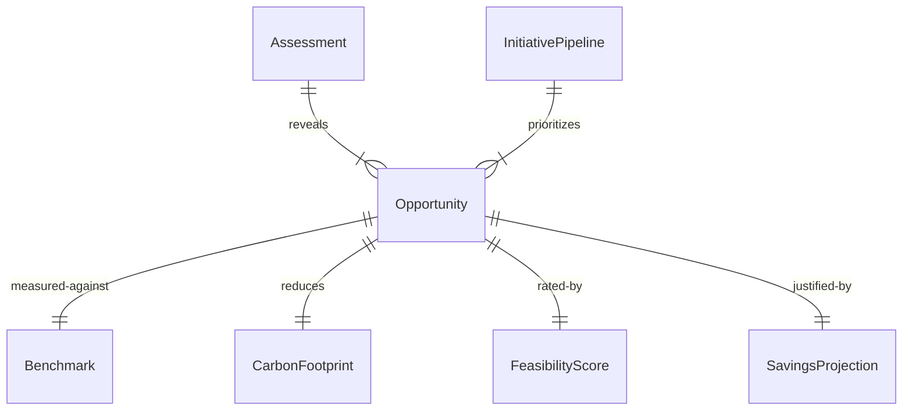
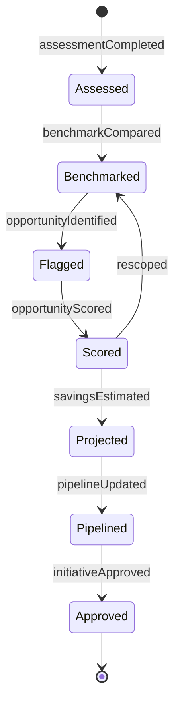
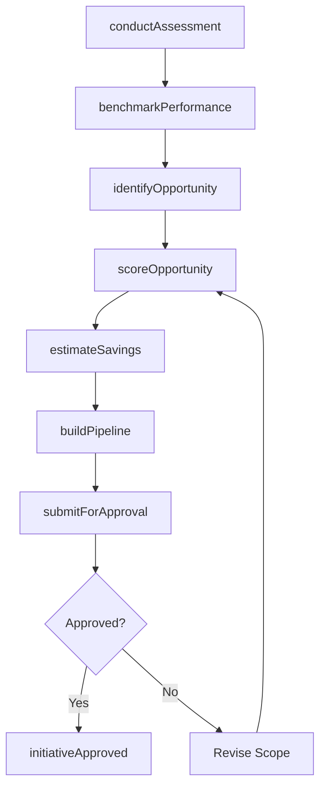
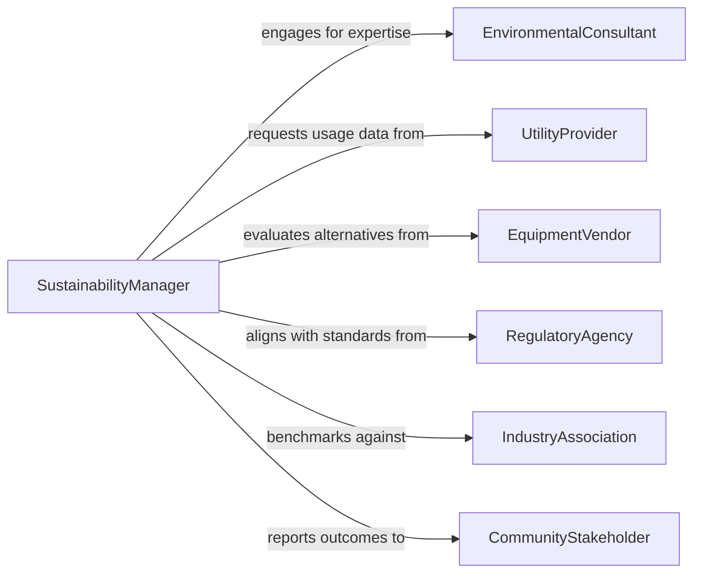

# Identify Opportunities for Green Initiatives

> Business-as-Code definition for identifying opportunities for green initiatives. Models the process of assessing organizational operations, supply chains, and facilities to discover areas where sustainability practices can reduce environmental impact and generate business value.

## Overview

Identifying opportunities for green initiatives involves systematic evaluation of energy consumption, waste streams, resource usage, and supply chain practices to pinpoint areas where sustainable alternatives can be implemented. This definition provides actions for conducting environmental assessments, benchmarking against industry standards, scoring opportunity viability, and building a prioritized initiative pipeline. It supports compliance with environmental regulations as well as voluntary sustainability frameworks such as GRI and CDP.

## Actors

| Actor | Description |
|-------|-------------|
| EnvironmentalConsultant | Provides expertise on sustainability best practices and regulatory requirements |
| UtilityProvider | Supplies energy and water usage data for baseline assessments |
| EquipmentVendor | Offers energy-efficient or low-emission equipment alternatives |
| RegulatoryAgency | Sets environmental standards and emissions reporting requirements |
| IndustryAssociation | Publishes benchmarking data and sustainability frameworks |
| CommunityStakeholder | Represents local interests affected by organizational environmental practices |

## Roles

| Role | Description |
|------|-------------|
| SustainabilityManager | Leads the identification and evaluation of green opportunities |
| FacilitiesEngineer | Assesses building and equipment systems for efficiency improvements |
| SupplyChainAnalyst | Evaluates supplier practices and logistics for carbon reduction potential |
| FinancialAnalyst | Models the return on investment and payback periods for green projects |

## Entities

| Entity | Description |
|--------|-------------|
| Opportunity | A specific area where a green initiative could be implemented |
| Assessment | An evaluation of current environmental performance in a given area |
| Benchmark | An industry or regulatory standard used for comparison |
| InitiativePipeline | A prioritized list of green opportunities under consideration |
| CarbonFootprint | A quantified measure of greenhouse gas emissions for an operation or process |
| ResourceUsageProfile | A data set capturing energy, water, and material consumption patterns |
| FeasibilityScore | A composite rating of an opportunity based on cost, impact, and complexity |
| SavingsProjection | An estimated financial and environmental benefit of implementing an initiative |

## Actions

| Action | Description |
|--------|-------------|
| conductAssessment | Evaluate current environmental performance for a facility, process, or supply chain |
| benchmarkPerformance | Compare organizational metrics against industry or regulatory standards |
| identifyOpportunity | Flag a specific area where a green initiative could yield measurable benefit |
| scoreOpportunity | Rate an opportunity on environmental impact, cost, and implementation feasibility |
| buildPipeline | Organize scored opportunities into a prioritized initiative roadmap |
| estimateSavings | Project the financial and emissions savings for a given opportunity |
| submitForApproval | Present a prioritized initiative for executive or board review |

## Events

| Event | Description |
|-------|-------------|
| assessmentCompleted | An environmental performance evaluation has been finalized |
| benchmarkCompared | Organizational metrics have been compared against reference standards |
| opportunityIdentified | A new green initiative opportunity has been flagged |
| opportunityScored | An opportunity has received a feasibility and impact rating |
| pipelineUpdated | The initiative pipeline has been reprioritized or modified |
| savingsEstimated | Financial and environmental projections for an opportunity are complete |
| initiativeApproved | An opportunity has been approved for implementation |

## Searches

| Search | Description |
|--------|-------------|
| findOpportunities | List green opportunities filtered by facility, category, or score |
| getAssessments | Retrieve environmental assessments by date, scope, or status |
| getBenchmarks | Look up industry benchmarks for a specific operational area |
| getPipeline | Retrieve the current prioritized initiative pipeline |
| getSavingsProjections | Query projected savings by opportunity or time period |


## Entity Relationships



## State Diagram



## Workflow



## Actor Relationships



## Usage

### Calling Actions

```typescript
import { identifyOpportunitiesGreenInitiatives } from '@headlessly/identify-opportunities-green-initiatives'

const greenOps = identifyOpportunitiesGreenInitiatives()

// Conduct an energy assessment for a manufacturing facility
const assessment = await greenOps.conductAssessment({
  facility: 'plant-detroit-01',
  scope: ['energy', 'waste', 'water'],
  period: { start: '2025-01-01', end: '2025-12-31' }
})

// Benchmark against industry standards
await greenOps.benchmarkPerformance({
  assessmentId: assessment.id,
  standard: 'EPA-EnergyStar-Industrial'
})

// Identify and score a specific opportunity
const opp = await greenOps.identifyOpportunity({
  assessmentId: assessment.id,
  category: 'energy',
  description: 'Replace boiler system with high-efficiency condensing unit',
  estimatedReduction: { co2Tons: 120, annualSavings: 85000 }
})

await greenOps.scoreOpportunity({
  opportunityId: opp.id,
  criteria: { environmentalImpact: 9, cost: 7, complexity: 5 }
})
```

### Event-Driven Automation

```typescript
// Notify leadership when a high-impact opportunity is identified
greenOps.opportunityScored(async ({ opportunityId, score, category }) => {
  if (score.overall >= 8) {
    await notify({
      to: 'sustainability-committee',
      message: `High-impact ${category} opportunity scored ${score.overall}/10`
    })
  }
})

// Trigger implementation workflow when an initiative is approved
greenOps.initiativeApproved(async ({ opportunityId, budget, timeline }) => {
  await projectManagement.createProject({
    sourceOpportunity: opportunityId,
    budget,
    timeline,
    type: 'green-initiative'
  })
})
```
