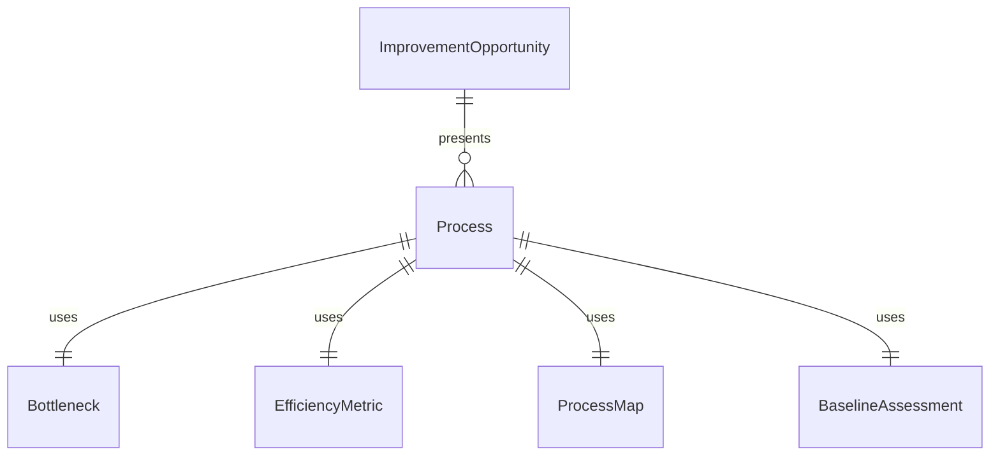
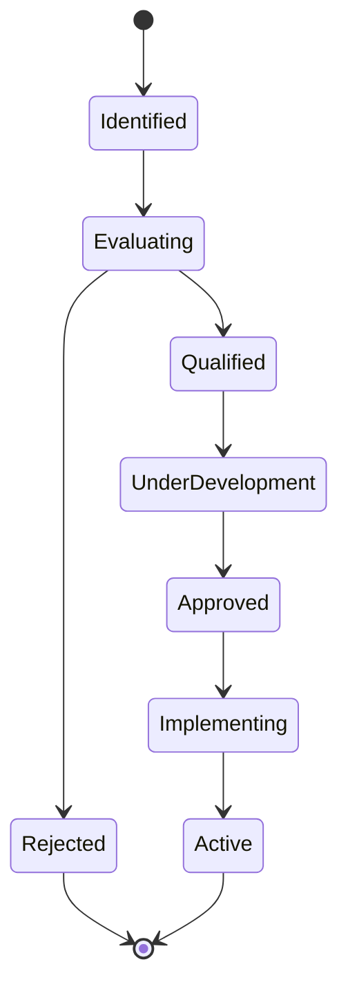
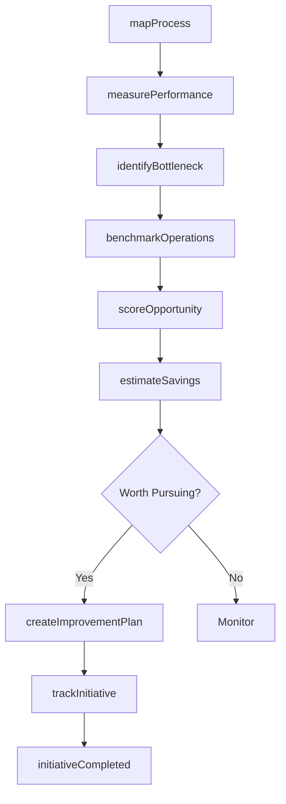
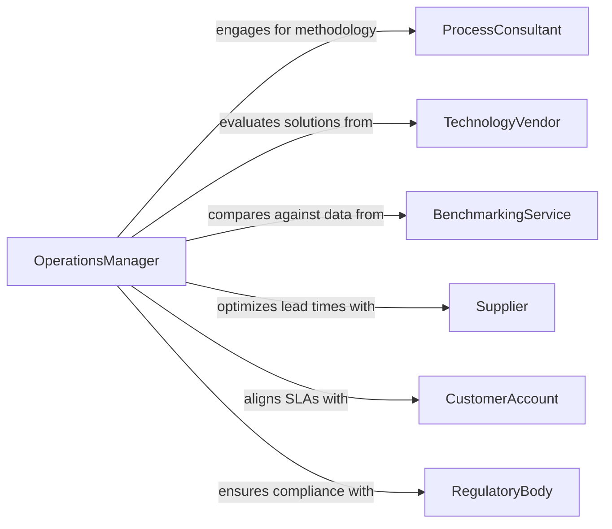

# Identify Opportunities to Improve Operational Efficiency

> Business-as-Code definition for identifying opportunities to improve operational efficiency. Models the process of analyzing workflows, measuring performance metrics, benchmarking against best practices, and prioritizing improvement initiatives across business operations.

## Overview

Identifying opportunities to improve operational efficiency involves systematic analysis of business processes, resource utilization, cycle times, and cost structures to find areas where waste can be eliminated and throughput increased. This definition provides actions for process mapping, bottleneck identification, efficiency scoring, and improvement planning. It supports lean, Six Sigma, and continuous improvement methodologies applied across manufacturing, services, and administrative operations.

## Actors

| Actor | Description |
|-------|-------------|
| ProcessConsultant | Provides expertise in lean, Six Sigma, or business process reengineering |
| TechnologyVendor | Offers automation tools, software platforms, or equipment upgrades |
| BenchmarkingService | Supplies industry performance benchmarks and best practice databases |
| Supplier | Provides materials or services whose lead times and quality affect operations |
| CustomerAccount | Drives demand patterns and service level expectations |
| RegulatoryBody | Sets compliance requirements that constrain operational design choices |

## Roles

| Role | Description |
|------|-------------|
| OperationsManager | Oversees day-to-day operations and sponsors efficiency initiatives |
| ProcessEngineer | Maps workflows, identifies bottlenecks, and designs process improvements |
| DataAnalyst | Collects and analyzes operational metrics to quantify inefficiencies |
| ContinuousImprovementLead | Facilitates improvement projects and tracks initiative outcomes |

## Entities

| Entity | Description |
|--------|-------------|
| Process | A defined sequence of activities producing a business outcome |
| Bottleneck | A constraint in a process that limits overall throughput |
| EfficiencyMetric | A quantitative measure such as cycle time, utilization rate, or defect rate |
| ImprovementOpportunity | A specific area where process changes can yield measurable gains |
| ProcessMap | A visual representation of workflow steps, handoffs, and decision points |
| BaselineAssessment | A snapshot of current operational performance for comparison |
| ImprovementPlan | A structured proposal for implementing changes with timelines and owners |
| SavingsEstimate | A projected cost or time reduction from implementing an improvement |

## Actions

| Action | Description |
|--------|-------------|
| mapProcess | Document current workflow steps, inputs, outputs, and handoffs |
| measurePerformance | Collect operational metrics for throughput, cost, quality, and cycle time |
| identifyBottleneck | Locate constraints that limit process capacity or speed |
| benchmarkOperations | Compare current performance against industry standards or best practices |
| scoreOpportunity | Rate an improvement opportunity on impact, effort, and risk |
| estimateSavings | Project the cost, time, or quality improvements from a proposed change |
| createImprovementPlan | Define the scope, timeline, owners, and success criteria for an initiative |
| trackInitiative | Monitor progress and outcomes of an active improvement project |

## Events

| Event | Description |
|-------|-------------|
| processMapped | A workflow has been documented with all steps and handoffs |
| performanceMeasured | Operational metrics have been collected and baselined |
| bottleneckIdentified | A process constraint has been located and quantified |
| operationsBenchmarked | Performance has been compared against external standards |
| opportunityScored | An improvement opportunity has been rated for prioritization |
| savingsEstimated | Projected benefits from an improvement have been calculated |
| improvementPlanCreated | A structured improvement initiative has been approved for execution |
| initiativeCompleted | An improvement project has been delivered and outcomes measured |

## Searches

| Search | Description |
|--------|-------------|
| findBottlenecks | List identified constraints filtered by process, severity, or status |
| getOpportunities | Retrieve improvement opportunities ranked by score or category |
| getPerformanceMetrics | Query operational metrics by process, period, or facility |
| getBenchmarks | Look up industry performance standards for a given operational area |
| getActiveInitiatives | List improvement projects currently in progress |


## Entity Relationships



## State Diagram



## Workflow



## Actor Relationships



## Usage

### Calling Actions

```typescript
import { identifyOpportunitiesImproveOperationalEfficiency } from '@headlessly/identify-opportunities-improve-operational-efficiency'

const ops = identifyOpportunitiesImproveOperationalEfficiency()

// Map the order fulfillment process
const processMap = await ops.mapProcess({
  name: 'Order Fulfillment',
  facility: 'warehouse-chicago-02',
  scope: ['order-receipt', 'picking', 'packing', 'shipping']
})

// Measure current performance and identify bottlenecks
const metrics = await ops.measurePerformance({
  processId: processMap.id,
  metrics: ['cycleTime', 'throughput', 'errorRate', 'laborUtilization'],
  period: { start: '2025-10-01', end: '2025-12-31' }
})

const bottleneck = await ops.identifyBottleneck({
  processId: processMap.id,
  method: 'constraint-analysis'
})

// Score and plan the improvement
await ops.scoreOpportunity({
  bottleneckId: bottleneck.id,
  criteria: { impact: 8, effort: 5, risk: 3 }
})

await ops.createImprovementPlan({
  bottleneckId: bottleneck.id,
  solution: 'Implement automated pick-to-light system',
  timeline: '12-weeks',
  estimatedSavings: { annualCost: 240000, cycleTimeReduction: 0.30 }
})
```

### Event-Driven Automation

```typescript
// Alert leadership when a high-impact bottleneck is found
ops.bottleneckIdentified(async ({ processId, bottleneckId, severity }) => {
  if (severity === 'critical') {
    await notify({
      to: 'operations-leadership',
      message: `Critical bottleneck identified in process ${processId}`
    })
  }
})

// Track ROI when improvement initiatives complete
ops.initiativeCompleted(async ({ initiativeId, actualSavings, planned }) => {
  const roi = actualSavings / planned.investmentCost
  await dashboard.update({
    metric: 'improvement-roi',
    initiativeId,
    value: roi
  })
})
```
